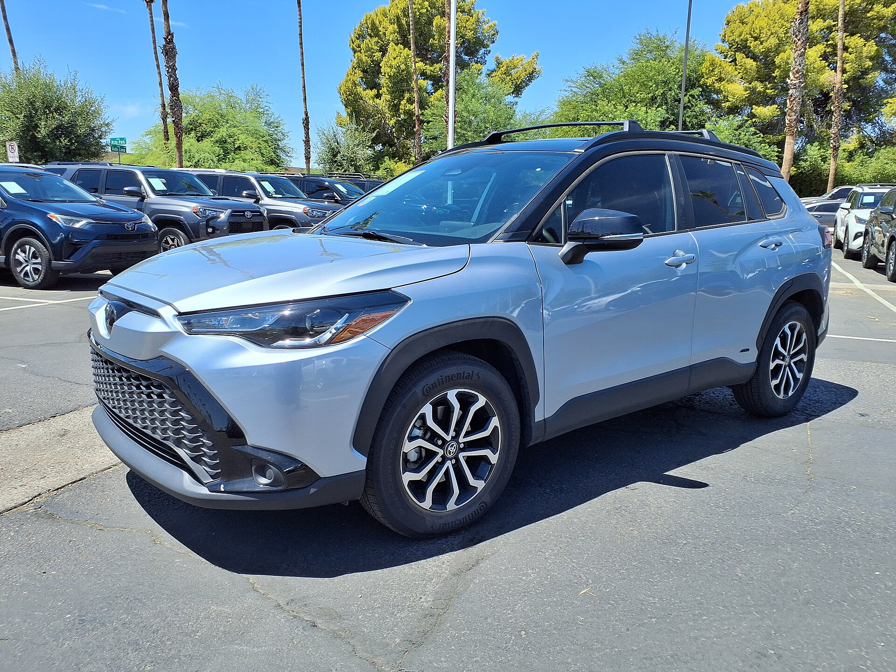

בזמן שכל תשומת הלב מופנית לרכבים החשמליים, **הרכב ההיברידי** חוזר בשקט להוביל נתח משמעותי משוק הרכב בישראל בשנת 2026. עבור נהגים רבים שמחפשים חיסכון בדלק בלי חרדת טווח ובלי תלות בעמדות טעינה, ההיברידי מציע את שביל הזהב — וזו בדיוק הסיבה שהמכירות שלו נשארות איתנות.

## למה הרכב ההיברידי חוזר לצמרת?

התשובה פשוטה: **נוחות**. רכב היברידי משלב מנוע בנזין ומנוע חשמלי, ומנהל ביניהם את המעבר באופן אוטומטי. אין צורך לחבר כבל, אין צורך לחפש עמדת טעינה, ואין דאגה לגבי טווח בכביש הבין-עירוני. בנסיעה עירונית, המערכת מנצלת את המנוע החשמלי בעצירות וברמזורים, ובכך חוסכת דלק בצורה מורגשת.

התייקרות מחירי הדלק, לצד אי-הוודאות סביב מיסוי הרכבים החשמליים, דחפו קונים רבים אל עבר פתרון הביניים. ההיברידי נהנה עדיין מהטבות מס יחסיות, שומר על **ערך משומש יציב**, ומציע עלות תחזוקה נמוכה בזכות שחיקה מופחתת של מערכת הבלמים והמנוע.

## אילו דגמים מובילים את הקטגוריה בישראל?

טויוטה נותרת המלכה הבלתי מעורערת של עולם ההיברידי, עם דגמים כמו **קורולה**, **קורולה קרוס** ו**ראב4**. יונדאי וקיה נלחמות בעקביות עם דגמי טוסון, ספורטג' וניורו ההיברידיים, בעוד יצרנים נוספים כמו הונדה ומאזדה מרחיבים את ההיצע.

חשוב להבחין בין שני סוגים עיקריים:

- **היברידי רגיל (מלא):** נטען מעצמו תוך כדי נסיעה ובלימה, ללא חיבור לחשמל. מתאים לרוב הנהגים.
- **היברידי נטען:** בעל סוללה גדולה יותר שניתן לחבר לחשמל, ומאפשר נסיעה חשמלית טהורה של עשרות קילומטרים לפני שהמנוע נכנס לפעולה.

## היברידי מול חשמלי מול בנזין — טבלת השוואה

| פרמטר | רכב היברידי | רכב חשמלי | רכב בנזין |
|---|---|---|---|
| תלות בעמדת טעינה | אין | גבוהה | אין |
| חיסכון בדלק | גבוה | מלא (חשמל) | נמוך |
| טווח נסיעה | ארוך מאוד | מוגבל יחסית | ארוך |
| עלות רכישה ראשונית | בינונית | גבוהה | נמוכה-בינונית |
| מורכבות תחזוקה | בינונית | נמוכה | בינונית |

## למי מתאים רכב היברידי?

הרכב ההיברידי מתאים במיוחד למי שנוסע הרבה **בין-עירונית** ואינו רוצה להתחייב לתשתית טעינה ביתית, וכן למי שגר בבניין ללא אפשרות טעינה. הוא גם בחירה טובה למשפחה שרוצה רכב אחד גמיש שמתאים לכל שימוש — מהעיר ועד לנסיעה ארוכה בסופ"ש.

מנגד, מי שנוסע בעיקר בעיר, מבצע קילומטראז' גבוה ויכול לטעון בבית, עשוי למצוא כי רכב חשמלי מלא יחסוך לו יותר בטווח הארוך.

### מה כדאי לבדוק לפני קנייה?

1. **צריכת דלק מוצהרת מול מציאותית** — בקשו נתוני צריכה עירונית ובין-עירונית.
2. **אחריות על הסוללה** — יצרנים מובילים מעניקים אחריות ארוכה על מערכת ההיברידי.
3. **גודל תא המטען** — בחלק מהדגמים הסוללה מקטינה את נפח האחסון.
4. **הטבות המס העדכניות** — התמונה משתנה, ולכן כדאי לבדוק את המצב במועד הרכישה.

## שורה תחתונה

הרכב ההיברידי אינו "פתרון ביניים" זמני — הוא הפך לבחירה בוגרת ומחושבת עבור נהגים ישראלים רבים ב-2026. הוא מציע את היתרון הכלכלי של החשמל בלי המגבלות של תשתית הטעינה, ומהווה חלופה שקטה אך משמעותית בשוק שמשתנה במהירות.
