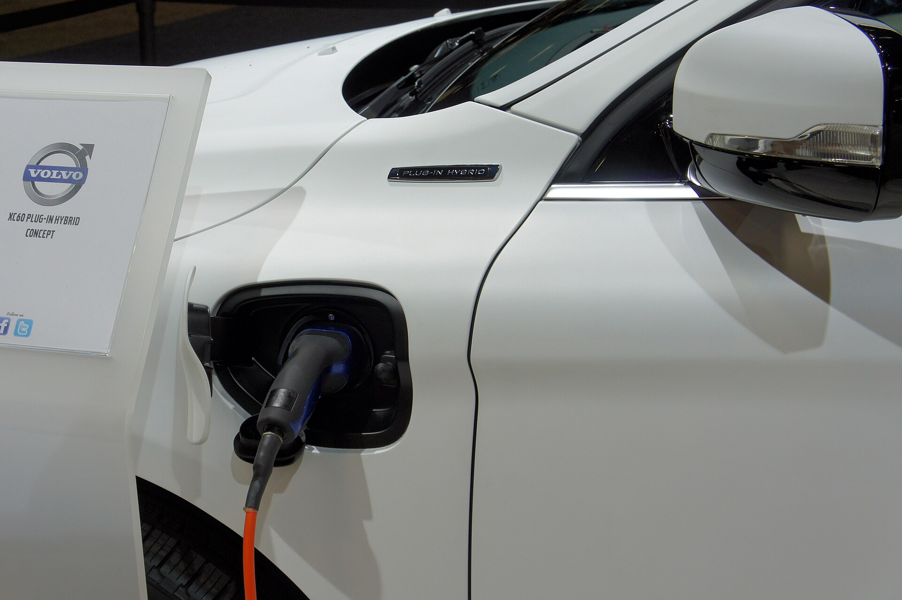

ההיברid הנטען (PHEV) חוזר להיות שחקן רלוונטי בשוק הישראלי ב-2026, אחרי תקופה שבה החשמליות המלאות גנבו את כל תשומת הלב. מדובר ברכב שמשלב מנוע בנזין קונבנציונלי עם מנוע חשמלי וסוללה גדולה יחסית, שאותה ניתן לטעון ישירות מהשקע — ובכך ליהנות מנסיעה חשמלית שקטה בנסיעות יומיומיות, לצד ביטחון של מנוע בעירה בנסיעות ארוכות.

המגמה מקבלת רוח גבית משילוב של גורמים: מגוון דגמים רחב יותר, כניסת מותגים סיניים אגרסיביים, ולקוחות שעדיין חוששים מהתלות בתשתית טעינה ציבורית. במילים אחרות — ה**היברid נטען** מציע פשרה שמדברת בדיוק לישראלי המהוסס.

## מה זה בעצם היברid נטען?

בניגוד להיברid ה"רגיל" (כמו טויוטה קורולה היברid), שבו הסוללה קטנה ומיטענת רק תוך כדי נסיעה ובלימה, ה-PHEV כולל סוללה גדולה בהרבה — בדרך כלל בין 10 ל-25 קוט"ש. הסוללה הזו מאפשרת טווח נסיעה חשמלי טהור של כ-40 עד 90 קילומטרים, תלוי בדגם.

המשמעות המעשית: מי שמבצע נסיעות יומיומיות קצרות (עבודה, בית ספר, קניות) ומטעין בבית — יכול לנסוע ימים שלמים כמעט ללא טיפת דלק. אבל ברגע שרוצים לצאת לחיפה או לאילת, מנוע הבנזין נכנס לפעולה ואין צורך לחפש עמדת טעינה מהירה.

## למי ה-PHEV באמת מתאים?

ה-PHEV אינו פתרון קסם לכולם. הוא מתאים במיוחד ל:

- **בעלי חניה פרטית** עם אפשרות התקנת עמדת טעינה ביתית (Wallbox).
- **נהגים עם נסיעה יומית קצרה** — שינצלו את הטווח החשמלי כמעט במלואו.
- **משפחות שנוסעות מדי פעם למרחקים** ולא רוצות להתמודד עם תכנון עצירות טעינה.

לעומת זאת, מי שאין לו גישה לטעינה ביתית, או מי שנוסע בעיקר בכביש בין-עירוני — עלול לגלות שהוא נושא סוללה כבדה לחינם, וצורך דלק בכמות גבוהה יותר מרכב בנזין רגיל בגלל המשקל הנוסף.

## היברid נטען מול חשמלי מלא מול היברid רגיל

כדי להבין את מקומו של ה**היברid נטען** בתמונה, הנה השוואה תמציתית:

| פרמטר | היברid רגיל (HEV) | היברid נטען (PHEV) | חשמלי מלא (BEV) |
|---|---|---|---|
| טעינה מהשקע | לא | כן | כן |
| טווח חשמלי | קילומטרים בודדים | 40-90 ק"מ | 300-600 ק"מ |
| מנוע בנזין | כן | כן | לא |
| חרדת טווח | אין | אין | קיימת בנסיעות ארוכות |
| מורכבות תחזוקה | בינונית | גבוהה (שתי מערכות) | נמוכה |
| מחיר יחסי | בינוני | גבוה | גבוה |

הטבלה ממחישה את ההיגיון של ה-PHEV: הוא "גשר" בין העולמות. הוא מוותר על הפשטות של חשמלי מלא, אך מבטל את חרדת הטווח לחלוטין.

## החיסרון שאסור להתעלם ממנו

האתגר הגדול ביותר של ה-PHEV הוא התלות המוחלטת במשמעת המשתמש. מחקרים בעולם הראו שנהגים רבים פשוט לא טורחים לטעון את הרכב, ואז הם גוררים סוללה כבדה כמשקל מת — מה שמוביל לצריכת דלק גבוהה ולפליטות גבוהות מהמובטח.

בנוסף, מדובר ברכב מורכב מכנית: שתי מערכות הנעה, מה שעשוי להשפיע על עלויות תחזוקה בטווח הארוך. גם מבחינת נפח המטען — לעיתים הסוללה "גוזלת" מקום בתא המטען לעומת גרסת הבנזין המקבילה.

## מיסוי ומחירים — התמונה בישראל

מדיניות המיסוי על רכבים היברידיים ונטענים בישראל משתנה מעת לעת, ומשפיעה ישירות על האטרקטיביות שלהם. באופן כללי, ה-PHEV נהנה ממדרגות מס נמוכות יותר מרכב בנזין טהור, אך גבוהות יותר בהשוואה להטבות שקיבל בעבר החשמלי המלא. חשוב לבדוק מול היבואן את המחיר העדכני ואת מדרגת המס הרלוונטית לפני קנייה, שכן הנתונים מתעדכנים.

המגמה הברורה היא הרחבת ההיצע: יצרנים אירופיים כמו פולקסווגן, BMW ומרצדס, לצד מותגים סיניים כמו BYD ו-MG, מציעים כיום דגמי PHEV במגוון רחב של קטגוריות — מ-SUV משפחתי ועד רכבי יוקרה.

## שורה תחתונה

ההיברid הנטען אינו "חצי פתרון" אלא כלי מדויק לפרופיל נהיגה מסוים. אם יש לכם חניה עם טעינה, ואתם משלבים נסיעות עירוניות יומיומיות עם נסיעות ארוכות מדי פעם — ה-PHEV יכול להיות בחירה חכמה מאוד שתחסוך משמעותית בדלק. אך אם לא תטעינו אותו בקביעות, עדיף לשקול היברid רגיל או חשמלי מלא.
