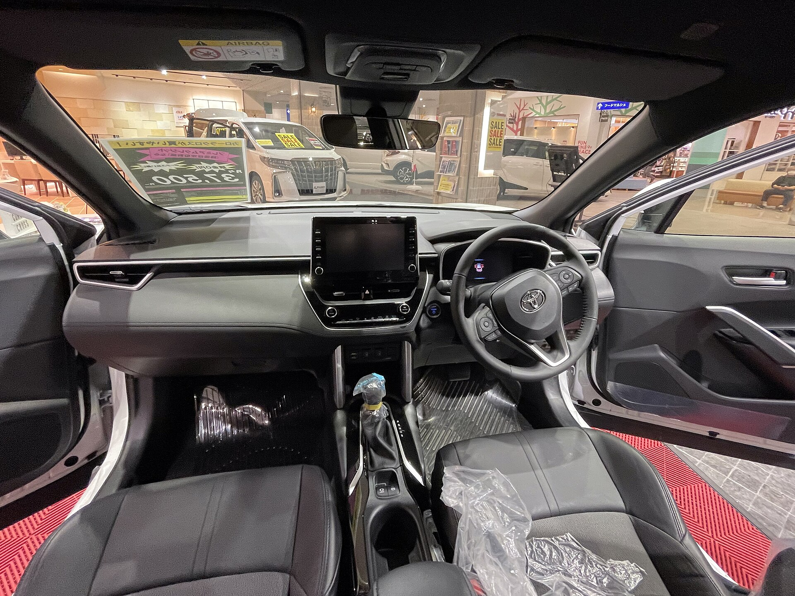

טויוטה קורולה קרוס היברידי היא אחת התשובות הבולטות בשוק לשאלה "איך משלבים רכב פנאי משפחתי עם חסכון בדלק בלי לעבור לחשמלי מלא". זהו רכב פנאי קומפקטי המבוסס על פלטפורמת הקורולה המוכרת, אך עם ישיבה גבוהה יותר, מרווח פנימי נדיב ומערכת הנעה היברידית שהפכה למותג בפני עצמו. בשורה התחתונה: מי שמחפש רכב אמין, חסכוני ונטול חרדת טווח — יקבל כאן חבילה מאוזנת מאוד.

## מה מייחד את הקורולה קרוס היברידי?

המערכת ההיברידית של טויוטה משלבת מנוע בנזין בנפח 1.8 ליטר עם מנוע חשמלי וסוללה קטנה שנטענת תוך כדי נסיעה ובלימה. אין צורך לחבר את הרכב לשקע — הוא מטעין את עצמו. התוצאה היא נהיגה שקטה במיוחד בעיר, זינוקים חלקים והמראה חשמלית מוחלטת במהירויות נמוכות.

התחושה מאחורי ההגה נעימה ורגועה. תיבת ההילוכים הרציפה (CVT) מתעדפת חלקות על פני ספורטיביות, ולכן מי שמחפש חוויית נהיגה תוססת עשוי להתאכזב מעט בעליות ובעקיפות. לעומת זאת, בנסיעה יומיומית — לעבודה, להסעות ולסידורים — הרכב עושה בדיוק את מה שמצופה ממנו.

## צריכת דלק — הסיבה המרכזית לקנייה

כאן הקורולה קרוס היברידי זוהרת. בנהיגה עירונית, שבה המערכת ההיברידית עובדת בשיאה, ניתן להגיע לצריכה מרשימה שמתקרבת ל-20 ק"מ לליטר. בנסיעה מעורבת של עיר ובין-עירוני מדובר בטווח כללי של כ-16 עד 19 ק"מ לליטר, בהתאם לסגנון הנהיגה ולעומס. בכביש מהיר במהירות קבועה היתרון ההיברידי מצטמצם, אך הצריכה עדיין נשארת חסכונית ביחס לרכבי בנזין דומים.

עבור נהג ישראלי ממוצע, החיסכון בדלק לאורך שנה מצטבר לסכום משמעותי — במיוחד למי שעושה קילומטראז' עירוני גבוה.

## נוחות, מרחב וטכנולוגיה

תא הנוסעים מרווח ונוח, עם ישיבה גבוהה שמעניקה תחושת ביטחון ושדה ראייה טוב. תא המטען מעשי ומספיק לצרכים משפחתיים יומיומיים, כולל עגלת תינוק וקניות שבועיות.

מערכת המולטימדיה כוללת מסך מגע מרכזי עם תמיכה בחיבור אלחוטי לטלפון, וברמות הגימור הגבוהות מתווספים אבזור עשיר יותר, גג זכוכית ומערכת שמע משודרגת. מבחינת בטיחות, טויוטה מציידת את הרכב בחבילת מערכות סיוע לנהג הכוללת בלימת חירום, שמירת נתיב ובקרת שיוט אדפטיבית כבר בדגמים הבסיסיים.

## טבלת השוואה: קורולה קרוס היברידי מול מתחרות

| פרמטר | טויוטה קורולה קרוס היברידי | יונדאי טוסון היברידי | קיה נירו היברידי |
|---|---|---|---|
| סוג הנעה | היברידי עצמאי | היברידי עצמאי | היברידי עצמאי |
| צריכת דלק מעורבת (הערכה) | כ-16-19 ק"מ/ליטר | כ-14-17 ק"מ/ליטר | כ-17-20 ק"מ/ליטר |
| גודל | פנאי קומפקטי | פנאי בינוני | פנאי קומפקטי |
| דגש עיקרי | אמינות וחסכון | מרחב ואבזור | חסכון ומחיר |
| תדמית אמינות | גבוהה מאוד | טובה | טובה |

## למי הרכב הזה מתאים?

קורולה קרוס היברידי מתאימה במיוחד למשפחות ולנהגים שמחפשים רכב פרקטי, חסכוני ואמין, בלי להתחייב לרכב חשמלי מלא ולתשתית טעינה. היא לא מתיימרת להיות ספורטיבית או מפוארת — אלא כלי תחבורה חכם, שקט וזול לתחזוקה.

מי שמחפש חוויית נהיגה מרגשת או פנים יוקרתי במיוחד — כדאי שיסתכל גם על מתחרות. אך עבור הרוב המכריע של הנהגים הישראלים, מדובר בבחירה שקשה לטעות בה.

## שורה תחתונה

הקורולה קרוס היברידי מגלמת את מה שטויוטה עושה הכי טוב: רכב מאוזן, אמין וחסכוני, שמתאים בדיוק לצרכים היומיומיים של המשפחה הישראלית. היא לא תרגש חובבי ביצועים, אבל היא כמעט בוודאות תחסוך לך כסף ותגרום לפחות כאבי ראש לאורך שנות הבעלות.
