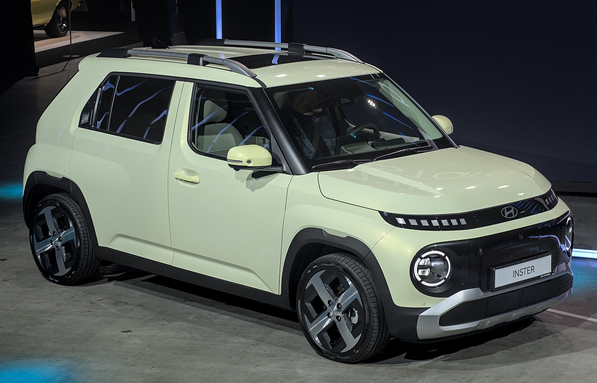

**יונדאי אינסטר** היא החשמלית העירונית הקטנה של יונדאי שמכוונת בדיוק לנקודה שחסרה בשוק הישראלי: רכב חשמלי אמין, קומפקטי ובמחיר כניסה נוח, בלי לוותר על טכנולוגיה עדכנית. המודל, שכבר נמכר באירופה ובמזרח הרחוק, נחשב לאחד המועמדים המעניינים ביותר לשנת 2026 בקטגוריית החשמליות הזולות.

האינסטר מבוססת על הדגם הקוריאני קסטר (Casper), אך עברה התאמות רבות לגרסה החשמלית: פסי חישוק ארוכים יותר, עיצוב פנסים "פיקסלי" האופייני ליונדаי החשמלית, ותא נוסעים גמיש במיוחד. מדובר ברכב שנועד להחליף מכונית עירונית קטנה במשפחה, או לשמש כרכב ראשון וזול לנהגים צעירים.

## מה מיוחד ביונדאי אינסטר?

היתרון הבולט של האינסטר הוא השילוב בין מידות קומפקטיות לתא פנימי חכם. אורך הרכב עומד על כ-3.8 מטרים בלבד, אך בזכות מרווח סרנים נדיב ומושבים אחוריים שניתן להזיז ולקפל בנפרד, נפח המטען משתנה בקלות בהתאם לצורך. המושב הקדמי אף מתקפל לגמרי, מה שמאפשר הובלת חפצים ארוכים או אפילו "מיטת שינה" מאולתרת לטיולים.

בתוך התא מוצאים שני מסכים דיגיטליים בגודל 10.25 אינץ' — אחד ללוח המחוונים ואחד למערכת המולטימדיה — עם תמיכה בחיבורים אלחוטיים לטלפון. יונדאי מקפידה על מערך בטיחות עשיר גם בדגם הזול, הכולל בלימה אוטומטית, שמירת נתיב ובקרת שיוט אדפטיבית.

## טווח, סוללה וטעינה

האינסטר מוצעת בשתי תצורות סוללה. גרסת הבסיס עם סוללה קטנה יותר (כ-42 קילוואט-שעה) מציעה טווח מוערך של כ-300 קילומטרים במחזור אירופאי, בעוד הגרסה עם הסוללה הגדולה (כ-49 קילוואט-שעה) מגיעה לטווח מוערך של כ-355–360 קילומטרים. בתנאי נהיגה ישראליים אמיתיים, כולל מיזוג וכביש מהיר, סביר לצפות לטווח מעשי נמוך מעט מהמספרים הרשמיים.

מבחינת טעינה, הרכב תומך בטעינה מהירה בזרם ישר שמאפשרת מעבר מ-10% ל-80% בכ-30 דקות בעמדה מתאימה. אלו נתונים סבירים לחלוטין עבור רכב עירוני שרוב הטעינות שלו יתבצעו ממילא בבית או בעבודה.

## כמה תעלה האינסטר בישראל?

המחיר המדויק בישראל טרם פורסם רשמית, אך על פי מיצוב הדגם בעולם והמדיניות של יבואנית יונדאי, מדובר ברכב שאמור להשתלב בקטגוריית החשמליות הזולות. ההערכה היא שהאינסטר תתומחר באזור שמתחרה ישירות בדגמי חשמל קטנים אחרים, כתלות במיסוי ובמדיניות הסובסידיות שתהיה בתוקף במועד ההשקה.

חשוב לזכור כי מס הקנייה על רכבים חשמליים ממשיך לעלות בהדרגה בישראל, ולכן מחיר ההשקה עשוי להיות מושפע מעיתוי הכניסה לשוק.

## טבלת השוואה: אינסטר מול המתחרות

| דגם | קטגוריה | טווח מוערך (ק"מ) | יתרון בולט |
|------|----------|------------------|-------------|
| יונדאי אינסטר | חשמלית עירונית | כ-300–360 | גמישות תא ומידות קומפקטיות |
| BYD דולפין | חשמלית קומפקטית | כ-340–420 | מרחב פנימי גדול |
| MG4 | חשמלית משפחתית | כ-350–450 | ביצועים ומחיר |
| ניסאן ליף | חשמלית משפחתית | כ-270–380 | ותק ואמינות מוכחת |

## למי מתאימה יונדאי אינסטר?

האינסטר מתאימה במיוחד לתושבי ערים שמחפשים רכב שני קטן וחסכוני, לנהגים צעירים שרוצים חשמלית ראשונה במחיר שפוי, ולמשפחות שמחפשות רכב עירוני נוח לחניה ולנסיעות יומיומיות. מי שנוסע מדי יום מרחקים גדולים בין ערים עשוי להעדיף דגם עם סוללה גדולה יותר.

עם השם המוכר של יונדאי, אחריות היצרן ורשת השירות הרחבה בישראל, האינסטר עשויה להפוך לאחת החשמליות הקטנות המבוקשות של 2026 — בתנאי שהמחיר הסופי יישאר תחרותי.

## שורה תחתונה

יונדаי אינסטר מסמנת מגמה חשובה: חזרתן של החשמליות הקטנות והזולות, אחרי שנים שבהן השוק נשלט בעיקר על ידי רכבי פנאי גדולים ויקרים. אם היבואנית תתמחר אותה נכון, זו עשויה להיות אחת ההצעות המעניינות ביותר לישראלי שמחפש כניסה חכמה לעולם החשמלי.
