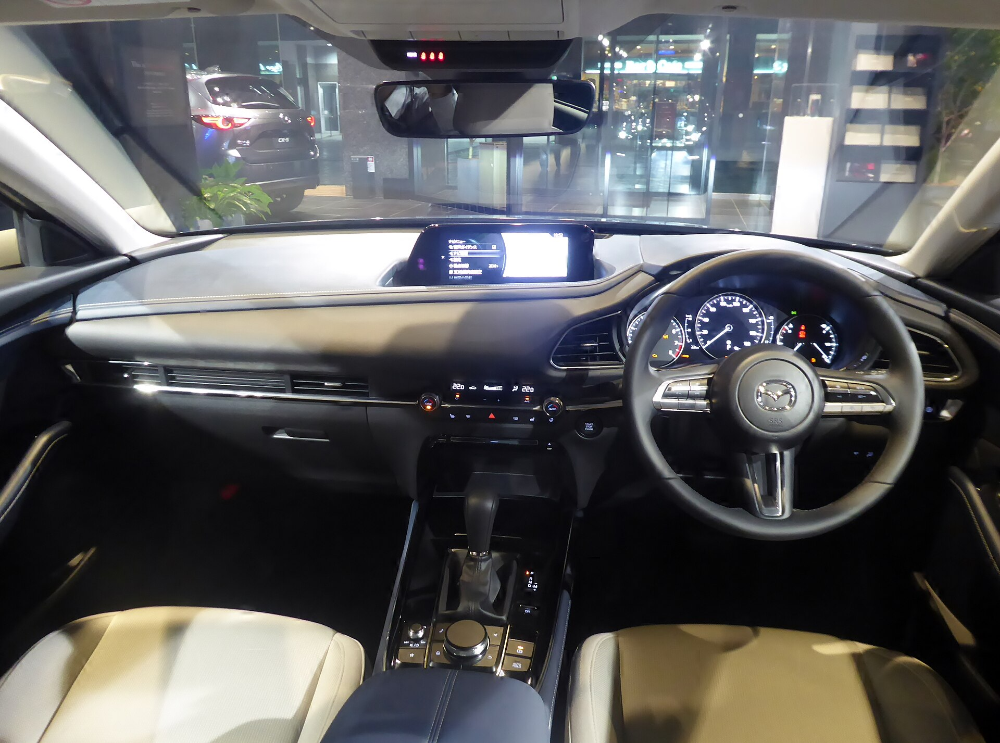

## מאזדה CX-30 — למי היא מתאימה?

מאזדה CX-30 היא קרוסאובר קומפקטי שממוצב בין ה-CX-3 הקטן ל-CX-5 המשפחתי, והיא אחת הבחירות המעניינות בקטגוריה עבור הקהל הישראלי שמחפש רכב גבוה, מהוקצע ונעים לנהיגה. במבחן הדרך שלנו התרשמנו שהיא מציעה תחושת יוקרה שחורגת ממחירה, אך גם דורשת פשרה מסוימת בנפח הפנימי.

הרכב פונה בעיקר לזוגות, למשפחות קטנות ולנוסעים שמעריכים איכות גימור ונהיגה מדויקת יותר מאשר מקום מרבי לרגליים. מי שמחפש שטח מטען גדול או תא נוסעים מרווח במיוחד — כדאי שישקול גם את המתחרים.

## עיצוב פנים: יוקרה בקטגוריה שמפתיעה

התא הפנימי הוא ללא ספק הכוכב של מאזדה CX-30. השימוש בחומרים רכים, התפרים המוקפדים והפריסה הנקייה של הלוח יוצרים אווירה שמזכירה מותגי יוקרה. מסך המולטימדיה ממוקם גבוה בשדה הראייה ונשלט באמצעות בורר סיבובי — פתרון שדורש התרגלות אך בטיחותי יותר בנהיגה מאשר מסך מגע.

### נוחות ומרחב

מושבי החזית תומכים ונוחים גם בנסיעות ארוכות. המושב האחורי סביר לשני מבוגרים, אך מרחב הרגליים והראש מוגבל יותר ממתחרים כמו סקודה קמיק או פולקסווגן טי-רוק. תא המטען מציע נפח בינוני שמספיק לקניות שבועיות ולמזוודות של סוף שבוע, אך פחות אידיאלי לטיולי משפחה עמוסים.

## איך היא מתנהגת על הכביש?

כאן מאזדה CX-30 באמת זורחת. ההיגוי מדויק ומתגמל, מרכב הרכב יציב בכניסה לפניות, והתחושה הכללית ספורטיבית יותר מהמקובל בקטגוריה. מערכת המיקרו-היברید הקלה מסייעת בהאצות ומשפרת מעט את צריכת הדלק, אך אין כאן מנוע חשמלי שדוחף לבדו.

בנסיעה עירונית הרכב זריז ונוח לתמרון, ובכביש הבין-עירוני הוא שקט ויציב במהירויות גבוהות. מנוע הבנזין מספק ביצועים סבירים, אם כי מי שמחפש דחיפה ספורטיבית של ממש עשוי להרגיש שחסרה עוצמה בעומסים.

## צריכת דלק ותחזוקה

בתנאי ישראל מדובר בצריכת דלק סבירה לקטגוריה — משתלמת יחסית בנהיגה מעורבת, אם כי לא ברמת ההיברידים המלאים של טויוטה. עלויות התחזוקה של מאזדה נחשבות סבירות, ומערך השירות בישראל נגיש ומוכר.

## טבלת השוואה: מאזדה CX-30 מול מתחרות

| פרמטר | מאזדה CX-30 | טויוטה קורולה קרוס | סקודה קמיק |
|---|---|---|---|
| קטגוריה | קרוסאובר קומפקטי | קרוסאובר קומפקטי | קרוסאובר קומפקטי |
| הנעה | בנזין + מיקרו-היברид | היברид מלא | בנזין טורבו |
| חוויית נהיגה | ספורטיבית ומדויקת | נוחה ורגועה | מאוזנת |
| איכות תא נוסעים | גבוהה מאוד | טובה | טובה |
| נפח מטען | בינוני | גדול | גדול |
| חיסכון בדלק | סביר | מצוין | סביר |

## בטיחות

מאזדה CX-30 מגיעה עם חבילת הבטיחות i-Activsense הכוללת בלימה אוטונומית, ניטור נקודות מתות, שמירת נתיב ובקרת שיוט אדפטיבית. הרכב זכה בדירוגי בטיחות גבוהים במבחני הריסוק האירופיים, מה שהופך אותו לבחירה בטוחה למשפחה.

## שורה תחתונה

מאזדה CX-30 היא בחירה מצוינת למי שמעדיף איכות, עיצוב וחוויית נהיגה על פני מרווח מרבי. היא מרגישה יקרה מכפי מחירה, נוהגת נהדר ומצוידת היטב בבטיחות. הפשרה העיקרית היא בנפח הפנימי ובמטען, ומי שזקוק למקום רב יעדיף חלופה משפחתית יותר.
