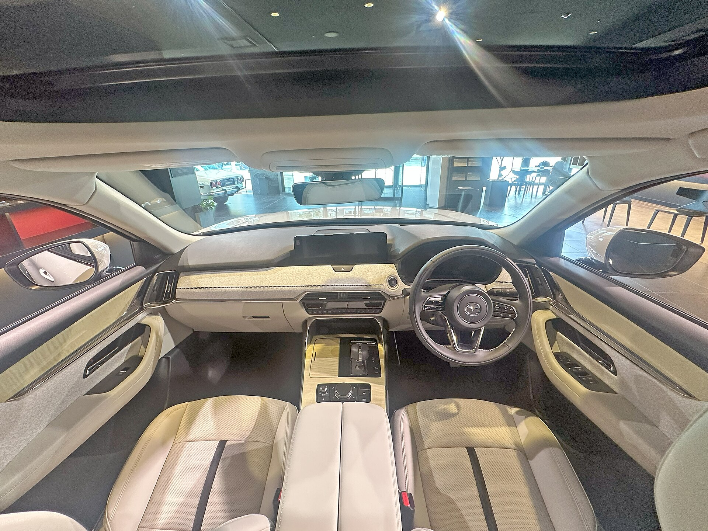

מאזדה CX-80 מגיעה לישראל ומסמנת את כניסת המותג היפני לזירת ה-SUV היוקרתיים בני שבעה מושבים. מדובר בדגם הדגל הגדול ביותר של החברה, שנבנה על פלטפורמה אורכית חדשה ומציע שילוב של עיצוב אלגנטי, פנים מוקפד ומגוון הנעה רחב הכולל גם מנוע שש-בשורה וגם גרסת היברید נטען. עבור המשפחה הישראלית שמחפשת ג'יפון מרווח עם תו תקן פרימיום, זו הצעה חדשה ומעניינת.

## מה מייחד את מאזדה CX-80?

הדגם החדש נבנה על ארכיטקטורה אורכית (מנוע לאורך הרכב), גישה נדירה בפלח המשפחתי שמאפשרת פרופורציות זקופות וספורטיביות יותר. בניגוד למרבית המתחרים המבוססים על פלטפורמות רוחביות, מאזדה בחרה בכיוון שמזכיר יצרני יוקרה אירופיים.

הרכב מתמקם מעל דגם ה-CX-60 הקצר יותר, ומציע תא נוסעים בן שלוש שורות. שתי תצורות הושבה עיקריות צפויות: שבעה מושבים בשורה שלישית רגילה, או שישה מושבים עם שני כיסאות קפטן נפרדים בשורה האמצעית — פתרון שמעניק תחושת נוחות מוגברת.

## מנועים והנעה: מה יגיע לישראל?

אחד הדברים המעניינים ב-CX-80 הוא מגוון ההנעה. באירופה הרכב מוצע עם מנוע בנזין שש-בשורה נפחי, מנוע דיזל שש-בשורה, וגרסת **היברید נטען** שמשלבת מנוע בנזין עם מנוע חשמלי וסוללה המאפשרת נסיעה חשמלית מוגבלת ביומיום.

גרסת ההיברید הנטען היא המעניינת ביותר לשוק הישראלי, בשל מבנה המיסוי שמיטיב עם רכבים בעלי פליטות נמוכות. היא מציעה הספק משולב גבוה, הנעה כפולה (4X4) ותצרוכת דלק נמוכה בשימוש עירוני. הייבוא המדויק לישראל תלוי בהחלטת היבואן, אך סביר שדגש יושם על הגרסאות המשולבות.

### נתונים עיקריים (הערכה)

- הנעה: 4X4 בסטנדרט ברוב הגרסאות
- מושבים: 6 או 7
- תיבת הילוכים: אוטומטית 8 הילוכים
- טווח חשמלי בגרסת ההיברید הנטען: עשרות קילומטרים בודדים

## איך CX-80 מתמודדת מול התחרות בישראל?

פלח ה-SUV הגדולים בני שבעה מושבים הפך תחרותי במיוחד. מאזדה נכנסת לזירה שכבר מאוכלסת בדגמים מבוססים, וממצבת את עצמה בקצה הפרימיום שלה.

| דגם | מושבים | הנעה בולטת | מיצוב |
|------|---------|-------------|--------|
| מאזדה CX-80 | 6-7 | שש-בשורה / היברید נטען | פרימיום |
| סקודה קודיאק | 7 | בנזין / היברид נטען | מיינסטרים גבוה |
| יונדאי סנטה פה | 7 | היברید | מיינסטרים גבוה |
| קיה סורנטו | 7 | היברید / היברید נטען | מיינסטרים גבוה |

היתרון של מאזדה טמון בעיצוב הפנים המוקפד, איכות החומרים והתחושה היוקרתית — תחומים שבהם המותג השתפר משמעותית בשנים האחרונות. מנגד, המחיר הצפוי עשוי למקם את הרכב מעל חלק מהמתחרים הפופולריים.

## תא הנוסעים והטכנולוגיה

מאזדה שמה דגש על סביבת נהיגה נקייה ומינימליסטית. תא הנוסעים כולל מסך מולטימדיה מרכזי, לוח מחוונים דיגיטלי ותצוגה עילית (הד-אפ) בגרסאות הגבוהות. החברה נאמנה לגישתה שבה חלק מהפעולות מבוצעות באמצעות בקר סיבובי ולא רק במסך מגע — פתרון שנועד להפחית הסחות דעת בנהיגה.

מערך הבטיחות צפוי לכלול חבילה עשירה של מערכות עזר לנהג: בקרת שיוט אדפטיבית, שמירת נתיב, זיהוי הולכי רגל ובלימת חירום אוטומטית — בהתאם לתקינה המחמירה שנכנסת לתוקף.

## למי מתאימה מאזדה CX-80?

הדגם מתאים למשפחות גדולות שמחפשות ג'יפון מרווח עם אופי יוקרתי, ומוכנות לשלם פרמיה עבור עיצוב ואיכות גימור. גרסת ההיברید הנטען תמשוך את מי שמעוניין לשלב נוחות של מנוע חזק עם יעילות עירונית והטבות מיסוי.

מנגד, מי שמחפש את הפתרון המשפחתי המשתלם ביותר ימצא ככל הנראה ערך רב יותר בדגמים כמו סורנטו או סנטה פה. ההכרעה תלויה במידה רבה בתמחור הסופי בישראל ובגרסאות שיובאו בפועל.
