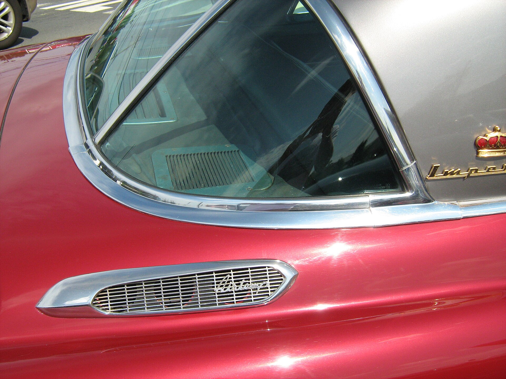

## למה המזגן ברכב לא מקרר כמו פעם?

אם אתם עולים לרכב בצהריים של יולי ומרגישים שהמזגן פשוט "לא מושך" כמו שהיה — כנראה שהגיע הזמן לתחזוקת מזגן רכב. ברוב המקרים הסיבה פשוטה: מחסור הדרגתי בגז מיזוג, מסנן אבקה סתום או מעבה מלוכלך. הקיץ הישראלי, עם טמפרטורות שחוצות בקלות את ה-35 מעלות, חושף כל חולשה קטנה במערכת ומגדיל את העומס על הקומפרסור.

החדשות הטובות: רוב התקלות ניתנות למניעה בעלות נמוכה יחסית, אם מטפלים בהן בזמן ולא מחכים שהמערכת תקרוס לגמרי.

## סימני האזהרה שאסור להתעלם מהם

לפני שממהרים למוסך, כדאי להכיר את הסימנים שמעידים על בעיה במערכת המיזוג:

- **קירור חלש** — האוויר יוצא, אבל לא באמת קר. הסימן הנפוץ ביותר למחסור בגז.
- **ריח לא נעים** — ריח "עבש" בהפעלה מעיד לרוב על עובש במאייד או מסנן אבקה מלוכלך.
- **רעשים חריגים** — צפצוף או נקישות בהפעלת המזגן עשויים להצביע על בלאי ברצועה או בקומפרסור.
- **חלונות מתאדים לאט** — מערכת שמתקשה לייבש את האוויר.
- **נזילת מים בתא הנוסעים** — סתימה בצינור הניקוז של המאייד.

## כל כמה זמן מטפלים במזגן הרכב?

הנה טבלה שמסכמת את פעולות התחזוקה המרכזיות והתדירות המומלצת. הנתונים הם טווחים כלליים — כדאי להתאים אותם לתנאי הנסיעה ולהמלצות היצרן.

| פעולה | תדירות מומלצת | חשיבות |
|---|---|---|
| החלפת מסנן אבקה | כל 15-20 אלף ק"מ | גבוהה |
| בדיקת כמות גז מיזוג | אחת לשנה-שנתיים | גבוהה |
| טעינת גז מלאה | כל 3-4 שנים (בהתאם לבדיקה) | בינונית |
| ניקוי מעבה ומאייד | לפי הצורך / ריחות | בינונית |
| חיטוי מערכת נגד עובש | אחת לשנה, לפני הקיץ | בינונית |

## מסנן האבקה — הפתרון הזול שרובנו שוכחים

מסנן האבקה (או "פילטר תא נוסעים") אחראי לסינון האבק, האבקנים והלכלוך שנכנסים למערכת. בישראל, עם הרבה אבק וחול, הוא נסתם מהר יחסית. מסנן סתום מקטין משמעותית את זרימת האוויר, פוגע בעוצמת הקירור ומכניס ריחות לא נעימים.

החלפה עולה מעט, ולעיתים אפשר לבצע אותה בבית תוך מספר דקות. זו אחת הפעולות המשתלמות ביותר בתחזוקת מזגן רכב.

## גז מיזוג — למה הכמות יורדת?

מערכת מיזוג היא מערכת סגורה, אבל עם השנים הגז מתאדה בכמויות קטנות דרך אטמים וצנרת. ירידה של גז אינה בהכרח סימן לתקלה — זו תופעה טבעית. עם זאת, ירידה מהירה מעידה על נזילה שדורשת איתור וטיפול.

חשוב לדעת: הפעלת מזגן עם מעט מדי גז מסכנת את הקומפרסור — אחד הרכיבים היקרים ביותר במערכת. לכן עדיף לבדוק ולהשלים גז בזמן, מאשר לגלות תקלה יקרה בהמשך.

## טיפים פרקטיים שישמרו על המזגן לאורך שנים

1. **הפעילו את המזגן גם בחורף** — כמה דקות בשבוע שומרות על שימון הקומפרסור ומונעות ייבוש אטמים.
2. **אווררו את הרכב לפני ההפעלה** — פתחו חלונות לכמה שניות כדי לשחרר את האוויר הלוהט, כך המזגן יעבוד פחות קשה.
3. **כבו את המזגן דקה-שתיים לפני כיבוי המנוע** — כך המאייד מתייבש ומצטמצם היווצרות עובש וריחות.
4. **החנו בצל כשאפשר** — שמשונית פשוטה מורידה משמעותית את הטמפרטורה בתא הנוסעים.
5. **אל תתעלמו מריחות** — הם הסימן המוקדם ביותר לצורך בחיטוי מערכת.

## מתי לגשת למוסך?

אם ביצעתם החלפת מסנן ואיוורור נכון והמזגן עדיין לא מקרר — כנראה שיש מחסור בגז או תקלה במערכת שמצריכה בדיקה מקצועית. מוסך מיזוג יבצע בדיקת לחצים, איתור נזילות והשלמת גז. פנייה מוקדמת חוסכת נזק לקומפרסור ומחזירה את הקירור לרמה מלאה בדיוק בזמן לגל החום הבא.
