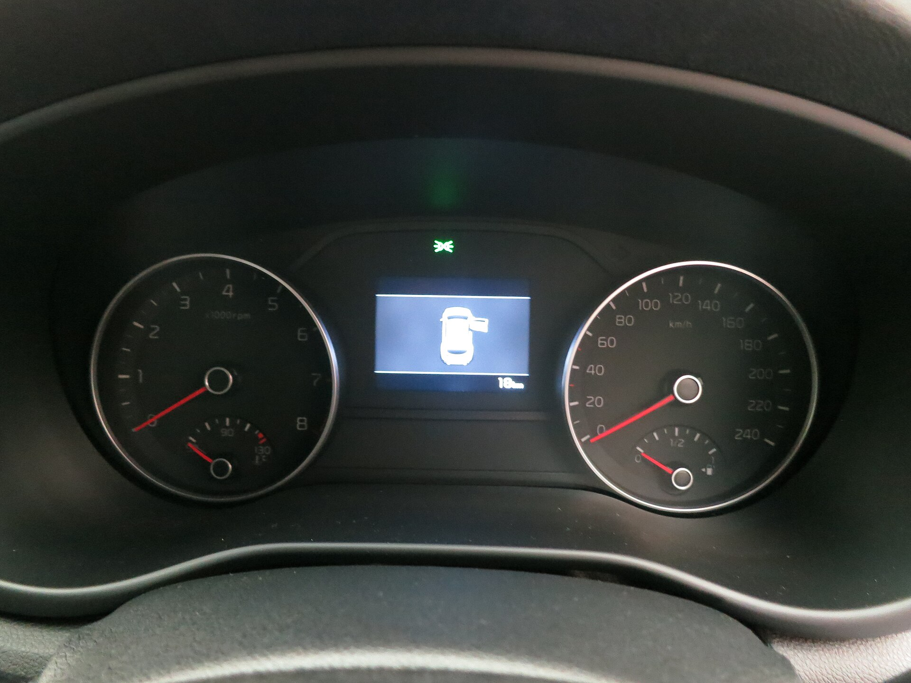

קיה ספורטאז' היברידי היא אחת ההצעות המשפחתיות המשכנעות בשוק הישראלי כרגע: קרוסאובר בגודל בינוני, עם מערכת הנעה היברידית חסכונית, עיצוב נועז ומפרט עשיר יחסית למחיר. אחרי שבוע של נהיגה מעורבת — עיר, בין-עירוני וכביש מהיר — התמונה ברורה: זה רכב שיודע לפנק משפחה מבלי לרוקן את הארנק בתחנת הדלק.

## מה מיוחד בקיה ספורטאז' היברידי?

הדור הנוכחי של ספורטאז' עשה קפיצת מדרגה בעיצוב ובטכנולוגיה. החזית עם תאורת הפנימיות בצורת חץ והמסכים המאוחדים בתא הנוסעים מעניקים תחושה יוקרתית שלא הייתה מובנת מאליה בעבר. מערכת ההנעה ההיברידית משלבת מנוע בנזין טורבו בנפח 1.6 ליטר יחד עם מנוע חשמלי, בהספק משולב מוערך של כ-230 כוחות סוס — נתון שמתורגם לנהיגה זריזה ורגועה כאחד.

בניגוד להיברידים "קלים", מדובר במערכת היברידית מלאה עם תיבה אוטומטית בעלת שש הילוכים, שמאפשרת נסיעה קצרה על חשמל בלבד במהירויות נמוכות. התוצאה: זינוקים חלקים מרמזור ותחושת שקט נעימה בעיר.

## איך היא נוהגת בכביש הישראלי?

בנהיגה עירונית ספורטאז' מרגישה קלילה ונוחה. ההיגוי מדויק אך לא ספורטיבי מדי, והמתלים סופגים היטב את מהמורות הכביש הישראלי. בכביש מהיר הרכב יציב ושקט, ומערכות הסיוע לנהג — בעיקר בקרת השיוט האדפטיבית ושמירת הנתיב — מורידות עומס משמעותי בנסיעות ארוכות.

במעברי מהירות ובעקיפות, המנוע החשמלי משלים את הבנזין בצורה חלקה ומספק "דחיפה" מיידית. זה לא רכב ספורט, אבל בהחלט מרגיש בטוח ומספק כשצריך.

### צריכת דלק — הנתון שחשוב באמת

כאן ספורטאז' ההיברידי זוהרת. בנהיגה מעורבת רשמנו טווח של כ-17-19 ק"מ לליטר, ובנסיעה עירונית זהירה אפשר להתקרב אף למספרים גבוהים יותר. בכביש מהיר במהירות קבועה הצריכה עולה מעט, אך עדיין נשארת חסכונית ביחס לגודל הרכב ולמשקלו.

## מרחב פנימי ותא מטען

זה אחד היתרונות הבולטים של ספורטאז'. מרחב הרגליים האחורי מרווח במיוחד — נוסעים מבוגרים יישבו בנוחות גם בנסיעות ארוכות. תא המטען רחב ושימושי, ומספיק בקלות לעגלת תינוק, קניות שבועיות או מזוודות לחופשה משפחתית.

המערכת המולטימדיה עם מסך המגע הגדול תומכת בחיבור אלחוטי לאפל קארפליי ואנדרואיד אוטו, וממשק הבקרה המשולב בין המיזוג למולטימדיה נחשב לאחד המוצלחים בקטגוריה.

## טבלת השוואה: ספורטאז' היברידי מול המתחרות

| פרמטר | קיה ספורטאז' היברידי | טויוטה קורולה קרוס | יונדאי טוסון היברידי |
|---|---|---|---|
| הספק משולב מוערך | כ-230 כ"ס | כ-197 כ"ס | כ-230 כ"ס |
| צריכת דלק משולבת | 17-19 ק"מ/ל | 18-21 ק"מ/ל | 16-19 ק"מ/ל |
| נפח תא מטען | רחב מאוד | בינוני | רחב |
| אופי | משפחתי מרווח | קומפקטי חסכוני | משפחתי טכנולוגי |

## בטיחות ומפרט

ספורטאז' מגיעה עם חבילת בטיחות עשירה הכוללת בלימת חירום אוטומטית, זיהוי הולכי רגל ורוכבי אופניים, ניטור שטח מת, שמירת נתיב ובקרת שיוט אדפטיבית. הרכב זכה בדירוגי בטיחות גבוהים במבחני הריסוק האירופיים, מה שמחזק את מעמדו כבחירה משפחתית אחראית.

## למי מתאימה קיה ספורטאז' היברידי?

זו בחירה מצוינת למשפחה שמחפשת קרוסאובר מרווח, חסכוני ומאובזר, בלי לעבור למעבר מלא לחשמל. אם אתם עושים הרבה קילומטרים בשנה ורוצים לחסוך בדלק אך עדיין נהנות מגמישות של רכב בנזין — ספורטאז' ההיברידי עונה על הצורך במדויק.
