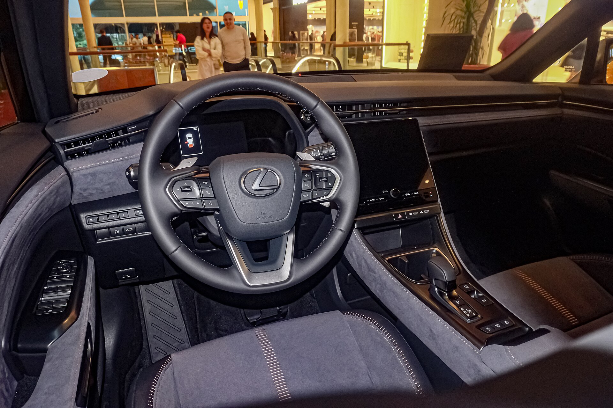

לקסוס LBX מגיעה לישראל ומסמנת מהלך חדש עבור מותג היוקרה של טויוטה: לראשונה מציעה לקסוס קרוסאובר קומפקטי, נגיש ומשתלם יחסית, שמכוון לקהל צעיר יותר שמחפש פרימיום אמין בגודל עירוני. ה-LBX (ראשי תיבות של Lexus Breakthrough Crossover) היא הדגם הקטן והזול ביותר בתולדות המותג, והיא בנויה על בסיס פלטפורמה משותפת עם טויוטה יאריס קרוס — אך עם עיצוב, גימור וחוויית נהיגה שמתיימרים להיות ברמה גבוהה בהרבה.

## מה מיוחד בלקסוס LBX?

החידוש המרכזי הוא הפוזיציה: לקסוס LBX פונה לנהגים שרוצים תג יוקרה יפני אך אינם זקוקים לממדים של NX או RX. באורך של כ-4.19 מטר, מדובר בקרוסאובר קומפקטי במיוחד שמתאים לחניה עירונית, אך מציע תא נוסעים מוקפד עם חומרים איכותיים ותשומת לב לפרטים — סימן ההיכר של המותג.

העיצוב החיצוני נאמן לשפה העדכנית של לקסוס, עם חזית "ספינדל" מרומזת יותר, פנסי לד חדים ומראה שרירי ומודרני. בפנים בולטים מסך מולטימדיה מרכזי, לוח מחוונים דיגיטלי וחומרי ריפוד שנעים למגע.

## מנוע היברידי חסכוני

תחת מכסה המנוע פועלת מערכת היברידית מוכרת וידועה באמינותה: מנוע בנזין בנפח 1.5 ליטר בשילוב מנוע חשמלי, בהספק משולב של סביב 136 כוחות סוס. זו אותה משפחת מערכות שמניעה את דגמי טויוטה ההיברידיים הפופולריים בישראל, מה שמבטיח **צריכת דלק נמוכה במיוחד** — הערכות מדברות על ממוצע משולב באזור 20 קילומטר לליטר ואף מעבר לכך בנהיגה עירונית.

לקסוס LBX אמורה להגיע בעיקר בהנעה קדמית, כאשר בשווקים מסוימים מוצעת גם גרסת הנעה כפולה (E-Four) שמוסיפה מנוע חשמלי בציר האחורי. ההאצה אינה ספורטיבית במיוחד, אך היא חלקה ושקטה — בדיוק מה שקהל היעד מחפש.

## למי מתאימה לקסוס LBX?

הדגם מכוון לזוגות צעירים, למשפחות קטנות ולנהגים עירוניים שמחפשים שדרוג מפלח המשפחתי הרגיל לעבר תווית פרימיום — בלי לקפוץ למחיר של רכב יוקרה גדול. היא מתאימה במיוחד למי שמעריך אמינות יפנית, שירות מוכר בישראל וצריכת דלק נמוכה.

### השוואה לפלח הפרימיום הקומפקטי

| דגם | סוג הנעה | הספק משולב (מוערך) | יתרון בולט |
|---|---|---|---|
| לקסוס LBX | היברידי | כ-136 כ"ס | חסכוניות ואמינות יפנית |
| אאודי Q2 | בנזין/מיילד | כ-110-150 כ"ס | מיתוג גרמני ותחושת נהיגה |
| מיני קאנטרימן | בנזין/היברידי | משתנה | אופי שובב ועיצוב ייחודי |
| וולוו EX30 | חשמלי מלא | גבוה | חשמלי לחלוטין, בטיחות |

## בטיחות וטכנולוגיה

כמו כל דגם לקסוס עדכני, גם ה-LBX מגיעה עם חבילת בטיחות עשירה הכוללת בלימת חירום אוטומטית, ניטור מרחק, בקרת שיוט אדפטיבית, שמירת נתיב וזיהוי הולכי רגל ורוכבי אופניים. מערכת המולטימדיה תומכת ב-Apple CarPlay ו-Android Auto אלחוטיים, ובחיבוריות מקוונת מתקדמת.

חשוב לזכור שבישראל נכנסות בהדרגה דרישות בטיחות מחמירות לרכבים חדשים, ולקסוס נוטה לצייד את דגמיה ברמת אבזור גבוהה כבר בגרסאות הבסיס — יתרון עבור הקונה הישראלי.

## כמה תעלה לקסוס LBX בישראל?

המחיר המדויק ייקבע על ידי יבואנית לקסוס בישראל, אך מדובר בדגם שאמור להיות **הנגיש ביותר** בקטלוג המותג. סביר להניח שהמחיר ימוצב בטווח שמעל הקרוסאוברים המשפחתיים הרגילים, אך מתחת לדגמי לקסוס הגדולים יותר. מי שמחפש כניסה לעולם הפרימיום היפני יקבל כאן הצעה מעניינת, במיוחד לאור ערך השייר הגבוה שמאפיין את המותג בישראל.

בשורה התחתונה, לקסוס LBX היא מהלך אסטרטגי שמנגיש את המותג לקהל רחב יותר, ומציעה שילוב נדיר של יוקרה, חסכוניות ואמינות בגוף קומפקטי שמתאים לכבישים ולחניות של ישראל.
