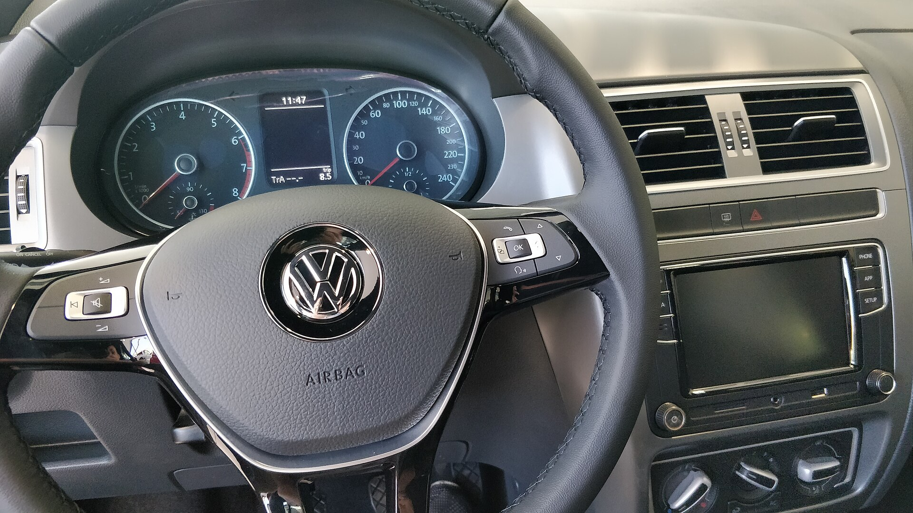

## האם פולקסווגן טיגואן החדש עדיין רלוונטי בישראל?

פולקסווגן טיגואן החדש נותר אחת הבחירות הבטוחות ביותר בקטגוריית הקרוסאוברים המשפחתיים בישראל: הוא מציע נהיגה בוגרת ושקטה, תא נוסעים איכותי ומרחב מטען נדיב, לצד מערך בטיחות עשיר. מי שמחפש רכב משפחתי מאוזן שלא מתפשר על תחושת האיכות — יימצא כאן קרקע פורייה, גם אם המחיר אינו מהזולים בקטגוריה.

הדור החדש שומר על הקווים המוכרים של הטיגואן, אך מזוקק אותם: חזית נקייה יותר, פנסים דקים וגוף שנראה בוגר ומכובד מבלי לצעוק. זהו רכב שמתאים בדיוק לקהל הישראלי שמעדיף אלגנטיות שקטה על פני ראוותנות.

## איך זה מרגיש מאחורי ההגה?

התחושה הראשונה שעולה בנהיגה בפולקסווגן טיגואן החדש היא של בשלות. מתלים שסופגים היטב את מהמורות הכביש הישראלי, הגה מדויק ותחושת יציבות במהירויות גבוהות. בולט במיוחד השקט בתא הנוסעים — בידוד הרעשים מהכביש ומהרוח משופר, מה שהופך נסיעות ארוכות בכביש 6 לנעימות במיוחד.

מנועי הבנזין הטורבו מספקים תאוצה חלקה ומספקת לנהיגה יומיומית, ותיבת ההילוכים האוטומטית של פולקסווגן מתחלפת בצורה רכה. בשווקים נבחרים מוצעות גם גרסאות היברידיות נטענות, שמאפשרות נסיעה עירונית חשמלית לחלוטין למרחקים קצרים.

### נוחות ותא הנוסעים

כאן פולקסווגן ממשיכה להצטיין. החומרים איכותיים, ההרכבה מוקפדת, והמושבים תומכים ונוחים גם בנסיעות ארוכות. המערכת המולטימדיה מבוססת מסך מגע גדול, ולצידה מערכת בקרת אקלים. יש לציין שהמעבר לבקרות מגע במקום כפתורים פיזיים דורש התרגלות, אך פולקסווגן שיפרה את ההיגיון של התפריטים בדור החדש.

מרחב הרגליים במושב האחורי נוח לשלושה נוסעים למרחקים בינוניים, ותא המטען נדיב ומתאים לעגלת תינוק, מזוודות וציוד לטיול משפחתי.

## מה עם בטיחות ומערכות סיוע?

פולקסווגן טיגואן החדש מגיע עם מערך נרחב של מערכות סיוע לנהג: בקרת שיוט אדפטיבית, שמירת נתיב אקטיבית, זיהוי הולכי רגל, בלימת חירום אוטומטית וניטור שטחים מתים. הדגם צבר לאורך השנים דירוגי בטיחות גבוהים במבחני ההתרסקות האירופיים, וזהו יתרון משמעותי עבור משפחות.

## פולקסווגן טיגואן מול המתחרים

כדי להעמיד את הטיגואן בפרספקטיבה, ריכזנו השוואה כללית מול מתחרים מרכזיים בקטגוריית הקרוסאוברים המשפחתיים בישראל:

| דגם | יתרון בולט | קהל יעד |
|------|-----------|---------|
| פולקסווגן טיגואן | איכות גימור ושקט נסיעה | מחפשי בשלות ואיכות |
| סקודה קודיאק | מרחב פנימי ואפשרות 7 מושבים | משפחות גדולות |
| טויוטה ראב4 | אמינות וצריכת דלק היברידית | שמרנים מעשיים |
| קיה ספורטג' | תמורה למחיר ואחריות ארוכה | מוכווני ערך |

## למי מתאים פולקסווגן טיגואן החדש?

הטיגואן החדש מתאים במיוחד למי שמחפש רכב משפחתי אירופי מאוזן, עם דגש על איכות נהיגה ושקט, ומוכן לשלם מעט יותר בעבור התחושה הבוגרת. מי שמחפש את התמורה הגבוהה ביותר למחיר — עשוי למצוא הצעות אטרקטיביות יותר אצל היצרנים הקוריאניים, אך מבחינת בשלות כללית וחוויית נהיגה, הטיגואן נותר שחקן מוביל.

המחיר בישראל מוערך בטווח הביניים-פלוס בקטגוריה, בהתאם לרמת הגימור והמנוע. מומלץ לבדוק את רמות הציוד המדויקות והמחירים העדכניים מול היבואן הרשמי לפני רכישה.
