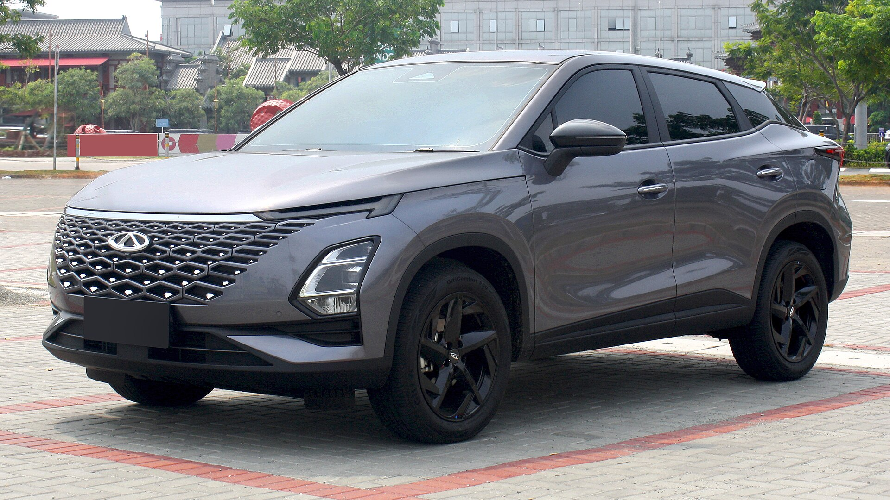

שוק הרכב בישראל עובר בשנים האחרונות שינוי דרמטי, וה**רכבים הסיניים** נמצאים בלב המהפכה. מה שנתפס לפני עשור כניסיון שיווקי שולי הפך למגמה מבוססת: מותגים כמו BYD, צ'רי (Chery), MG ו-Geely נכנסו לטבלאות המכירות המובילות בישראל, כשהם מציעים לצרכן שילוב מנצח של מחיר תחרותי, ציוד עשיר וטכנולוגיה עדכנית. במילים פשוטות — הרכבים הסיניים כבר לא "אלטרנטיבה זולה", הם מתחרים ישירים של השחקנים הוותיקים.

## למה הרכבים הסיניים מצליחים כל כך בישראל?

ההצלחה של הרכבים הסיניים בישראל נשענת על כמה גורמים שמתלכדים יחד. ראשית, **התמחור**: היצרנים הסיניים מציעים לרוב יותר רכב תמורת אותו תקציב — מנוע חזק יותר, מסך גדול יותר ורשימת ציוד בטיחות ונוחות שבעבר הייתה שמורה לדגמי יוקרה.

שנית, **הזמן הנכון**. הכניסה המסיבית של המותגים הסיניים לישראל חפפה למהפכת הרכב החשמלי. יצרנים כמו BYD מגיעים עם ניסיון עשיר בסוללות ובהנעה חשמלית, וזה נותן להם יתרון משמעותי בקטגוריה הצומחת ביותר בשוק.

שלישית, **הזמינות והבשלות של המוצר**. הדגמים הסיניים של היום נראים טוב, נוסעים טוב ומצוידים במערכות מולטימדיה ובטיחות מתקדמות. הפער האיכותי מול המתחרים המסורתיים הצטמצם משמעותית.

## מי המותגים והדגמים הבולטים?

השוק הסיני בישראל מגוון, וכל מותג מכוון לקהל מעט שונה:

- **BYD** — הענקית הסינית שהפכה לאחת מיצרניות הרכב החשמלי הגדולות בעולם. דגמים כמו אטו 3 (Atto 3), הסדאן סיל (Seal) והקומפקטית דולפין (Dolphin) פופולריים במיוחד.
- **צ'רי (Chery)** ומותג הבת **אומודה (Omoda)** — מתמקדים בקרוסאוברים משפחתיים בתמחור אטרקטיבי, עם גרסאות בנזין, היברید וחשמל.
- **MG** — מותג בריטי בבעלות סינית (SAIC), עם היצע רחב מהחשמלית MG4 ועד קרוסאוברים משפחתיים והיברידים נטענים.
- **Geely** — הקבוצה שמאחורי וולוו ופולסטאר, שמביאה גם דגמים תחת המותג שלה.

## השוואה: מה מקבלים מהמותגים הסיניים?

הטבלה הבאה ממחישה את הפוזיציה של הרכבים הסיניים מול קטגוריות מוכרות בשוק (הערכה כללית, לא מחירון מדויק):

| פרמטר | מותגים סיניים | מותגים מסורתיים |
|---|---|---|
| מחיר בסיס | תחרותי מאוד | בינוני-גבוה |
| רמת ציוד סטנדרטי | עשירה מאוד | משתנה לפי גרסה |
| היצע חשמלי | רחב ומתקדם | הולך ומתרחב |
| רשת שירות | בהתרחבות | מבוססת ורחבה |
| שמירת ערך | עדיין נבחנת | מוכחת לאורך שנים |

## מה חשוב לבדוק לפני קנייה?

למרות ההתלהבות, כדאי לגשת לקנייה בעיניים פקוחות. שלושה נושאים ראויים לתשומת לב:

### שירות וחלפים
היבואנים הסיניים בישראל משקיעים בהרחבת מערך השירות, אך זהו מותג צעיר יחסית בשוק. שווה לבדוק את פריסת המוסכים, זמינות החלפים ותנאי האחריות — לרוב אחריות נדיבה של מספר שנים או ק"מ.

### שמירת ערך
זהו אולי הנעלם הגדול. מכיוון שהמותגים חדשים יחסית בישראל, אין עדיין נתוני שמירת ערך ארוכי טווח כמו שיש לטויוטה או יונדאי. מי שמתכנן להחליף רכב תוך שנים ספורות צריך לקחת זאת בחשבון.

### בטיחות
כדאי לבדוק את דירוג הבטיחות במבחני יורו NCAP. חלק ניכר מהדגמים הסיניים החדשים זוכים לדירוגים גבוהים, אך לא כולם — לכן שווה לוודא מול הדגם הספציפי.

## מה צופן העתיד?

המגמה צפויה להתחזק ב-2026 ואילך. עוד מותגים סיניים בוחנים כניסה לישראל, וההיצע — בעיקר בתחום החשמלי וההיברידי — ימשיך להתרחב. עבור הצרכן הישראלי אלו חדשות טובות: יותר תחרות פירושה מחירים נוחים יותר, ציוד עשיר יותר ולחץ על היצרנים הוותיקים לשפר את ההצעה שלהם.

השורה התחתונה: הרכבים הסיניים כבר הוכיחו שהם כאן כדי להישאר. השאלה כבר אינה "האם לשקול" אלא "איזה דגם מתאים לי" — ובחירה מושכלת דורשת השוואה מסודרת בין מחיר, ציוד, שירות ושמירת ערך.
