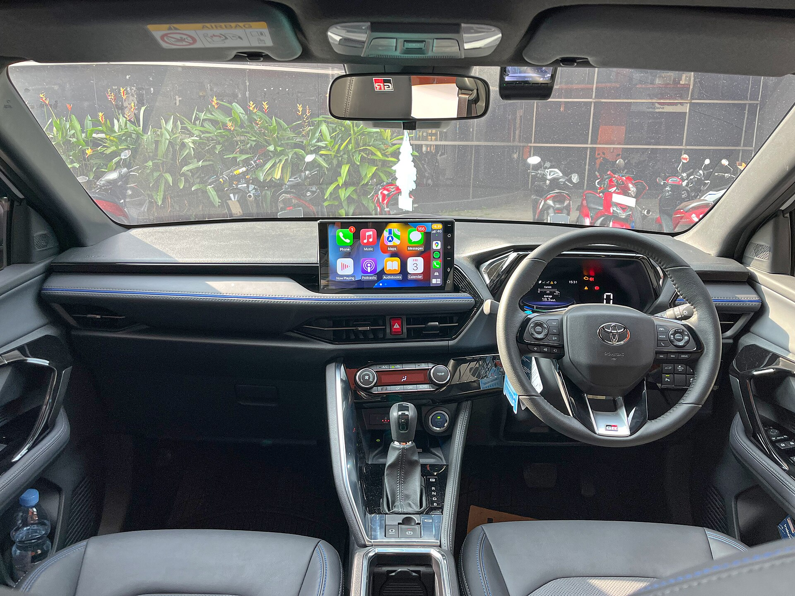

טויוטה יאריס קרוס היברידי היא אחת התשובות המדויקות ביותר לצרכן הישראלי שמחפש קרוסאובר קטן, חסכוני וגבוה מהכביש — בלי לשלם על רכב פנאי גדול ויקר. במבחן הדרך שלנו גילינו רכב שמצטיין דווקא במה שחשוב באמת בישראל: צריכת דלק נמוכה בעיר, נהיגה נינוחה בפקקים ותחושת ביטחון בזכות ישיבה מוגבהת. זה לא רכב ספורטיבי ולא מפלצת כוח, אבל הוא עושה את העבודה בצורה חכמה.

## למי מתאימה טויוטה יאריס קרוס היברידי?

היאריס קרוס מכוונת בדיוק לקהל שגדל בשנים האחרונות בישראל: זוגות צעירים, משפחות קטנות ונהגים שמחליפים סדאן ישנה בקרוסאובר גבוה. מי שמבלה שעות בפקקי גוש דן ייהנה במיוחד מהמערכת ההיברידית, שמאפשרת נסיעה על מנוע חשמלי במהירויות נמוכות וחוסכת דלק משמעותי.

המרחב הפנימי הגיוני לגובה הרכב. מקדימה יש תחושת אוויר נעימה, ומאחור המקום סביר לשני מבוגרים לנסיעות עירוניות ובינוניות. תא המטען מרווח דיו לקניות שבועיות, עגלת תינוק או מזוודות לחופשה זוגית.

## איך נוהגת יאריס קרוס בישראל?

בנהיגה עירונית זהו כלי הבית הטבעי של הרכב. המעבר בין המנוע החשמלי לבנזיני חלק כמעט לחלוטין, והרכב שקט ורגוע. גובה הגחון המוגבה מקל על עלייה על מדרכות ומהמורות, וזווית הראייה הגבוהה נותנת ביטחון בצמתים עמוסים.

בכביש הפתוח היאריס קרוס פחות מרשימה. ההאצות מספקות אך לא יותר מכך, ובעליות תלולות המנוע נשמע. עם זאת, לנסיעות בין-עירוניות רגילות היא נוחה ויציבה, ומערכות הבטיחות של טויוטה עובדות ברקע בצורה טבעית.

### צריכת הדלק — הקלף המנצח

כאן היאריס קרוס באמת זורחת. בנהיגה עירונית מעורבת ניתן להגיע לצריכה מרשימה במיוחד, בטווח שמזכיר רכבים היברידיים גדולים ויקרים בהרבה. גם בנהיגה משולבת עיר-בין-עירוני התוצאות טובות מאוד, מה שהופך אותה לאחת האופציות המשתלמות בתחזוקה שוטפת.

## יתרונות וחסרונות

| נושא | יתרון | חיסרון |
|------|--------|---------|
| צריכת דלק | חסכונית במיוחד בעיר | פחות בולט בכביש מהיר |
| נהיגה | שקטה ונוחה | ביצועים בינוניים בעליות |
| מרחב | תא מטען פרקטי | מושב אחורי מוגבל לגבוהים |
| עלויות | אמינות ותחזוקה זולה | מחיר גבוה מעט מהמתחרים הסיניים |
| טכנולוגיה | מערכות בטיחות מקיפות | מסך מולטימדיה בסיסי בדגמים נמוכים |

## מול המתחרים

בקטגוריה הזו היאריס קרוס מתמודדת מול שחקנים כמו הונדה HR-V, יונדאי קונה וקיה סטוניק, וכן מול גל הקרוסאוברים הסיניים החדשים. היתרון המרכזי של טויוטה הוא שילוב האמינות המוכחת עם המערכת ההיברידית הבשלה, שנחשבת לאחת הטובות והחסכוניות בשוק. מנגד, יצרנים סיניים מציעים לעיתים יותר ציוד ומסכים גדולים תמורת מחיר דומה.

## המחיר בישראל — האם זה משתלם?

מחיר טויוטה יאריס קרוס היברידי בישראל ממצב אותה בטווח התחרותי של הקרוסאוברים הקומפקטיים. היא אינה הזולה ביותר, אך כשמכניסים למשוואה את החיסכון בדלק, ערך המכירה החוזרת הגבוה של טויוטה ואמינות מוכחת — התמונה הכלכלית הכוללת הופכת לאטרקטיבית מאוד לנהג הישראלי הממוצע.

## סיכום

טויוטה יאריס קרוס היברידי אינה מנסה להיות הרכב המרגש ביותר בכביש, אלא הבחירה הפרקטית והחכמה. היא חסכונית, נוחה, אמינה וגבוהה מהכביש — בדיוק מה שרוב הישראלים מחפשים בקרוסאובר קטן. אם אתם מבלים הרבה בעיר ורוצים רכב שיחזיק שנים בלי כאבי ראש, זו אופציה שקשה להתעלם ממנה.
