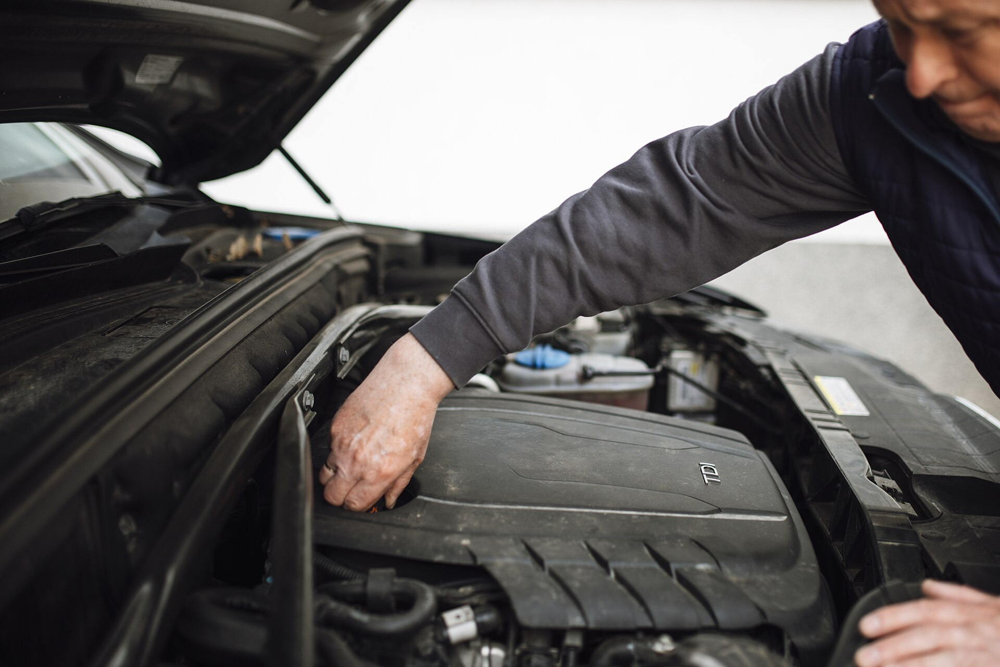

## מה חשוב לבדוק ברכב יד שנייה לפני קנייה?

**בדיקת רכב יד שנייה** נכונה מתחילה הרבה לפני שמגיעים לפגישה: מצליבים את פרטי הרכב, מזמינים דוח היסטוריה, ורק אז בוחנים את הרכב פיזית ובנסיעה. השילוב של בדיקה עצמית חכמה עם בדיקה מקצועית במכון מוסמך הוא הדרך הבטוחה ביותר לוודא שאתם קונים רכב תקין ולא בעיה על ארבעה גלגלים. במדריך הזה נסביר בדיוק על מה להסתכל, אילו סימנים מדליקים נורה אדומה, ואיך לנהל את המשא ומתן בביטחון.

## בדיקת מסמכים והיסטוריה — לפני שנוגעים ברכב

לפני שאתם יוצאים מהבית, בקשו את מספר הרישוי ופרטי הרכב. הצליבו אותם מול מה שמופיע ברשומות הרשמיות ובאפליקציות ההיסטוריה. שימו לב במיוחד ל:

- **מספר בעלים קודמים** — ריבוי בעלויות בזמן קצר יכול לרמז על בעיה חוזרת.
- **בעלות קודמת** — רכב שהיה בבעלות חברת ליסינג או השכרה עבר לרוב שימוש אינטנסיבי.
- **היסטוריית טסטים** — עיכובים או כשלים חוזרים במבחן הרישוי.
- **שעבודים ועיקולים** — ודאו שהרכב נקי מחובות לפני שמעבירים כסף.
- **קילומטראז' הגיוני** — סביב 15 אלף קילומטר בשנה נחשב ממוצע; פער חריג כלפי מטה מחשיד בגלגול מד.

דגמים פופולריים בישראל כמו טויוטה קורולה, יונדאי איוניק, קיה ספורטאז' ומאזדה 3 שומרים בדרך כלל על ערך טוב ועל היסטוריית תחזוקה זמינה — יתרון בבואכם לאמת נתונים.

## בדיקת גוף הרכב — סימנים לתאונה

בחנו את הרכב באור יום ובמזג אוויר יבש. עברו סביב הרכב ובדקו את **אחידות פערי המרווח** בין הדלתות, המכסה והכנף. פערים לא סימטריים מעידים לעיתים על החלפת חלקים לאחר תאונה.

בדקו את **גוון הצבע** מזוויות שונות — הבדל דק בין פנל לפנל מרמז על תיקון. העבירו יד על השוליים הפנימיים של הדלתות ומכסה המנוע: **ברגים עם סימני מפתח** או צבע חדש מסביבם מעידים על פירוק והרכבה. אל תשכחו לבדוק את רצפת תא המטען מתחת לשטיח — חלודה או ריתוכים חדשים הם דגל אדום.

## בדיקת מנוע, נוזלים וצמיגים

פתחו את מכסה המנוע כשהמנוע קר. בדקו:

- **שמן מנוע** — צבע שחור-סמיך במיוחד או מרקם חלבי (עירוב מים) הם בעיה.
- **נוזל קירור ובלמים** — מפלס תקין וללא לכלוך.
- **דליפות** — כתמים מתחת לרכב או שמן על גוש המנוע.
- **חגורות וצינורות** — סדקים או שחיקה.

בצמיגים בדקו את **עומק הסוליה** ובעיקר את **אחידות השחיקה**: שחיקה לא אחידה מרמזת על בעיית כיוונים או מתלים. ודאו שכל ארבעת הצמיגים מאותו סוג ובגיל דומה.

## נסיעת מבחן — החלק הכי חשוב

התעקשו על **נסיעת מבחן אמיתית**, לא סיבוב של דקה ברחוב. התניעו את הרכב כשהוא קר לגמרי — כך תשמעו רעשים שנעלמים כשהמנוע מתחמם.

במהלך הנסיעה שימו לב ל:

- **תאוצה חלקה** ללא היסוסים או רעד.
- **הילוכים** — במרבה אוטומטי מעברים חלקים; בידני חיבור נקי של המצמד.
- **בלימה** — עצירה ישרה ללא משיכה לצד וללא רעד בהגה.
- **הגה** — ללא רעשים בסיבוב מלא וללא סטייה בכביש ישר.
- **מערכות** — מזגן, מולטימדיה, חלונות חשמליים, מצלמת רוורס וחיישנים.

בכביש מהיר בדקו יציבות ורעשי רוח, ובכביש עירוני נסו נסיעה איטית מעל מהמורות כדי לשמוע את המתלים.

## מכון בדיקה — למה זה שווה כל שקל

גם אם הרכב נראה מושלם, **בדיקה במכון מוסמך** היא הביטוח האמיתי שלכם. המכון מרים את הרכב, בודק שלדה, מתלים, מערכות בלימה ומחשב תקלות שאי אפשר לראות בעין. עלות הבדיקה נעה בדרך כלל בטווח של כמה מאות שקלים בלבד — שבריר ממה שתחסכו אם תימנעו מרכב בעייתי. מוכר שמתנגד לבדיקה במכון לבחירתכם — זהו בעצמו סימן אזהרה.

## טבלת סימני אזהרה בבדיקת רכב יד שנייה

| מה שרואים/שומעים | מה זה עלול להעיד | רמת חומרה |
|---|---|---|
| פערי גוון בצבע וברגים חבוטים | תיקון תאונה | גבוהה |
| שמן מנוע חלבי | חדירת מים למנוע | גבוהה מאוד |
| רעד בהגה בבלימה | דיסקים עקומים | בינונית |
| שחיקת צמיגים לא אחידה | בעיית כיוונים/מתלים | בינונית |
| קילומטראז' נמוך חשוד | חשד לגלגול מד | גבוהה |
| נורית ביקורת מנוע דולקת | תקלה פעילה | גבוהה |

## איך מנהלים משא ומתן חכם?

אחרי שאספתם את כל הממצאים, השתמשו בהם כמנוף. כל פגם שאותר — צמיגים שחוקים, בלמים לפני החלפה, טיפול שמתקרב — הוא נקודת מחיר לגיטימית. אל תיכנעו ללחץ של 'יש עוד קונה מחכה'. סבלנות היא הכלי הכי חזק שלכם, וברכב הנכון אתם תרגישו בטוחים גם בלי לחץ.
