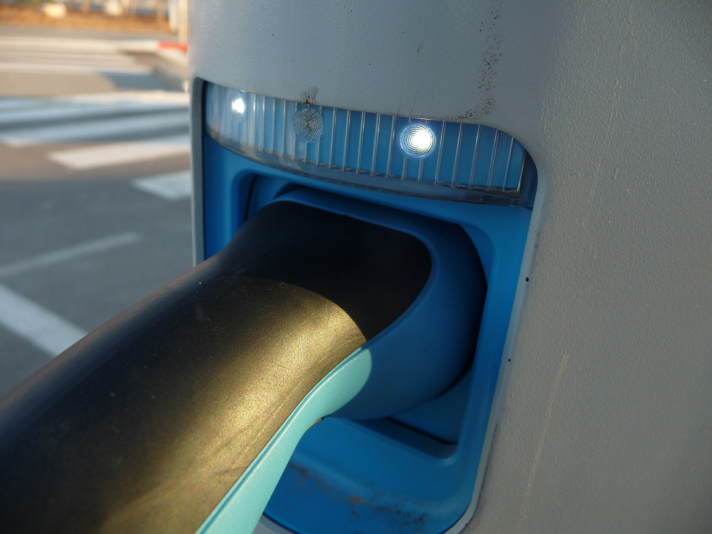

מס הקניה על רכב חשמלי בישראל צפוי לעלות שוב בתחילת שנת 2026, כחלק ממתווה "המיסוי הירוק" ההדרגתי שקבע משרד האוצר. בשורה התחתונה: המחיר הסופי לצרכן של רכב חשמלי חדש צפוי להתייקר, אם כי החשמליים עדיין ייהנו מהטבת מס ניכרת בהשוואה לרכבי בנזין ודיזל. במילים פשוטות — מי ששוקל מעבר לחשמלי כדאי שיבין את לוח הזמנים לפני שהוא חותם.

## מה בעצם משתנה במיסוי?

בשנים האחרונות נהנו רוכבי הרכב החשמלי ממדרגת מס קניה מופחתת במיוחד, שנועדה לעודד מעבר לתחבורה נקייה. במקום שיעור המס הגבוה שחל על רכבי בנזין, החשמליים חויבו בשיעור נמוך משמעותית, לצד תקרת הטבה מוגדרת. מתווה האוצר קובע העלאה מדורגת של שיעור המס מדי שנה, כך שהפער בין חשמלי לבנזין הולך ומצטמצם בהדרגה.

העלייה הצפויה ב-2026 היא המשך ישיר של אותו מתווה. המשמעות המעשית: תוספת של אלפי שקלים ואף עשרות אלפים במחיר הקטלוגי, בהתאם למחיר הבסיס של הדגם ולשוויו.

## כמה זה יעלה בפועל?

חשוב להדגיש — אלה **הערכות כלליות** ולא נתונים סופיים, שכן המחירים המדויקים תלויים ביבואנים, בשער המטבע ובמדיניות שתפורסם רשמית. ככלל, ככל שהרכב יקר יותר, כך התוספת בשקלים גבוהה יותר.

| קטגוריית רכב חשמלי | טווח מחיר משוער היום | השפעה צפויה ב-2026 |
|---|---|---|
| חשמלי קומפקטי (למשל MG4, BYD אטו 3) | כ-130–170 אלף ש"ח | תוספת מתונה של אלפי שקלים |
| חשמלי משפחתי (למשל טסלה מודל 3, יונדאי איוניק 5) | כ-180–230 אלף ש"ח | תוספת בינונית של אלפי עד עשרות אלפים |
| פנאי/פרימיום (למשל טסלה מודל Y, קיה EV9) | כ-230 אלף ש"ח ומעלה | תוספת מורגשת של עשרות אלפי שקלים |

המספרים בטבלה נועדו להמחשה בלבד. הכלל שכדאי לזכור: **המס נקבע לפי מועד השחרור מהמכס ולא לפי מועד ההזמנה**. כלומר, רכב שהוזמן ב-2025 אך ישוחרר בפועל ב-2026 עלול להתחייב במדרגת המס החדשה.

## האם עדיין משתלם לקנות חשמלי?

בהחלט. גם לאחר ההעלאה, רכב חשמלי נהנה משיעור מס קניה נמוך משמעותית בהשוואה לרכב בנזין מקביל. מעבר לכך, יש לזכור את החיסכון התפעולי המצטבר:

- **עלות טעינה** נמוכה בהרבה מעלות דלק, במיוחד בטעינה ביתית בתעריף לילה.
- **תחזוקה מופחתת** — פחות חלקים מתכלים, אין החלפות שמן וסינון תקופתיות מורכבות.
- **מס שנתי (אגרת רישוי)** שנהנה עדיין מהקלות מסוימות.

עם זאת, פער המחיר ההולך ומצטמצם מול רכבים היברידיים הופך את ההשוואה למורכבת יותר. מי שנוסע קילומטראז' גבוה ומטעין בבית ירוויח יותר מהמעבר לחשמלי, בעוד שנהג עירוני קל עשוי למצוא בהיברید פתרון נוח יותר בינתיים.

## למי ההשפעה הגדולה ביותר?

רוכבי דגמי פרימיום ופנאי חשמליים יחושו את ההעלאה בצורה החדה ביותר, פשוט משום שהמס מחושב כאחוז משווי הרכב. לעומתם, קוני החשמליים הקומפקטיים — כמו יונדאי אינסטר, MG4 או BYD דולפין — יספגו תוספת מתונה יחסית, מה שממשיך להפוך את הקטגוריה הזו לאטרקטיבית במיוחד למשפחה השנייה או לנהג הצעיר.

## מה כדאי לעשות עכשיו?

אם אתם ממילא לקראת רכישת רכב חשמלי, שווה לבדוק מול היבואן את מועד המסירה הצפוי ולוודא בכתב לפי איזו מדרגת מס יחויב הרכב. אם המסירה מתעכבת אל תוך 2026, בקשו הבהרה מי סופג את ההפרש. מנגד, אין סיבה להיכנס ללחץ ולקבל החלטה פזיזה — השוק החשמלי בישראל צומח, התחרות עזה, והיבואנים לא אחת מקזזים חלק מעליית המס במבצעים ובהנחות.

בשורה התחתונה: המגמה ברורה — ההטבה מצטמצמת בהדרגה, אך הרכב החשמלי נשאר אופציה כלכלית והגיונית עבור נהגים רבים בישראל.
