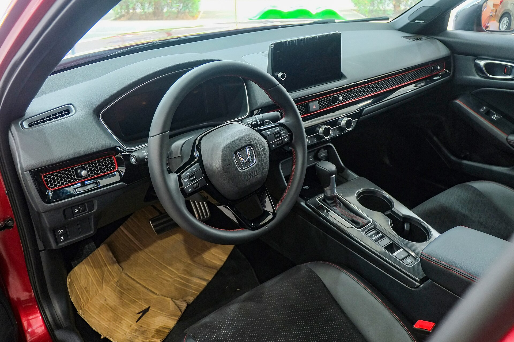

## האם הונדה סיוויק היברידי היא הסדאן החכם לישראלי?

**הונדה סיוויק היברידי** היא אחת ההפתעות הנעימות בשוק הסדאנים היברידיים בישראל: היא מצליחה לשלב אופי נהיגה ספורטיבי ותגובתי עם צריכת דלק חסכנית מאוד, ובכך פונה גם לנהג שמחפש הנאה מאחורי ההגה וגם למשפחה שרוצה חשבון דלק נמוך. לאחר שבוע של נהיגה מעורבת — עיר, בין-עירוני וכביש מהיר — התרשמנו שמדובר באחת האלטרנטיבות המשכנעות ביותר לקורולה המסורתית.

המערכת ההיברידית של הונדה, המכונה e:HEV, פועלת אחרת מהמתחרות: ברוב מצבי הנהיגה המנוע החשמלי הוא זה שמניע את הגלגלים, בעוד מנוע הבנזין משמש בעיקר כמחולל חשמל. התוצאה היא תחושת נהיגה חלקה שמזכירה רכב חשמלי, עם התאוצה הליניארית והשקטה שכל כך מתאימה לפקקים העירוניים בישראל.

## איך היא מרגישה על הכביש?

הדבר הראשון שמורגש הוא היציבות. מרכז הכובד הנמוך והמתלים המכוילים היטב מעניקים לסיוויק אחיזת כביש בטוחה בסיבובים, בלי לוותר על נוחות סבירה בבליעת מהמורות. ההגה מדויק ומספק משוב טוב, מה שהופך את הנהיגה למהנה בכבישים מפותלים כמו עליות הכרמל או דרכי הגליל.

בנהיגה עירונית המערכת ההיברידית באה לידי ביטוי מלא: זינוקים מרמזור נעשים בשקט וברכות, וכאשר לוחצים חזק על דוושת ההאצה המנוע מגיב מהר. בכביש המהיר המנוע יכול להישמע מעט צורמני בהאצות חדות, אך במהירות שיוט קבועה הרעש שכך והנסיעה נעימה.

### צריכת דלק — כמה באמת?

כאן הסיוויק ההיברידית מבריקה. בנהיגה עירונית מעורבת הגענו לצריכה נמוכה במיוחד, ובנסיעה בין-עירונית רגועה הנתונים היו מרשימים גם כן. בפועל, מדובר בטווח צריכה שמתחרה ואף עוקף חלק מהיברידים הפופולריים בשוק, בזכות ניצול יעיל של המנוע החשמלי בעומסים נמוכים.

## מה יש בפנים?

תא הנוסעים של הסיוויק החדשה עשה קפיצת מדרגה מבחינת איכות. הלוח מינימליסטי ונקי, עם רשת מתכת אופקית שמסתירה את פתחי המיזוג ומעניקה תחושה יוקרתית. החומרים נעימים למגע והמכלולים מורכבים בקפדנות.

מערכת המולטימדיה כוללת מסך מגע עם תמיכה באפל קארפליי ואנדרואיד אוטו, ולצידו לוח מחוונים דיגיטלי ברור. מרחב הרגליים מאחור נדיב, ותא המטען מציע נפח מכובד לרכב מהמעמד הזה.

### בטיחות

הסיוויק מגיעה עם חבילת מערכות הבטיחות המקיפה של הונדה, הכוללת בלימה אוטונומית, בקרת שיוט אדפטיבית, שמירת נתיב, זיהוי הולכי רגל והתרעת שטח מת. מדובר במערך עשיר שמעניק ביטחון גבוה בנסיעה יומיומית.

## הונדה סיוויק היברידי מול המתחרות

| פרמטר | הונדה סיוויק היברידי | טויוטה קורולה היברידי | קיה סיד |
|--------|----------------------|------------------------|----------|
| אופי נהיגה | ספורטיבי ותגובתי | מאוזן ונוח | נוח ומשפחתי |
| מערכת הנעה | היברידי e:HEV | היברידי מלא | בנזין/היברידי קל |
| צריכת דלק | חסכנית מאוד | חסכנית מאוד | בינונית |
| איכות פנים | גבוהה | טובה | טובה |
| מרחב פנימי | נדיב | טוב | טוב |

## למי היא מתאימה?

הונדה סיוויק היברידי מתאימה במיוחד לנהג שמחפש רכב משפחתי אחד שגם חסכן וגם מהנה לנהיגה. היא לא מנסה להיות רכב שטח או קרוסאובר גבוה — היא סדאן קלאסי עם אופי דינמי, שמתאים לזוגות ולמשפחות שמעריכות נהיגה איכותית לצד הוצאות תפעול נמוכות.

מי שמחפש בעיקר עמדת ישיבה גבוהה או תא מטען ענק אולי יעדיף קרוסאובר, אך למחפשי האיזון בין ביצועים, חסכון ונוחות — זו אחת ההצעות המשכנעות בשוק כיום.

## סיכום

הונדה סיוויק היברידי מוכיחה שאפשר ליהנות מנהיגה ספורטיבית מבלי לשלם על כך בתחנת הדלק. עם מערכת היברידית מתוחכמת, פנים איכותי ומערך בטיחות עשיר, היא ראויה בהחלט לרשימת ההתלבטות של כל מי ששוקל סדאן היברידי בישראל.
