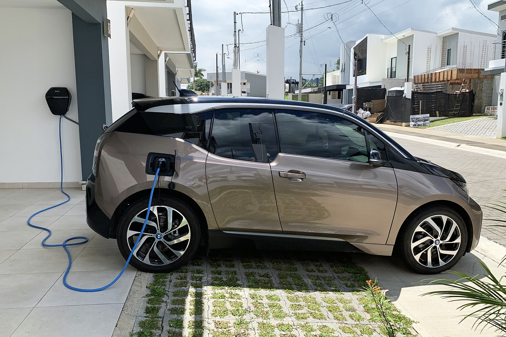

עלות טעינת רכב חשמלי בישראל תלויה כמעט לחלוטין במקום שבו אתם טוענים: טעינה ביתית בשעות הלילה היא הזולה ביותר ויכולה להסתכם בפחות מ-15 אגורות לקילומטר, בעוד שטעינה בעמדה ציבורית מהירה עלולה לעלות פי שלושה עד ארבעה. במילים אחרות — אותו רכב חשמלי בדיוק יכול לעלות לכם כמו רכב בנזין חסכוני, או להיות זול פי כמה, והכול תלוי בהרגלי הטעינה שלכם.

במדריך הזה נפרק את **עלות טעינת רכב חשמלי** לגורמים, נשווה בין האפשרויות ונראה כמה באמת יוצא לכם כל קילומטר בכביש הישראלי.

## כמה חשמל צורך רכב חשמלי?

רוב הרכבים החשמליים הפופולריים בישראל — כמו טסלה מודל 3, יונדאי איוניק 5, קיה EV6 או BYD אטו 3 — צורכים בממוצע בין 15 ל-20 קילוואט-שעה לכל 100 קילומטר. בנהיגה עירונית מתונה הצריכה נמוכה יותר, ובנהיגה מהירה בכביש בין-עירוני או בחורף הקר היא עולה.

לשם המחשה: אם הרכב שלכם צורך 17 קילוואט-שעה ל-100 ק"מ, ואתם נוסעים כ-1,500 ק"מ בחודש, תצרכו כ-255 קילוואט-שעה בחודש. עכשיו נותר רק לחשב כמה עולה כל קילוואט-שעה — וכאן מתחיל ההבדל הגדול.

## טעינה ביתית: האפשרות הזולה ביותר

טעינה בבית באמצעות עמדת קיר (wallbox) היא הדרך החסכונית ביותר. תעריף החשמל הביתי הרגיל בישראל נע סביב 60 אגורות לקילוואט-שעה (כולל מע"מ), אך מי שמצטרף למסלול תעריף לילה (למשל בשעות 23:00–07:00) יכול לשלם פחות משמעותית עבור אותה טעינה.

בהנחת תעריף לילה, כל 100 ק"מ עשויים לעלות כ-8-12 שקלים בלבד — כלומר סביב 10 אגורות לקילומטר. זה החלום של כל בעל רכב חשמלי, וזו גם הסיבה שהתקנת עמדה ביתית משתלמת לרוב תוך זמן קצר יחסית.

### טיפ לחוסכים

הגדירו את הרכב או את העמדה לטעון אוטומטית רק בשעות תעריף הלילה. כך תבטיחו שהמכונית מלאה בבוקר, מבלי לשלם את התעריף היקר של שעות היום.

## עמדות ציבוריות: נוחות שעולה כסף

עמדות הטעינה הציבוריות בישראל מתחלקות לשתי קבוצות עיקריות: עמדות איטיות (AC) ועמדות מהירות (DC). העמדות המהירות, שמאפשרות למלא סוללה בעשרות דקות, הן גם היקרות ביותר — התעריפים בהן עשויים לנוע סביב 1.8-2.5 שקלים לקילוואט-שעה ואף יותר בשעות שיא.

משמעות הדבר: טעינה מהירה בכביש עלולה להעלות את עלות הקילומטר לכ-35-45 אגורות — קרוב לעלות של רכב בנזין. עבור מי שנוסע בעיקר בעיר ומסתמך על עמדות מהירות, היתרון הכלכלי של הרכב החשמלי מצטמצם מאוד.

## טבלת השוואה: עלות לפי סוג טעינה

הטבלה הבאה ממחישה את ההבדלים עבור רכב הצורך כ-17 קילוואט-שעה ל-100 ק"מ (ההערכות מקורבות ונתונות לשינויי תעריף):

| סוג טעינה | מחיר משוער לקוט"ש | עלות ל-100 ק"מ | עלות משוערת לק"מ |
|---|---|---|---|
| ביתית בתעריף לילה | כ-0.5-0.6 ₪ | כ-8-11 ₪ | כ-8-11 אגורות |
| ביתית תעריף רגיל | כ-0.6 ₪ | כ-10-12 ₪ | כ-10-12 אגורות |
| ציבורית איטית (AC) | כ-1-1.5 ₪ | כ-17-25 ₪ | כ-17-25 אגורות |
| ציבורית מהירה (DC) | כ-1.8-2.5 ₪ | כ-30-42 ₪ | כ-30-42 אגורות |

## אז כמה זה יוצא בחודש?

נחזור לדוגמה של 1,500 ק"מ בחודש. מי שטוען כמעט תמיד בבית בתעריף לילה ישלם בערך 120-165 שקלים לחודש על ה"דלק". לעומתו, מי שנשען בעיקר על עמדות מהירות עלול לשלם 450-600 שקלים — פער של מאות שקלים על אותה נסיעה בדיוק.

האסטרטגיה המנצחת עבור רוב הישראלים היא **טעינה ביתית כברירת מחדל**, ושימוש בעמדות מהירות רק בנסיעות ארוכות או במקרי חירום. כך נהנים גם מהחיסכון וגם מהנוחות.

## מה עם מי שאין לו חניה פרטית?

זו נקודת התורפה הגדולה. דיירי בניינים משותפים ללא אפשרות להתקין עמדה עלולים למצוא את עצמם תלויים בעמדות ציבוריות יקרות. במקרים כאלה כדאי לבדוק:

- **מנויים חודשיים** של חברות הטעינה, שמוזילים את התעריף.
- עמדות **AC איטיות** בקרבת מקום העבודה או הבית, הזולות מהמהירות.
- הסדרי טעינה **בחניוני מקומות עבודה**, שלעיתים מסובסדים.

## שורה תחתונה

רכב חשמלי בישראל יכול להיות זול מאוד לתפעול — אבל רק אם משחקים נכון. ההבדל בין טעינה ביתית חכמה לבין הישענות על עמדות מהירות הוא ההבדל בין חיסכון משמעותי לבין עלות שמתקרבת לרכב דלק. לפני שקונים חשמלית, שווה לבדוק בכנות: איפה תטענו את רוב הזמן?
