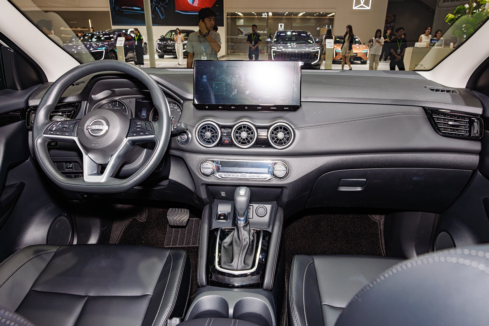

## מהי בעצם ניסאן קשקאי e-POWER?

ניסאן קשקאי e-POWER היא פרשנות שונה ומעניינת למונח "היברид". בניגוד להיברידים המוכרים של טויוטה, כאן מנוע הבנזין **לעולם אינו מניע את הגלגלים ישירות** — תפקידו היחיד הוא לייצר חשמל שמזין מנוע חשמלי, וזה מה שמניע את הרכב בפועל. התוצאה היא חוויית נהיגה שמרגישה כמעט חשמלית לחלוטין, אך בלי הצורך לחבר את הרכב לשקע אי פעם.

עבור הקהל הישראלי, שמתלבט בין רכב היברידי לחשמלי מלא, ניסאן קשקאי e-POWER מציעה מעין דרך ביניים: תחושת נהיגה חשמלית, ללא חרדת טווח וללא תלות בעמדות טעינה.

## איך זה מרגיש על הכביש?

הדבר הראשון שמורגש הוא השקט. בזינוק ובנסיעה עירונית איטית הרכב נע על החשמל בלבד, בשקט כמעט מוחלט. ההאצה מיידית וחלקה, בלי "קפיצות" של תיבת הילוכים, פשוט כי אין כזו במובן המסורתי. בכביש מהיר, כשנדרש כוח נוסף, מנוע הבנזין נכנס לפעולה כדי להטעין את הסוללה הקטנה — ולעיתים מורגש רעש מנוע מעט מנותק מהמהירות בפועל, מאפיין ידוע של המערכת.

מערכת ההיגוי מדויקת והמתלים מכוילים לנוחות מעל ספורטיביות — בדיוק מה שמשפחה ישראלית מחפשת בנסיעות יומיומיות ובכבישים המחוררים שלנו.

### מצב e-Pedal

כמו ברכבים חשמליים, קשקאי מציעה נהיגה בדוושה אחת. שחרור דוושת ההאצה גורם להאטה משמעותית ולבלימה מתחדשת שמחזירה אנרגיה לסוללה. אחרי כמה ימי הרגלות, זו הופכת לדרך הנהיגה המועדפת בעיר.

## צריכת דלק: מה קורה בפועל בישראל?

כאן טמון היתרון המרכזי. בנהיגה עירונית שקטה בדקנו צריכה סביב **18–20 קילומטר לליטר**, נתון מרשים לקרוסאובר בגודל הזה. בנסיעה בין-עירונית מהירה הצריכה יורדת מעט, שכן דווקא שם מנוע הבנזין עובד קשה יותר — בניגוד לרכב בנזין רגיל שחסכן יותר בכביש פתוח.

## תא הנוסעים והמערכות

הפנים של קשקאי החדשה עשו קפיצת מדרגה. החומרים איכותיים, מסך המולטימדיה המרכזי גדול וברור, ולוח מחוונים דיגיטלי לנהג. יש חיבוריות אלחוטית לטלפון, מערכת שמע טובה ותאורת אווירה נעימה.

מבחינת מרחב — הרגליים מאחור נדיבות, ותא המטען מתאים לצרכים משפחתיים כולל טיולים וקניות שבועיות. הישיבה הגבוהה יחסית מעניקה תחושת ביטחון ושליטה בכביש.

## בטיחות

ניסאן קשקאי מגיעה עם חבילת מערכות בטיחות עשירה הכוללת בלימה אוטומטית, ניטור נקודות מתות, שמירת נתיב, בקרת שיוט אדפטיבית ומערכת ProPILOT לנהיגה חצי-אוטונומית בכביש מהיר. הדגם זכה בעבר לדירוגים גבוהים במבחני הבטיחות האירופיים.

## טבלת השוואה: קשקאי e-POWER מול מתחרים

| פרמטר | ניסאן קשקאי e-POWER | טויוטה קורולה קרוס היברידי | קיה ספורטאז' היברידי |
|---|---|---|---|
| סוג הנעה | חשמלי עם מחולל בנזין | היברידי מקבילי | היברידי מקבילי |
| תחושת נהיגה | חשמלית ושקטה | חלקה ומאוזנת | דינמית |
| צריכה עירונית (הערכה) | 18–20 קמ"ל | 20–22 קמ"ל | 16–18 קמ"ל |
| גודל | קרוסאובר קומפקטי | קרוסאובר קומפקטי | קרוסאובר משפחתי |
| טעינה חיצונית | לא נדרשת | לא נדרשת | לא נדרשת |

## למי זה מתאים?

ניסאן קשקאי e-POWER מתאימה במיוחד למי שמבלה חלק ניכר מזמנו בנהיגה עירונית, מחפש חוויית נהיגה חשמלית ושקטה, אך אינו מוכן להתמודד עם טעינה חיצונית או חרדת טווח. זהו פתרון ביניים חכם עבור נהגים ישראלים רבים.

מצד שני, מי שנוסע בעיקר בכבישים מהירים בין-עירוניים ארוכים עשוי לגלות שהיתרון בצריכה מצטמצם, ואולי ימצא היברידי מקבילי קלאסי כמו של טויוטה משתלם יותר.

## שורה תחתונה

ניסאן קשקאי e-POWER היא הצעה מרעננת ומעניינת בשוק הקרוסאוברים הישראלי. היא מצליחה להביא את היתרונות של נהיגה חשמלית — שקט, חלקות והאצה מיידית — בלי החסרונות של טעינה. המחיר מעט גבוה מגרסת הבנזין הרגילה, אך למי שמחפש נוחות וחיסכון עירוני, זו עסקה שכדאי לשקול ברצינות.
