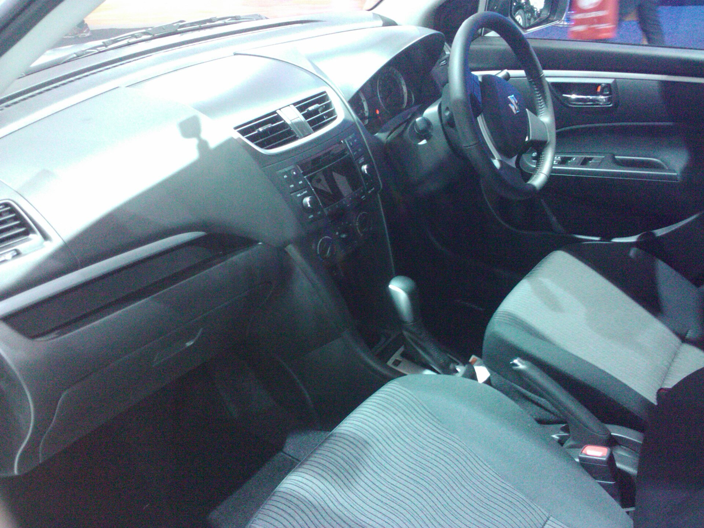

## מה חדש בסוזוקי סוויפט החדשה?

סוזוקי סוויפט החדשה מגיעה לישראל ומביאה איתה דור חדש לחלוטין של אחד הרכבים העירוניים הפופולריים בשוק המקומי. השילוב המרכזי הוא מנוע בנזין קטן וחסכוני בשלושה צילינדרים המשולב במערכת היברид רך (Mild Hybrid), שנועדה לצמצם את צריכת הדלק ולשפר את התגובתיות בנהיגה עירונית. התוצאה: רכב קליל, זריז ומשתלם שממשיך את המסורת של המשפחה — אך עם עדכון טכנולוגי משמעותי.

המעבר לדור החדש אינו רק קוסמטי. סוזוקי עבדה על שיפור היעילות האווירודינמית, הפחתת משקל והכנסת מערכות בטיחות מתקדמות כבר בדגמי הבסיס. הכל תוך שמירה על מה שהפך את הסוויפט לאהובה: מידות קומפקטיות שמתאימות לחניה בעיר, נהיגה שובבה ותחזוקה זולה יחסית.

## מנוע ומערכת ההיברид הרך

בלב הדגם החדש עומד מנוע בנזין בנפח כליטר וחצי (בקירוב), בעל שלושה צילינדרים, המחובר למערכת היברид רך המבוססת על מחולל-מתנע חכם ומצבר קטן. בניגוד להיברید מלא, המערכת אינה מניעה את הרכב באופן עצמאי, אך היא מסייעת למנוע בעת ההאצה, מייעלת את מערכת ה-Start/Stop ומאפשרת גלישה חסכונית.

היתרון המורגש ביותר הוא בצריכת הדלק. סוזוקי מצהירה על ערכים נמוכים במיוחד, שהופכים את הסוויפט לאחת מהחסכוניות בקטגוריה — נתון קריטי לנהג הישראלי לנוכח מחירי הדלק. בתיבת ההילוכים צפויה להיות זמינה תיבה ידנית לצד תיבה אוטומטית מסוג CVT, בהתאם לרמת הגימור.

## עיצוב ופנים

העיצוב החיצוני מעודכן אך שומר על קווי המתאר המוכרים של הסוויפט: גג משופע, ידיות דלת אחוריות מוסתרות בעמוד וקדמת רכב חדה יותר. הפנים קיבלו שדרוג משמעותי בדגש על מסך מולטימדיה מרכזי צף, לוח מחוונים דיגיטלי חלקי ואיכות חומרים משופרת מעט ביחס לדור הקודם.

חשוב לומר — זהו עדיין רכב עירוני קומפקטי, כך שנפח תא המטען ומרווח הרגליים במושב האחורי מתאימים בעיקר לזוגות, סטודנטים ומשפחות קטנות. עבור מי שמחפש רכב ראשון או רכב שני למשק בית, זוהי חבילה מדויקת.

## בטיחות ומערכות עזר לנהג

אחד השיפורים הבולטים בדור החדש הוא הכללת מערכות בטיחות מתקדמות (ADAS) כבר כבסיס. בין המערכות הצפויות: בלימת חירום אוטומטית, שמירת נתיב, בקרת שיוט אדפטיבית וזיהוי הולכי רגל. שדרוג זה חשוב במיוחד לאור הדרישות הרגולטוריות המחמירות בישראל ובאירופה, והוא מקרב את הסוויפט לרמת הבטיחות של רכבים גדולים ויקרים יותר.

## סוזוקי סוויפט מול המתחרות

הקטגוריה של הסופרמיני בישראל תחרותית ביותר. כך נראית הסוויפט החדשה מול היריבות הבולטות שלה:

| דגם | הנעה | יתרון בולט | קהל יעד |
|------|--------|-------------|-----------|
| סוזוקי סוויפט | בנזין + היברид רך | חסכוניות ומשקל קל | נהג עירוני מחפש חיסכון |
| טויוטה יאריס | היברид מלא | אמינות וצריכה נמוכה | קונה שמרן |
| יונדאי i20 | בנזין | ציוד עשיר וגימור | מחפש תמורה מלאה |
| קיה פיקנטו | בנזין | מחיר כניסה נמוך | רכב ראשון/שני |

היתרון של הסוויפט טמון באיזון: היא זריזה ומהנה לנהיגה יותר מרוב יריבותיה, שומרת על משקל נמוך, ומציעה חסכוניות מרשימה — גם אם היא אינה היברید מלא כמו טויוטה יאריס.

## מחיר וזמינות בישראל

המחיר המדויק ורמות הגימור עדיין כפופים לעדכוני היבואן, אך בהתאם למיצוב ההיסטורי של הדגם, הסוויפט צפויה להישאר בטווח המחירים התחרותי של הרכבים העירוניים בישראל. סוזוקי נהנית בישראל מנאמנות לקוחות גבוהה ומרשת שירות רחבה, מה שמחזק את הכדאיות שבבעלות ארוכת טווח.

עבור מי שמחפש רכב עירוני חסכוני, אמין ומהנה לנהיגה — סוזוקי סוויפט החדשה היא בהחלט מועמדת ראויה לבדיקה בקטגוריה שלה.
