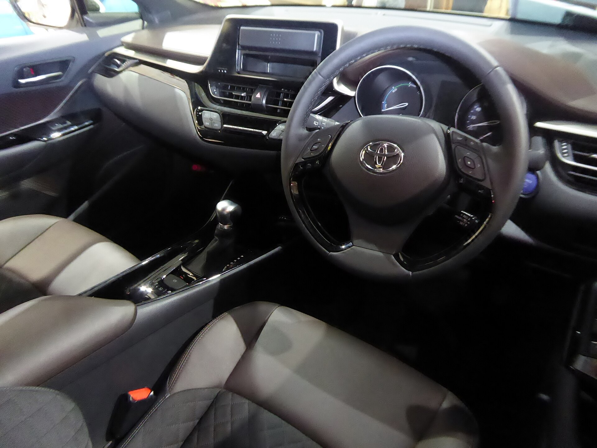

## מה מייחד את טויוטה C-HR החדש?

טויוטה C-HR החדש הוא אחד הקרוסאוברים הקומפקטיים המסקרנים שהגיעו לישראל, והוא ממשיך את הקו העיצובי הנועז שהפך את הדגם לסמל סטייל כבר בדור הראשון. הפעם טויוטה חידדה את הקווים, הוסיפה מערכת היברידית מעודכנת ושדרגה משמעותית את חוויית הפנים. התשובה הקצרה: זהו רכב שמדבר קודם כל אל מי שמחפש עיצוב יוצא דופן וחסכוניות גבוהה, ופחות אל מי שזקוק למרחב פנימי מקסימלי.

הדור החדש בנוי על פלטפורמת TNGA המוכרת של טויוטה, שמעניקה נוקשות מבנית טובה, מרכז כובד נמוך ותחושת נהיגה יציבה יותר מהממוצע בקטגוריה.

## עיצוב חיצוני שממשיך לשבור מוסכמות

גם בדור השני, C-HR נשאר אחד הרכבים הנועזים בכביש. קווי הגוף החדים, הפנסים המחודדים והגג היורד יוצרים צללית קופה-קרוסאובר שקשה להישאר אליה אדיש. ידיות הדלתות האחוריות מוסתרות בעמוד, מה שמחזק את המראה הדו-דלתי המתעתע.

מבחינת מידות מדובר ברכב קומפקטי באורך של כ-4.36 מטר, שמתאים היטב לחניה עירונית ולנהיגה בעיר צפופה.

## איך זה מרגיש מבפנים?

תא הנוסעים עשה קפיצת מדרגה לעומת הדור הקודם. איכות החומרים השתפרה, לוח המחוונים דיגיטלי, ובמרכז מוצב מסך מגע גדול עם מערכת מולטימדיה מעודכנת התומכת ב-Apple CarPlay ו-Android Auto אלחוטיים.

החיסרון הבולט הוא המרחב האחורי. הגג המשופע פוגע במרווח הראש, והחלונות הקטנים יוצרים תחושה סגורה יחסית לנוסעים מאחור. תא המטען בנפח של כ-360 ליטר סביר לזוג או משפחה קטנה, אך לא יותר מכך.

## המערכת ההיברידית — הלב של C-HR

כאן טויוטה עושה את מה שהיא יודעת הכי טוב. המערכת ההיברידית המשולבת מספקת האצה חלקה ושקטה במיוחד בנהיגה עירונית, כשהמנוע החשמלי נכנס לפעולה בעומסים נמוכים והמנוע הבנזיני מצטרף בעת הצורך.

במבחן שלנו רשמנו צריכת דלק חסכונית מאוד בנהיגה מעורבת, בטווח שסביב 20 ק"מ לליטר — נתון מרשים לקרוסאובר. בכביש מהיר החיסכון פחות דרמטי, אך עדיין תחרותי מאוד. קיימת גם גרסת היברид נטען למי שמחפש נסיעה חשמלית טהורה לטווח קצר.

### נהיגה וכביש

C-HR אינו מתיימר להיות רכב ספורטיבי, אך המתלים המכוילים היטב מספקים איזון נעים בין נוחות ליציבות. ההגה מדויק, וגוף הרכב נשאר מרוסן בפניות. בנסיעה עירונית ובין-עירונית זו חוויה שקטה, נעימה וללא מאמץ.

## טבלת השוואה: C-HR מול מתחרים

| פרמטר | טויוטה C-HR היברידי | טויוטה קורולה קרוס | קיה סטוניק |
|---|---|---|---|
| סוג הנעה | היברידי | היברידי | בנזין/מיקרו-היברידי |
| נפח תא מטען | כ-360 ליטר | כ-430 ליטר | כ-350 ליטר |
| אופי | עיצובי-ספורטיבי | משפחתי-פרקטי | עירוני חסכוני |
| חסכוניות | גבוהה מאוד | גבוהה מאוד | בינונית-גבוהה |
| מרחב אחורי | מוגבל | מרווח | סביר |

## בטיחות וטכנולוגיה

טויוטה מציידת את C-HR בחבילת מערכות הבטיחות Toyota Safety Sense, הכוללת בלימת חירום אוטומטית, בקרת שיוט אדפטיבית, שמירת נתיב וזיהוי הולכי רגל ורוכבי אופניים. זהו יתרון משמעותי בקטגוריה, שממצב את הרכב היטב גם מבחינת דירוגי בטיחות.

## למי מתאים טויוטה C-HR החדש?

הרכב מתאים במיוחד לזוגות, ליחידים ולמשפחות קטנות שמחפשים רכב עם נוכחות ויזואלית חזקה, חסכוניות גבוהה ואמינות מוכרת של טויוטה. מי שזקוק למרחב אחורי גדול או לתא מטען נדיב יעדיף כנראה את קורולה קרוס או קרוסאובר משפחתי אחר.

בשורה התחתונה, טויוטה C-HR החדש מציע חבילה מאוזנת של סטייל, טכנולוגיה וחיסכון — ובלבד שמקבלים את המגבלות של תא הנוסעים בתמורה לעיצוב הייחודי.
