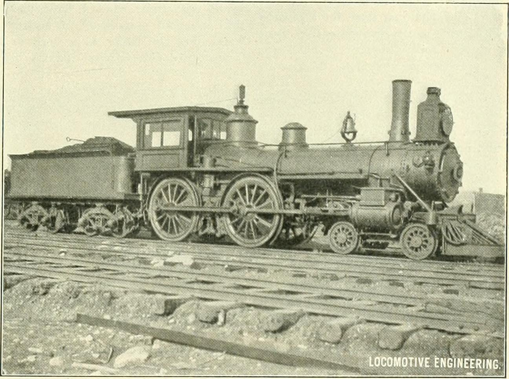

רעשים חשודים ברכב הם למעשה השפה שבה המכונית מדברת אתכם — וברוב המקרים היא מנסה להזהיר מבעוד מועד. צפצוף בבלימה, נקישה במהמורה או שריקה מהמנוע אינם גזירת גורל, אלא סימנים שמאפשרים לתקן תקלה קטנה לפני שהיא הופכת ליקרה ומסוכנת. במדריך הזה נפרק את הרעשים הנפוצים ביותר לפי מקור, ונסביר מתי אפשר להמתין ומתי חובה לגשת למוסך.

## למה חשוב להקשיב לרכב?
מכונית מודרנית מתוכננת לעבוד בשקט יחסי. כשמופיע רעש חדש שלא היה שם קודם, זו כמעט תמיד אינדיקציה לבלאי או לתקלה מתפתחת. הישראלים נוטים להתעלם מרעשים קטנים בגלל העומס בכבישים ורעשי הרקע, אבל דווקא זיהוי מוקדם חוסך כסף רב. הכלל הפשוט: **רעש חדש שמלווה בשינוי בתחושת הנהיגה — עצירה, היגוי או האצה — הוא תמיד דחוף**.

## רעשי בלמים: הצפצוף הכי מוכר
מערכת הבלמים היא המקור השכיח ביותר לרעשים חשודים ברכב, וגם המסוכן ביותר להזנחה.

- **צפצוף חד וגבוה בבלימה**: לרוב חיישן הבלאי ברפידות מסמן שהגיע הזמן להחליף. זהו סימן מכוון שמזהיר לפני שהרפידה נגמרת.
- **חריקה מתכתית או שריטה**: אם הרפידות נשחקו לגמרי, המתכת משפשפת את הדיסק — מצב שמחייב טיפול מיידי ועלול לפגוע בדיסקים ולייקר את התיקון.
- **רעד ברגל בזמן בלימה**: לרוב דיסקים מעוותים שדורשים חידוד או החלפה.

רפידות בלמים הן פריט מתכלה, ותדירות ההחלפה תלויה בסגנון הנהיגה — בנהיגה עירונית צפופה הן נשחקות מהר יותר.

## רעשי מתלים והיגוי: נקישות במהמורות
אם אתם שומעים **נקישה מתכתית** כשעוברים מהמורה או פס האטה, ההימור הראשון הוא מערכת המתלים או מערכת ההיגוי. הגורמים הנפוצים:

- תותבים (בושים) בלויים בזרועות
- מוטות מייצב או קצוות הגה עם משחק
- בולם זעזועים דולף שאיבד את יכולת הבלימה

רכב שמתנדנד יותר מדי אחרי מהמורה, או שההגה מרגיש "רופף", מאותת על בלאי במתלים. זו אינה תקלה שנעלמת מעצמה, והיא משפיעה ישירות על יציבות הרכב ומרחק הבלימה.

## רעשי מנוע: שריקות, תקתוקים ורעמים
חדר המנוע יכול להשמיע מגוון רעשים, וכל אחד מהם מספר סיפור אחר:

- **שריקה מתגברת עם התאוצה**: לרוב רצועת אביזרים רופפת או בלויה. החלפה פשוטה שמונעת תקלות חשמל וקירור.
- **תקתוק מטרונומי מהיר**: ייתכן חוסר שמן או בלאי במנגנון ההנעה של השסתומים — סימן לבדוק מיד את מפלס השמן.
- **רעם עמום מאזור הפליטה**: אפשר שיש נזילה במערכת האגזוז או אטם שנשחק.

עם רכבים היברידיים כמו טויוטה קורולה או יונדאי איוניק, כדאי לזכור שהמעבר בין מנוע חשמלי לבנזין מלווה לעיתים ברעשים תקינים לחלוטין — לכן חשוב להכיר את "קול הרקע" הרגיל של הרכב שלכם.

## טבלת אבחון מהיר: איזה רעש, מה המשמעות

| הרעש | מתי הוא מופיע | המקור הסביר | דחיפות |
|------|---------------|--------------|---------|
| צפצוף חד | בבלימה | רפידות בלמים שחוקות | בינונית-גבוהה |
| חריקה מתכתית | בבלימה | רפידות גמורות, פגיעה בדיסק | גבוהה |
| נקישה | במהמורות | מתלים או מוטות היגוי | גבוהה |
| שריקה | בהאצה | רצועת אביזרים | בינונית |
| המהום מונוטוני | בנסיעה קבועה | מיסבי גלגל (רולמנים) | גבוהה |
| תקתוק מהיר | בסרק ובנסיעה | מפלס שמן נמוך / שסתומים | גבוהה |

## רעש גלגלים: ההמהום שמתגבר עם המהירות
המהום מונוטוני שמתחזק ככל שמאיצים, ולעיתים משתנה בפניות, מצביע בדרך כלל על **מיסב גלגל (רולמן) בלוי**. זו תקלה שמתדרדרת בהדרגה ועלולה בסופו של דבר לגרום לנעילת גלגל. אם ההמהום מלווה ברעד בהגה, ייתכן גם חוסר איזון בגלגלים או צמיג שחוק בצורה לא אחידה.

## מתי אפשר להמתין ומתי לרוץ למוסך?
הכלל המנחה: אם הרעש **מלווה בשינוי בהתנהגות הרכב** — בלימה חלשה, היגוי לא יציב, נורית אזהרה בלוח או ריח חריג — אל תמתינו. גשו למוסך באותו יום. רעש קל שמופיע רק במצבים מסוימים וללא כל שינוי אחר בנהיגה מאפשר בדרך כלל להמתין לביקורת הקרובה, אך עדיף לתעד אותו (מתי, באיזו מהירות, בקור או בחום) כדי לעזור לטכנאי לאבחן במהירות.

בשורה התחתונה, הקשבה לרכב היא הכלי הזול והיעיל ביותר לתחזוקה מונעת. רעש קטן שמטופל בזמן חוסך תיקונים גדולים ושומר על הבטיחות שלכם ושל הנוסעים.
