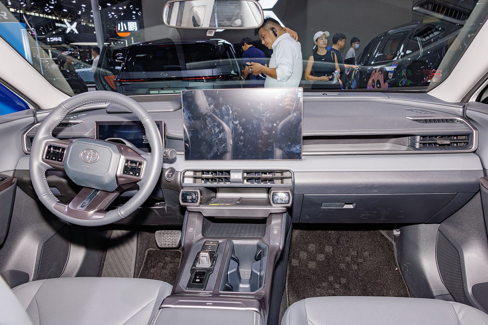

טויוטה חשפה רשמית את **טויוטה RAV4 2026** — הדור השישי של אחד הקרוסאוברים הנמכרים בעולם ובישראל. הבשורה המרכזית ברורה: כל גרסאות הדגם החדש יהיו היברידיות, ללא מנוע בנזין "רגיל" בלבד, במקביל לגרסת היברید נטען חזקה ומשופרת. עבור הקונה הישראלי, שכבר אימץ את RAV4 כאחד הרכבים המשפחתיים האהובים, מדובר בחדשות משמעותיות.

## מה חדש בטויוטה RAV4 2026?

הדור החדש מביא עיצוב חיצוני עדכני יותר, עם חזית חדה, פנסים דקים בטכנולוגיית לד ומראה כללי שרירי ומודרני. טויוטה שמרה על הפרופיל המשפחתי המוכר, אך חידדה קווים רבים כדי להעניק לרכב נוכחות עכשווית יותר על הכביש.

בתא הנוסעים מגיע השדרוג הבולט ביותר: **מערכת מולטימדיה חדשה** עם מסך מרכזי גדול, ממשק מהיר ותומך בעדכונים אלחוטיים. לוח המחוונים הדיגיטלי החליף כמעט לחלוטין את השעונים האנלוגיים, והחיבוריות לטלפון (אפל קארפליי ואנדרואיד אוטו אלחוטיים) הפכה לסטנדרט.

### מערכת ההנעה — הכל היברידי

השינוי המהותי ביותר הוא בליבו של הרכב. הדור החדש נשען כולו על מערכות היברידיות:

- **היברид רגיל (עצמי-טעינה):** משלב מנוע בנזין עם מנוע חשמלי, ללא צורך בטעינה מחוץ לבית — בדיוק כפי שהישראלים אוהבים.
- **היברид נטען:** גרסה משודרגת עם סוללה גדולה יותר וטווח נסיעה חשמלי מורחב, שמאפשר נסיעות יומיומיות רבות ללא הפעלת מנוע הבנזין.

טויוטה מבטיחה תגובה מהירה יותר, צריכת דלק חסכונית והספק כולל גבוה מהדור הקודם. הנתונים המדויקים לגרסאות שיגיעו לישראל טרם פורסמו רשמית, אך הכיוון ברור — יותר כוח לצד יעילות משופרת.

## טבלת השוואה: הדור החדש מול הדור הקודם

| פרמטר | RAV4 דור קודם | טויוטה RAV4 2026 |
|---|---|---|
| מערכת הנעה | היברידי / היברид נטען | היברידי בלבד (כולל נטען משודרג) |
| מסך מולטימדיה | בינוני | גדול, ממשק חדש ומהיר |
| לוח מחוונים | חלקי דיגיטלי | דיגיטלי מלא |
| עיצוב חיצוני | מרובע-שרירי | חד ומודרני יותר |
| טווח חשמלי (נטען) | מוגבל | מורחב |

## למה זה חשוב לשוק הישראלי?

ישראל היא אחד השווקים שבהם RAV4 מככב בטבלאות המכירות של קטגוריית הקרוסאוברים המשפחתיים. המעבר לגרסאות היברידיות בלבד מתאים במדויק להעדפות הישראליות — צריכת דלק נמוכה, אמינות גבוהה ותחזוקה נוחה יחסית, ללא חרדת טווח או תלות בעמדות טעינה.

גרסת **היברید נטען** עשויה להפוך לאטרקטיבית במיוחד עבור מי שרוצה נסיעות עירוניות חשמליות ברובן, אך עדיין מעוניין בגמישות של מנוע בנזין לנסיעות ארוכות. עם זאת, המיסוי על גרסאות אלו ומדיניות המחירים של יבואנית טויוטה בישראל יקבעו עד כמה הן ישתלמו בפועל.

### מתי הדגם יגיע לישראל?

על פי ההערכות, טויוטה RAV4 2026 צפוי להגיע לישראל במהלך שנת 2026, בהתאם ללוחות הזמנים של ההשקה הגלובלית ולהיצע הרכבים. **מחירים רשמיים טרם פורסמו**, ומקובל שהיבואן יחשוף אותם סמוך למועד ההשקה המקומית. בהתחשב במגמת השוק, סביר שהדגם ימוקם בטווח המחירים של הקרוסאוברים המשפחתיים המובילים.

## שורה תחתונה

טויוטה RAV4 2026 ממשיך את הנוסחה שהפכה את הדגם ללהיט — מרחב פנימי נדיב, אמינות ידועה וכלכליות — ומוסיף לה עיצוב רענן, טכנולוגיה מתקדמת ומעבר מלא לעולם ההיברידי. עבור המשפחה הישראלית, מדובר באחד הדגמים המעניינים לעקוב אחריהם לקראת 2026.
