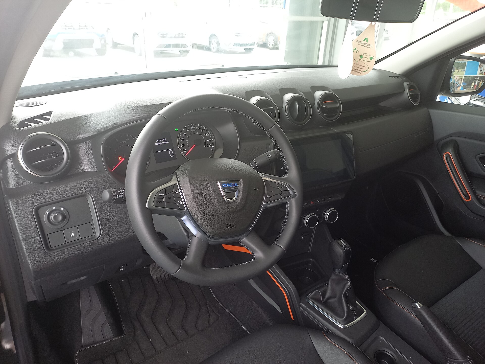

## מה הופך את דאצ'יה דאסטר החדש למעניין כל כך?

**דאצ'יה דאסטר** בגרסתו החדשה הוא אחת ההפתעות הגדולות בשוק הישראלי: קרוסאובר משפחתי עם מראה קשוח, יכולת שטח אמיתית ומחיר שממשיך להיות מהנמוכים בקטגוריה. אם אתם מחפשים רכב גבוה, מרווח ופרקטי מבלי לשלם על תג פרימיום — הדאסטר החדש הוא בדיוק התשובה. הדור הזה מבוסס על פלטפורמה מודרנית ומשותפת עם רנו, ומרגיש בוגר ומגובש יותר מכל קודמיו.

## עיצוב חיצוני: קשוח אבל מעודכן

המעצבים העניקו לדאסטר החדש שפה עיצובית נקייה יותר, עם פנסי לד בצורת האות Y, קווים זוויתיים וקשתות גלגלים רחבות שמשדרות נוכחות שטח. המראה גברי ופרקטי, בלי להתאמץ להיראות יוקרתי — וזה בדיוק החן שלו. הפרשי הגובה מהקרקע מרשימים, מה שמאפשר לו להתמודד עם דרכי עפר, מכבשים ושבילים לא סלולים בקלות יחסית.

## איך זה מרגיש מבפנים?

תא הנוסעים עבר שדרוג ניכר. הפלסטיק עדיין קשיח ברובו, אך הרכבה טובה יותר, המסך המרכזי גדול וברור, ומערכת המולטימדיה תומכת בחיבור אלחוטי לטלפון. יש שפע מקום לרגליים במושב האחורי ותא מטען נדיב שמתאים למשפחה עם עגלה, ציוד קמפינג או קניות שבועיות.

החוויה כאן פונקציונלית לחלוטין: כפתורים פיזיים לבקרת האקלים (יתרון גדול על פני מסכי מגע), ידיות אחיזה נוחות ופתרונות אחסון חכמים. זה לא רכב שמפנק, אבל הוא לא מתיימר להיות כזה.

## מנוע וביצועים: מה מניע את הדאסטר?

הגרסה המרכזית מגיעה עם מנוע **בנזין טורבו** קטן נפח משולב במערכת **מיקרו-היברید** של 48 וולט, שמסייעת בחיסכון בדלק ובהאצות ראשוניות חלקות יותר. מדובר בהנעה שקטה יחסית ומספקת לנהיגה עירונית ובין-עירונית, גם אם היא לא מתיימרת לספורטיביות.

למחפשי יכולת שטח אמיתית קיימת גם גרסת הנעה כפולה, שהופכת את הדאסטר לאחד הרכבים המשתלמים ביותר עם יכולת אופרוד רצינית בקטגוריה. צריכת הדלק המשולבת מוערכת כחסכונית, בעיקר בזכות מערכת המיקרו-היברید והמשקל הנמוך יחסית של הרכב.

## בטיחות: מה כלול?

הדור החדש מגיע עם חבילת מערכות בטיחות משופרת הכוללת בלימת חירום אוטומטית, ניטור נתיב, זיהוי הולכי רגל ובקרת שיוט. חשוב לבדוק מול היבואן אילו מערכות כלולות בכל רמת גימור, שכן בדגמי הכניסה חלק מהמערכות עשויות להיות אופציונליות.

## טבלת השוואה: דאצ'יה דאסטר מול מתחרים

| פרמטר | דאצ'יה דאסטר | סוזוקי ויטרה | קיה סטוניק |
|---|---|---|---|
| קטגוריה | קרוסאובר קומפקטי | קרוסאובר קומפקטי | קרוסאובר קטן |
| הנעה | קדמית / כפולה | קדמית / כפולה | קדמית |
| מערכת חשמלית | מיקרו-היברید | מיקרו/היברید | מיקרו-היברید |
| יכולת שטח | גבוהה | בינונית-גבוהה | נמוכה |
| מיצוב מחיר | נמוך מאוד | בינוני | בינוני |
| נפח תא מטען | נדיב | בינוני | בינוני |

## למי הדאסטר החדש מתאים?

הדאסטר מתאים למשפחות שמחפשות **ערך מרבי לכסף**: רכב גבוה, מרווח ואמין שלא ירוקן את החשבון. הוא אידיאלי לחובבי טיולים בשטח, לנהגים צעירים שרוצים רכב ראשון גדול, ולכל מי שמעדיף פרקטיות על פני יוקרה.

לעומת זאת, מי שמחפש חוויית נהיגה ספורטיבית, גימור פנים עשיר או שקט אקוסטי ברמת פרימיום — כדאי שיסתכל על מתחרים יקרים יותר.

## שורה תחתונה

דאצ'יה דאסטר החדש מוכיח שאפשר לקבל רכב שטח פרקטי, מודרני ומאובזר סבירות במחיר שפוי במיוחד. הוא לא מנסה להיות משהו שהוא לא — וזו בדיוק הסיבה שהוא כל כך מצליח. אם התקציב מוגבל אבל הצרכים גדולים, קשה למצוא הצעה משתלמת ממנו בשוק הישראלי.
