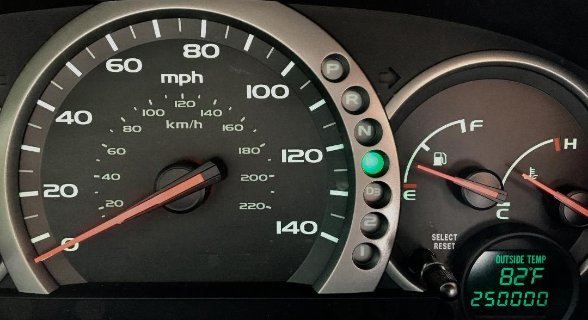
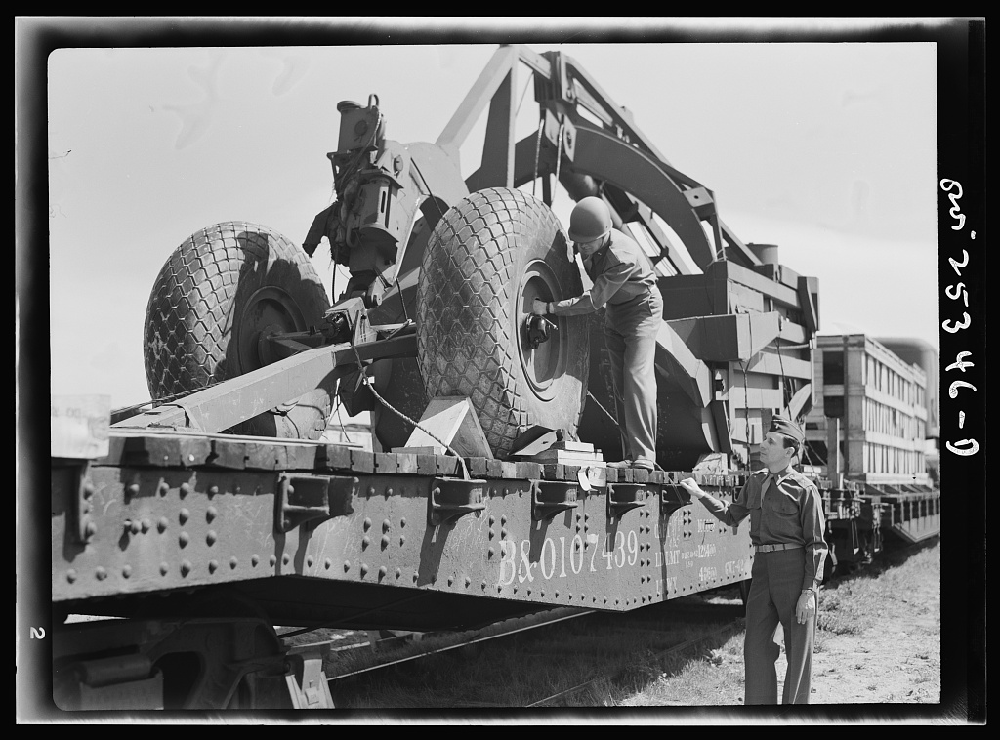

מחירי הדלק בישראל נשארים גבוהים, ולכל נהג יש דרכים פשוטות להוריד את ההוצאה. **חיסכון בדלק** מתחיל בשינוי הרגלי נהיגה קטנים ובתחזוקה נכונה — ואפשר להגיע בקלות להפחתה של 10% עד 20% בצריכה, בלי להחליף רכב ובלי לוותר על נוחות. ריכזנו עבורכם עשרה טיפים פרקטיים שעובדים על כל רכב, מבנזין ועד היברид.

## למה חשוב לחשוב על חיסכון בדלק?

משפחה ישראלית ממוצעת נוסעת בין 15,000 ל-20,000 קילומטר בשנה. הפרש של אחוזים בודדים בצריכת הדלק מצטבר למאות שקלים בשנה. הבשורה הטובה: רוב הטיפים לא עולים דבר, ורבים מהם גם מאריכים את חיי הרכב ומשפרים את הבטיחות.

## עשרה טיפים לחיסכון בדלק

### 1. נהגו ברוגע ובאחידות
האצות אגרסיביות ובלימות פתאומיות הן האויב הגדול של החיסכון. שמירה על מהירות אחידה, שחרור מוקדם של דוושת הגז לפני צומת והאצה מתונה יכולים לחסוך עד כחמישית מהדלק בנהיגה עירונית.

### 2. שמרו על לחץ אוויר תקין בצמיגים
צמיג עם לחץ נמוך מגדיל את התנגדות הגלגול ומעלה את הצריכה. בדקו לחץ אחת לחודש ולפני נסיעה ארוכה, לפי ההמלצה שמופיעה במדבקה בעמוד הדלת של הנהג.

### 3. הורידו משקל מיותר
כל קילוגרם עודף בתא המטען משפיע. פרקו ציוד שאינכם צריכים, והורידו מדף גג או תא אחסון חיצוני כשאינו בשימוש — הם פוגעים באווירודינמיקה יותר מכפי שנדמה.

### 4. השתמשו במזגן בתבונה
במהירות עירונית נמוכה, פתיחת חלון עדיפה לעיתים על המזגן. במהירות גבוהה בכביש מהיר, דווקא חלונות פתוחים מגבירים את גרר האוויר — ואז המזגן חסכוני יותר.

### 5. הימנעו מסרק מנוע מיותר
התנעה מחדש חסכונית יותר מהשארת המנוע דולק בסרק במשך דקות ארוכות. אם יש לרכב מערכת סטרט-סטופ אוטומטית — אל תכבו אותה.

### 6. תכננו מסלול חכם
ימבוקים, סטיות ופקקים שורפים דלק. שימוש באפליקציית ניווט לבחירת המסלול הזורם ביותר, וריכוז מספר סידורים בנסיעה אחת במקום כמה יציאות קצרות, מקטינים משמעותית את הצריכה.

### 7. תחזקו את המנוע
פילטר אוויר סתום, מצתים בלויים או שמן ישן גורמים למנוע לעבוד קשה יותר. הקפידו על טיפולים לפי ספר הרכב — זו ההשקעה שמחזירה את עצמה בדלק.

### 8. הרימו את הרגל בכביש המהיר
צריכת הדלק עולה בחדות ככל שהמהירות גבוהה יותר. נהיגה ב-100 קמ"ש במקום 120 קמ"ש יכולה לחסוך אחוזים ניכרים בנסיעה בין-עירונית ארוכה.

### 9. השתמשו בשליטת שיוט
בכביש פתוח וישר, בקרת השיוט שומרת על מהירות אחידה ומונעת תנודות שמעלות צריכה. בכבישים גבעתיים לעומת זאת, נהיגה ידנית ורגישה עדיפה.

### 10. שקלו שדרוג לדגם חסכוני
אם אתם ממילא לפני החלפת רכב, דגמים היברידיים כמו טויוטה קורולה או יונדאי טוסון היברید חוסכים דרמטית בנסיעה עירונית לעומת מנוע בנזין רגיל.

## כמה באמת אפשר לחסוך? טבלת השוואה

| פעולה | השפעה משוערת על הצריכה | עלות ליישום |
|-------|------------------------|-------------|
| נהיגה רגועה ואחידה | חיסכון של עד 20% | ללא עלות |
| לחץ אוויר תקין | חיסכון של 2%-3% | ללא / זניחה |
| הורדת מדף גג פנוי | חיסכון של 2%-5% | ללא עלות |
| הורדת מטען עודף | חיסכון של 1%-2% | ללא עלות |
| תחזוקה שוטפת | חיסכון של 4%-10% | עלות טיפול |

## שגיאות נפוצות שמבזבזות דלק

רבים ממלאים דלק "עד הסוף" ומעמיסים את הרכב, נוסעים עם צמיגים לא מנופחים, או מתעלמים מנורית אזהרה שמעידה על תקלה. גם שימוש קבוע בהילוך נמוך מדי במהירות גבוהה מעלה סרק ומבזבז דלק. תשומת לב קטנה לפרטים האלה עושה הבדל גדול בסוף החודש.

המסקנה פשוטה: **חיסכון בדלק** אינו דורש רכב חדש או טכנולוגיה יקרה — אלא הרגלים נכונים ותחזוקה עקבית. שילוב של כמה מהטיפים כאן יכול להחזיר לכיס שלכם מאות שקלים בשנה, ותוך כדי כך גם להאריך את חיי הרכב.
