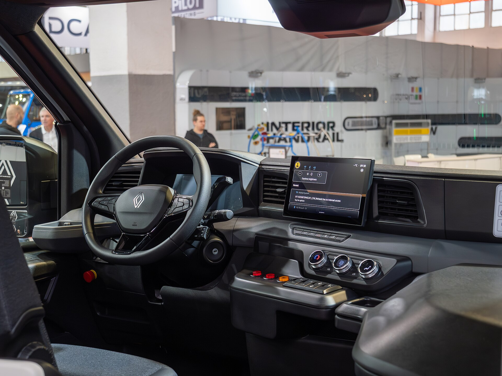

רנו 5 החשמלית מגיעה לישראל ומביאה איתה משב רוח מרענן: עירונית חשמלית קומפקטית עם עיצוב רטרו שמצדיע לדגם האגדי משנות ה-70 וה-80, אך עם טכנולוגיה חדישה לחלוטין. מדובר באחת ההשקות המעניינות של השנה בקטגוריית החשמליות הקטנות, והיא מכוונת ישירות אל הקונה הישראלי שמחפש רכב עירוני חסכוני, מעוצב ובמחיר הגיוני.

## למה רנו 5 החשמלית מעניינת את השוק הישראלי?

השוק הישראלי צמא לרכבים חשמליים קטנים ומשתלמים, ובדיוק לתוך הפער הזה נכנסת **רנו 5 החשמלית**. בניגוד לחשמליות גדולות ויקרות, כאן מדובר ברכב שנבנה מהיסוד לחיי היומיום העירוניים — קל לתמרון, נוח לחניה, וזול יחסית לתחזוקה ולטעינה. העיצוב הרטרו, עם הפנסים המרובעים והקווים החדים, הופך אותה לאחת החשמליות המזוהות והמדוברות ביותר כרגע באירופה.

## מה הטווח והביצועים הצפויים?

רנו 5 החשמלית מוצעת באירופה בשתי אפשרויות סוללה עיקריות. הגרסה הבסיסית מציעה טווח צנוע יותר המתאים בעיקר לנסיעות עירוניות, בעוד הגרסה עם הסוללה הגדולה יותר מכוונת לטווח של כ-**300 עד 400 קילומטרים** בתקן הבדיקה האירופי WLTP. בפועל, בנהיגה ישראלית ובמזג אוויר חם, הטווח האמיתי צפוי להיות נמוך מעט מהמספרים הרשמיים — כפי שקורה בכל רכב חשמלי.

מבחינת הנעה, מדובר בהספק שנע בין כ-95 כוחות סוס בגרסה הבסיסית ועד מעל 150 כוחות סוס בגרסאות המובילות — יותר מספיק לעירונית זריזה. הטעינה המהירה מאפשרת מילוי הסוללה מ-15 ל-80 אחוזים בפרק זמן קצר יחסית, מה שהופך גם נסיעות בין-עירוניות לאפשריות בתכנון סביר.

## עיצוב פנים וטכנולוגיה

תא הנוסעים משלב מודרניות עם נגיעות נוסטלגיה. במרכז לוח המחוונים בולטים שני מסכים דיגיטליים — אחד לנהג ואחד למערכת המולטימדיה — הכוללים תמיכה במערכת ההפעלה של גוגל עם ניווט, עוזר קולי ואפליקציות מובנות. החומרים איכותיים יחסית לקטגוריה, והעיצוב הפנימי משדר אווירה צעירה ועליזה.

## רנו 5 החשמלית מול המתחרות

העניין האמיתי מתחיל כשמשווים את רנו 5 החשמלית למתחרותיה בשוק הישראלי. מול הגל הסיני החזק ומול היצרנים הקוריאנים, האם לרנו יש קלף מנצח?

| דגם | מקור | טווח משוער (WLTP) | יתרון בולט |
|------|-------|------------------|-------------|
| רנו 5 החשמלית | צרפת | כ-300-400 ק"מ | עיצוב רטרו וזהות מובחנת |
| יונדאי אינסטר | קוריאה | כ-300-355 ק"מ | מרחב פנים ואמינות |
| BYD דולפין | סין | כ-340-420 ק"מ | מחיר תחרותי וציוד עשיר |
| פיאט 500e | איטליה | כ-320 ק"מ | קסם עירוני איטלקי |

היתרון הגדול של רנו 5 הוא **הזהות העיצובית הייחודית**. בעוד רבות מהמתחרות נראות דומות, הרנו בולטת בכל צומת. מנגד, המתחרות הסיניות והקוריאניות עדיין מובילות לרוב במחיר ובהיקף הציוד הסטנדרטי.

## מתי מגיעה ובכמה?

המחיר המדויק בישראל טרם פורסם רשמית במלואו, אך על פי הצפוי, רנו 5 החשמלית תמוקם כאחת החשמליות **האירופיות הנגישות** ביותר בשוק. חשוב לזכור כי מס הקנייה על רכבים חשמליים בישראל ממשיך לעלות בהדרגה, ולכן מומלץ לעקוב אחר העדכונים הרשמיים של יבואנית רנו לגבי המחיר הסופי ומועד ההגעה המדויק לתצוגות.

## למי היא מתאימה?

רנו 5 החשמלית מתאימה במיוחד למי שמחפש רכב שני למשפחה, לזוגות צעירים בעיר, או לכל מי שרוב הנסיעות שלו הן קצרות ועירוניות. אם אתם זקוקים לרכב לנסיעות ארוכות ותכופות בין-עירוניות, ייתכן שגרסת הסוללה הגדולה תתאים יותר — או שכדאי לשקול דגם עם טווח גדול יותר. בסופו של דבר, מדובר ברכב שמצליח לחבר בין רגש, פרקטיות וכלכליות בצורה נדירה.
