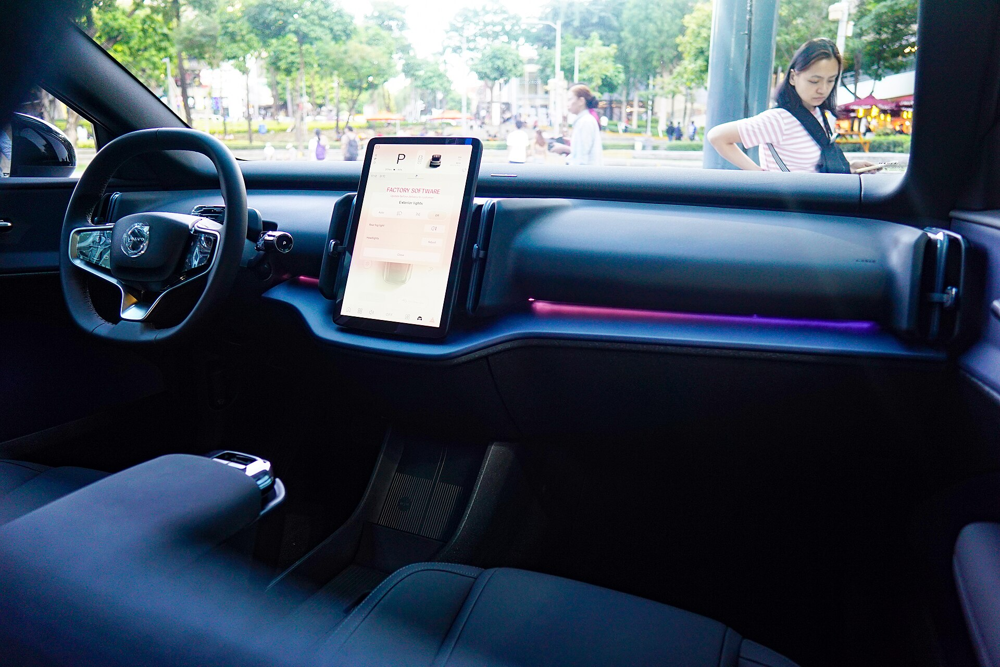

## מה מייחד את וולוו EX30 בשוק החשמליות?

וולוו EX30 היא החשמלית הקטנה והמשתלמת ביותר של המותג השוודי, והיא מגיעה לישראל כדי להתמודד על אחד הנתחים החמים בשוק — קרוסאוברים חשמליים קומפקטיים במחיר נגיש יחסית. מדובר ברכב שמצליח לשמר את זהות המותג — בטיחות, איכות בנייה ועיצוב סקנדינבי נקי — בגוף קטן שמתאים במיוחד לעיר הישראלית הצפופה, אך גם מסוגל לצאת לדרך בין-עירונית ללא חשש.

המידות הקומפקטיות (אורך של כ-4.23 מטר) הופכות את החניה בתל אביב או בירושלים למשימה פשוטה, בעוד המרווח הפנימי מפתיע לטובה עבור נהג ונוסע קדמי. במושב האחורי המצב סביר לשני מבוגרים, אך פחות נדיב בקטגוריה.

## טווח וצריכה: מה קורה בפועל בישראל?

וולוו EX30 מוצעת בכמה תצורות סוללה והנעה. הגרסה עם הטווח הארוך יותר מצהירה על כ-450-480 ק"מ במחזור הבדיקה האירופי, בעוד גרסאות בסיסיות נעות סביב 340-400 ק"מ. כמו בכל רכב חשמלי, המספרים בפועל נמוכים מהמוצהר.

בנהיגה מעורבת בכבישי ישראל, בתנאי מזג אוויר נעימים, מדדנו **צריכה של כ-15-17 קילוואט-שעה ל-100 ק"מ**, שמתורגמת לטווח מעשי של כ-330-400 ק"מ בהתאם לגרסה ולסגנון הנהיגה. בקיץ הישראלי, עם מיזוג פועל במלוא העוצמה, הצריכה עולה והטווח יורד — תופעה מוכרת בכל החשמליות.

מבחינת טעינה, הרכב תומך בטעינה מהירה בזרם ישר שמאפשרת מעבר מ-10% ל-80% בכ-25-30 דקות בעמדה מהירה מתאימה. לטעינה ביתית מומלצת עמדת קיר (ווֹלבּוקס) שתשלים טעינה מלאה בין לילה.

## ביצועים: קטנה עם אגרוף

כאן EX30 מפתיעה באמת. גרסת הביצועים הדו-מנועית מפתחת הספק גבוה ומאיצה מ-0 ל-100 קמ"ש בכ-**3.6 שניות** — מספר שמשייך אותה למועדון הספורטיבי ומביך רכבים יקרים בהרבה. גם הגרסאות החד-מנועיות מספקות תאוצה חלקה ומיידית שמתאימה מצוין לנסועה עירונית ולעקיפות בין-עירוניות.

ההגה מדויק, מרכז הכובד הנמוך (הודות לסוללה ברצפה) מעניק תחושת יציבות בפניות, והמתלים מכוונים לפשרה נוחה בין נוחות לספורטיביות. בכבישים משובשים מורגשת מעט קשיחות, אבל לא במידה מטרידה.

## פנים הרכב והמולטימדיה

תא הנוסעים של וולוו EX30 הוא תרגיל במינימליזם. וולוו ויתרה על לוח מחוונים מול הנהג, וכל המידע — כולל מהירות, ניווט ובקרת הרכב — מרוכז ב**מסך מרכזי אנכי** בגודל של כ-12.3 אינץ'. הגישה מבוססת על מערכת הפעלה של גוגל עם ניווט מובנה, חנות אפליקציות ועוזר קולי.

יש שיאהבו את הפשטות ואת החומרים הממוחזרים והאיכותיים, אך אחרים עשויים להתקשות בהיעדר תצוגה ישירה מול הנהג ובריבוי הפעולות שדורשות מגע במסך. פס תאורה ורמקול פנורמי מעל מסך המולטימדיה מוסיפים תחושת פרימיום.

תא המטען קטן יחסית (כ-320 ליטר), אך קיים גם תא אחסון קדמי קטן (פראנק) לכבלי הטעינה.

## בטיחות — הדנ"א של וולוו

כצפוי ממותג שבנה את שמו על בטיחות, EX30 מגיעה עמוסה במערכות סיוע לנהג: בלימת חירום אוטונומית, שמירת נתיב, בקרת שיוט אדפטיבית, זיהוי הולכי רגל ורוכבי אופניים, וניטור נקודות מתות. הרכב זכה לדירוג בטיחות גבוה במבחני יורו NCAP.

## טבלת השוואה: וולוו EX30 מול המתחרות

| פרמטר | וולוו EX30 | טסלה מודל 3 | סקודה אניאק |
|---|---|---|---|
| קטגוריה | קרוסאובר קומפקטי | סדאן משפחתי | קרוסאובר משפחתי |
| טווח מוצהר (מרבי) | כ-480 ק"מ | כ-510 ק"מ | כ-560 ק"מ |
| האצה 0-100 (גרסת ביצועים) | כ-3.6 שניות | כ-4.4 שניות | כ-6.5 שניות |
| גודל | קומפקטי (4.23 מ') | בינוני (4.72 מ') | גדול (4.65 מ') |
| אופי | עירוני-ספורטיבי | טכנולוגי-ביצועי | משפחתי-מרווח |

## למי מתאימה וולוו EX30?

וולוו EX30 מתאימה במיוחד למי שמחפש **חשמלית קומפקטית ואיכותית** לשימוש עירוני ופרברי, מעריך עיצוב ובטיחות, ומוכן להתפשר על גודל תא המטען והמושב האחורי. הנהג הבודד או הזוג ייהנו ממנה יותר ממשפחה גדולה.

מצד שני, מי שזקוק למרווב פנימי גדול, לתא מטען נדיב או ללוח מחוונים מסורתי — כדאי שישקול חלופות כמו סקודה אניאק או קיה EV6.

## סיכום

וולוו EX30 היא כניסה מרשימה של וולוו לזירת החשמליות הקומפקטיות. היא משלבת עיצוב מזמין, ביצועים מפתיעים, רמת בטיחות גבוהה וחווית נהיגה נעימה בגוף שמתאים לכביש הישראלי. אם המידות והמסך היחיד לא מרתיעים אתכם — זו אחת ההצעות המעניינות בקטגוריה.
