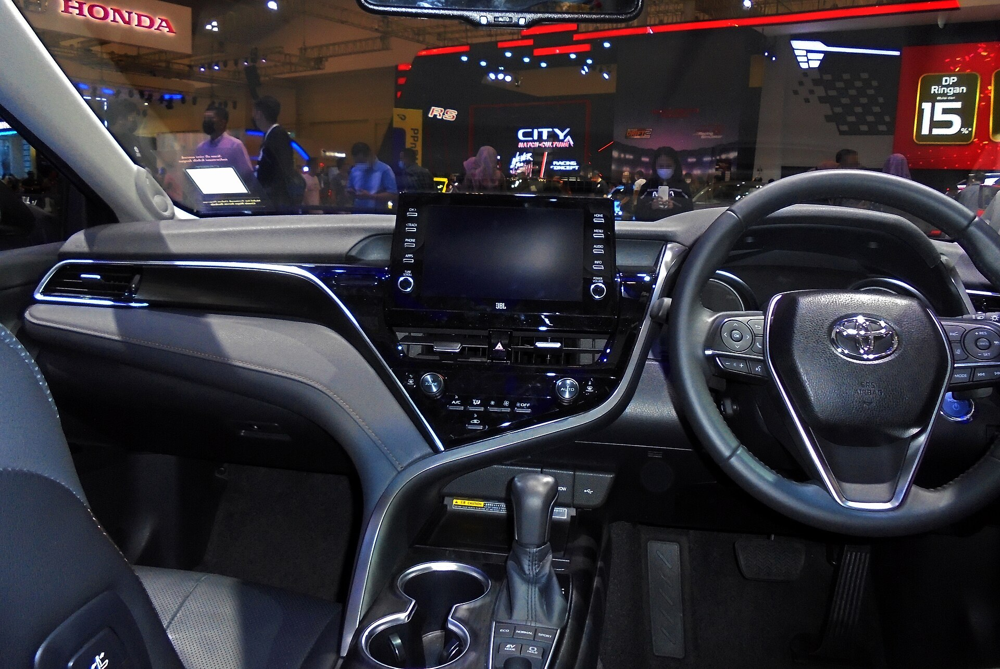

טויוטה קאמרי היברידי היא תזכורת נעימה לכך שסדאן גדול, שקט וחסכן עדיין יכול להיות בחירה חכמה — גם בשוק שנשלט על ידי קרוסאוברים. מדובר בסדאן משפחתי מרווח עם מערכת הנעה היברידית בשלה, שמציעה צריכת דלק נמוכה, נהיגה חלקה ותחזוקה שקטה לאורך שנים. במבחן הדרך שלנו התרשמנו שהקאמרי לא מנסה לרגש, אלא פשוט לעשות הכול נכון.

## מה מייחד את טויוטה קאמרי היברידי?

הקאמרי בנויה סביב עיקרון אחד: נוחות בלי דרמות. המערכת ההיברידית משלבת מנוע בנזין בנפח של כשני ליטר וחצי עם מנוע חשמלי וגיבוי סוללה, כך שברוב הנסיעה העירונית הרכב נע בשקט כמעט מוחלט. ההאצה נעימה ולינארית, וגם אם היא לא ספורטיבית במיוחד — היא בהחלט מספקת לעקיפות ולכניסה לכביש מהיר בביטחון.

מה שבולט הוא דווקא השקט. בידוד הרעשים טוב, והמעבר בין הנעה חשמלית לבנזין כמעט לא מורגש. זו חוויית נהיגה רגועה שמתאימה בול לנסועה יומיומית ולנסיעות ארוכות בין-עירוניות.

## צריכת דלק: כמה באמת חוסכים?

כאן טמון היתרון הגדול של טויוטה קאמרי היברידי. בנהיגה עירונית, שבה המערכת ההיברידית עובדת קשה ביותר, הצריכה נמוכה במיוחד — טובה משמעותית ממנועי בנזין מסורתיים בגודל דומה. גם בכביש מהיר הצריכה נשארת נוחה, וטווח הנסיעה בתדלוק מלא מרשים.

היתרון של גישה היברידית קלאסית הוא שאין צורך בטעינה כלל: מתדלקים כרגיל, והמערכת מטעינה את הסוללה תוך כדי נסיעה ובבלימה. למי שנרתע מהתלות בעמדות טעינה — זו נקודת מכירה מרכזית.

## מרחב פנימי ונוחות

תא הנוסעים של הקאמרי מרווח, במיוחד במושב האחורי, ומתאים בקלות למשפחה עם ילדים גדולים או נוסעים מבוגרים. החומרים סבירים עד טובים, מערכת המולטימדיה פשוטה לתפעול, והישיבה נוחה גם בנסיעות ארוכות. תא המטען גדול ומעשי, אם כי חשוב לבדוק בגרסה ההיברידית את מיקום הסוללה והשפעתה על נפח האחסון.

מבחינת בטיחות, טויוטה מציעה בדרך כלל חבילת מערכות סיוע לנהג הכוללת בלימת חירום, שמירת נתיב ובקרת שיוט אדפטיבית — פרטים מדויקים משתנים בין רמות הגימור.

## איך היא מתמודדת מול המתחרים?

בזירת הסדאנים המשפחתיים הגדולים, הקאמרי מתמודדת מול יריבות כמו יונדאי סונטה, קיה K5 וסקודה סופרב. לכל אחת יתרונות משלה, אבל הקאמרי בולטת באמינות המוכחת של טויוטה ובחסכוניות ההיברידית.

| דגם | סוג הנעה | יתרון בולט | קהל יעד |
|------|-----------|-------------|----------|
| טויוטה קאמרי | היברידי | חסכוניות ואמינות | מחפשי שקט וטווח |
| יונדאי סונטה | בנזין/היברידי | עיצוב וטכנולוגיה | אוהבי חדשנות |
| סקודה סופרב | בנזין/דיזל | מרחב פנימי ענק | משפחות גדולות |
| קיה K5 | בנזין | עיצוב ספורטיבי | נהגים צעירים |

## למי מתאימה טויוטה קאמרי היברידי?

הקאמרי מתאימה במיוחד למי שעושה קילומטראז' גבוה, מחפש נוחות ושקט, ולא רוצה להתעסק עם טעינה חשמלית. היא בחירה הגיונית לנהג פרטי, למשפחה, וגם לשוק הליסינג — בזכות עלויות תחזוקה נמוכות יחסית וערך שייר טוב שאופייני לטויוטה.

מצד שני, מי שמחפש ריגושים ספורטיביים או עמדת ישיבה גבוהה של קרוסאובר — כנראה יעדיף אלטרנטיבה אחרת. הקאמרי מכוונת בבירור לנוחות רגועה ולא לאדרנלין.

## שורה תחתונה

טויוטה קאמרי היברידי היא סדאן בוגר, שקט וחסכן שמזכיר לנו למה הפורמט הזה עדיין רלוונטי. היא לא תרגש חובבי ביצועים, אבל תספק שנים של נסיעה נטולת דאגות עם צריכת דלק נמוכה. בעולם שרץ אחרי קרוסאוברים חשמליים — יש משהו מרענן בסדאן שפשוט עובד.
