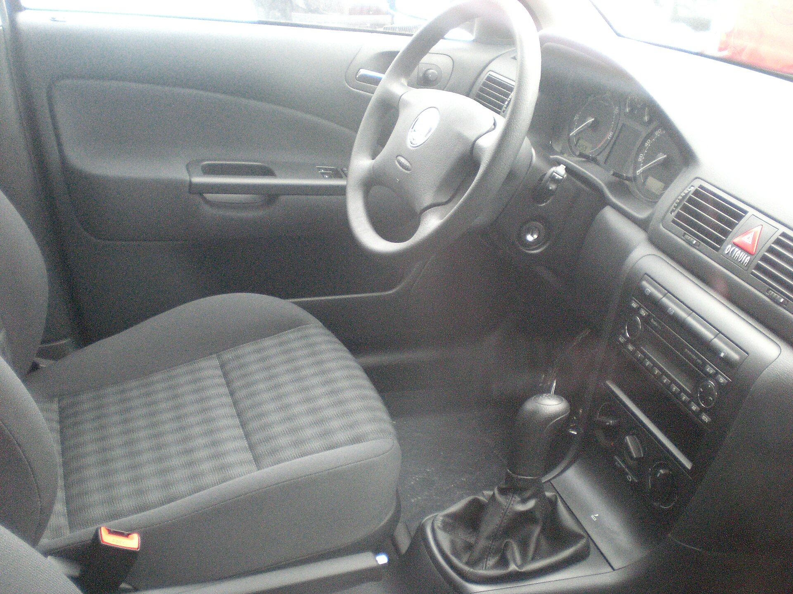

## האם סקודה אוקטביה עדיין המשפחתית החכמה של ישראל?

סקודה אוקטביה החדשה מוכיחה שוב מדוע היא נשארה כבר שנים אחת המשפחתיות המבוקשות בישראל: היא מציעה תא נוסעים ומטען גדולים בצורה יוצאת דופן, מנועים חסכוניים ואמינים, ותחושת איכות שמצדיקה את התג שלה. במבחן הדרך שלנו גילינו רכב שמבין בדיוק מה משפחה ישראלית צריכה — ומספק זאת בלי דרמה.

בעידן שבו כמעט כל יצרן דוחף לקוחות לעבר קרוסאוברים גבוהים, האוקטביה מזכירה שרכב משפחתי מרווח, נמוך וחסכוני עדיין הגיוני מאוד — גם מבחינת נוחות וגם מבחינת עלויות תפעול.

## עיצוב חיצוני: מהוקצע ובוגר

העיצוב של האוקטביה החדשה שמרני אך מלוטש. הקווים הנקיים, הפנסים הצרים והחזית המאופקת משדרים בגרות ולא צעקנות. זו לא מכונית שמנסה למשוך תשומת לב, אלא כזו שמזדקנת יפה. הגרסאות הגבוהות מגיעות עם חישוקי סגסוגת גדולים ותאורת לד מלאה שמשדרגים משמעותית את המראה.

האוקטביה מוצעת בישראל בעיקר בגרסת הליפטבק המעשית, עם דלת תא מטען ענקית שנפתחת רחב ומאפשרת העמסה נוחה במיוחד.

## תא הנוסעים: כאן היא מנצחת

זה הלב של האוקטביה. מרחב הרגליים במושב האחורי מהטובים בקטגוריה, ותא המטען — כ-600 ליטר בליפטבק — בולע עגלת תינוק, מזוודות וקניות בלי מאמץ. עבור משפחה, זה יתרון מכריע.

האיכות בתא השתפרה: חומרים רכים במקומות הנכונים, מסך מולטימדיה מרכזי גדול, ולוח מחוונים דיגיטלי. סקודה גם שמרה על פתרונות "סימפלי קלוור" האהובים — מטרייה בדלת, מחזיקי כוסות חכמים ותאי אחסון בכל פינה.

### מערכת המולטימדיה

המסך המרכזי מגיב טוב ותומך בחיבור אלחוטי לאפל קארפליי ואנדרואיד אוטו. עם זאת, המעבר של חלק מהפקדים למסך מגע — כולל בקרת האקלים — דורש התרגלות ופחות אינטואיטיבי מכפתורים פיזיים.

## מנועים וביצועים: איזון נכון

בישראל האוקטביה מוצעת בעיקר עם מנועי בנזין טורבו חסכוניים, המשולבים בתיבת אוטומט כפולת מצמד. ההאצה חלקה, המנוע שקט ברוב מצבי הנהיגה, וצריכת הדלק נשארת נוחה גם בנסועה עירונית וגם בכביש הפתוח.

האוקטביה אינה רכב ספורטיבי, אך היא יציבה, שקטה ונוחה — בדיוק מה שנדרש לנסיעות ארוכות עם המשפחה. המתלים מכוילים לנוחות, והרכב סופג מהמורות בכביש הישראלי בצורה מכובדת.

## טבלת השוואה: אוקטביה מול מתחרות

| פרמטר | סקודה אוקטביה | טויוטה קורולה | יונדאי איוניק |
|---|---|---|---|
| נפח תא מטען | ~600 ליטר | ~470 ליטר | ~350 ליטר |
| סוג הנעה עיקרי | בנזין טורבו | היברידי | היברידי |
| מרחב לנוסעים אחוריים | מצוין | טוב | טוב |
| אופי | מרווחת ונוחה | חסכונית ואמינה | חסכונית ומעוצבת |
| יתרון בולט | תא ומטען | חיסכון בדלק | אבזור |

## בטיחות ואבזור

האוקטביה מגיעה עם חבילת בטיחות עשירה: בקרת שיוט אדפטיבית, זיהוי הולכי רגל, בלימת חירום אוטומטית, שמירת נתיב והתראת שטח מת בגרסאות הגבוהות. הרכב זכה בעבר בדירוגי בטיחות גבוהים במבחני יורו אן.סי.איי.פי, מה שמעניק ביטחון להורים.

## כמה היא עולה ולמי היא מתאימה?

המחיר בישראל נע בטווח שהופך את האוקטביה לאלטרנטיבה משתלמת מול קרוסאוברים רבים — לרוב עם יותר מקום ואבזור בתמורה לכסף. היא מתאימה במיוחד למשפחות שמחפשות רכב מרווח, חסכוני ונוח, שאינן זקוקות לגובה נסיעה של רכב שטח.

מי שמחפש הנעה היברידית מובהקת ימצא אולי חלופות חסכוניות יותר בעיר, אך מבחינת שילוב של מרחב, נוחות ואיזון כללי — האוקטביה נשארת קשה לניצחון.

## סיכום

סקודה אוקטביה החדשה אינה מנסה להיות מגניבה או טרנדית — היא פשוט עושה את העבודה בצורה מצוינת. תא ענק, נהיגה נוחה, אבזור עשיר ותחושת איכות מגובשת הופכים אותה לבחירה חכמה ובוגרת עבור המשפחה הישראלית. אם אתם מוכנים לוותר על גובה הנסיעה של קרוסאובר, קשה למצוא הצעה מאוזנת יותר.
