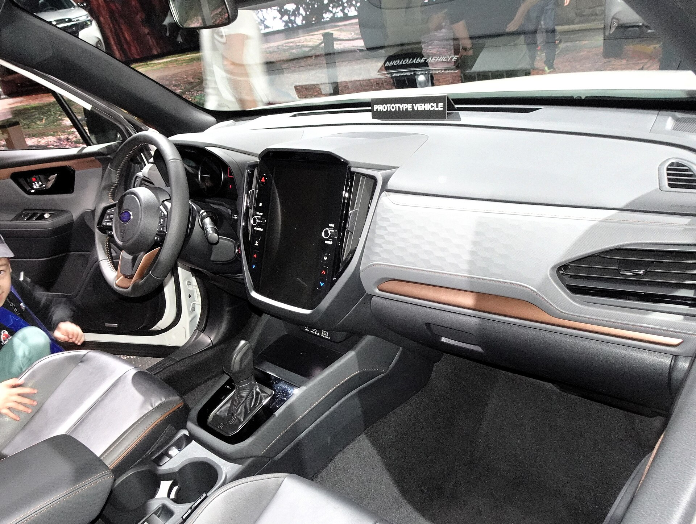

## מה מייחד את סובארו פורסטר החדש?

סובארו פורסטר החדש נשאר נאמן לעצמו: קרוסאובר משפחתי עם **הנעה כפולה סימטרית קבועה**, מרווח גחון גבוה ודגש בלתי מתפשר על בטיחות. בעוד רוב המתחרים בישראל עברו למערכות היברידיות מלאות וחסכוניות, סובארו בוחרת בגישה שמרנית יותר שמעמידה יכולת שטח ויציבות בראש סדר העדיפויות. בדקנו האם הנוסחה הזו עדיין מחזיקה מעמד בשוק הישראלי התחרותי.

הפורסטר תמיד היה ה"סוס עבודה" של סובארו — פחות זוהר, אבל אמין, פרקטי ובעל מוניטין של עמידות. הדור החדש משמר את הדנ"א הזה, עם עיצוב מרובע וזקוף שמקדש תפקודיות על פני קווים דרמטיים.

## איך זה מרגיש על הכביש?

החוויה מאחורי ההגה של סובארו פורסטר היא של רוגע ובטחון. ההנעה הכפולה הקבועה מעניקה אחיזה יוצאת דופן, בעיקר בכניסות לצמתים רטובים ובנסיעה על כבישים לא סלולים. מרכז הכובד הנמוך, תוצאה של מנוע הבוקסר השטוח האופייני לסובארו, תורם ליציבות ניכרת בפניות.

מצד שני, הביצועים אינם נקודת החוזק. המנוע הדו-ליטרי בשילוב מערכת היברידית מתונה מספק תאוצה סבירה אך לא מרשימה, ותיבת ההילוכים הרציפה (CVT) נוטה להשמיע קול מנוע גבוה בהאצות חדות. למי שמחפש נהיגה שקטה ורגועה בעיר ובין-עירונית — זה יספיק בהחלט.

### צריכת דלק וחסכוניות

כאן טמונה נקודת החולשה מול המתחרים. המערכת ההיברידית של הפורסטר היא **מתונה** ולא מלאה, ולכן החיסכון בדלק צנוע יחסית. בנהיגה עירונית הצריכה סבירה, אך היא רחוקה מהמספרים שמציגים דגמים היברידיים מלאים כמו טויוטה RAV4 או יונדאי טוסון היברידי.

## בטיחות: הקלף המנצח של פורסטר

מערכת הבטיחות **EyeSight** של סובארו נחשבת שנים לאחת המתקדמות והאמינות בקטגוריה. היא כוללת בלימה אוטומטית למניעת התנגשות, בקרת שיוט אדפטיבית, שמירת נתיב והתרעות מגוונות. סובארו פורסטר זכה לאורך השנים בציוני בטיחות גבוהים במבחני ההתרסקות המחמירים בעולם, וזה בהחלט שיקול משמעותי למשפחות בישראל.

## תא הנוסעים והמטען

הפנים של הפורסטר מתאפיין בפרקטיות מעל הכל. הישיבה זקופה, השדה ראייה מצוין בזכות עמודים דקים וחלונות גדולים, ותא המטען מהגדולים בקטגוריה. המושבים האחוריים מרווחים ומתאימים בקלות לשלושה נוסעים או למושבי בטיחות לילדים.

מערכת המולטימדיה כוללת מסך מגע מרכזי עם תמיכה בחיבור לטלפון החכם, אם כי הממשק אינו מהמהירים בשוק. חומרי הגימור סבירים ועמידים, בסגנון תועלתני יותר מפרימיום.

## סובארו פורסטר מול המתחרים

| פרמטר | סובארו פורסטר | טויוטה RAV4 היברידי | יונדאי טוסון היברידי |
|---|---|---|---|
| סוג הנעה | כפולה קבועה | כפולה (חשמלית מאחור) | קדמית/כפולה |
| סוג היברידיות | מתונה | מלאה | מלאה |
| חסכוניות בדלק | בינונית | גבוהה | גבוהה |
| יכולת שטח | מצוינת | טובה | סבירה |
| בטיחות | מובילה | גבוהה | גבוהה |
| מרווח גחון | גבוה | בינוני | בינוני |

## למי מתאים סובארו פורסטר?

הפורסטר מתאים במיוחד למי שמחפש **רכב משפחתי אמין עם יכולת שטח אמיתית** — טיולים בצפון, כבישי עפר וגררת קרוואן קלה. הנהגים שמעריכים בטיחות מעל הכל ומחפשים רכב שיחזיק מעמד שנים רבות ימצאו בו בן ברית מצוין.

מנגד, מי שהשיקול המרכזי שלו הוא חיסכון מרבי בדלק ונהיגה עירונית טהורה — כדאי לו לשקול היברידי מלא. המחיר של הפורסטר גם נוטה להיות גבוה יחסית לתמורה שהוא מציע בהיבט החסכוניות.

## שורה תחתונה

סובארו פורסטר החדש הוא רכב עם אופי ברור: פחות טרנדי, אבל יסודי, בטוח ורב-יכולת. הוא לא ינצח בקרב על צריכת הדלק, אבל בכל מה שקשור לאחיזת כביש, בטיחות ופרקטיות — הוא נשאר מהאפשרויות הבטוחות ביותר בקטגוריה עבור המשפחה הישראלית.
