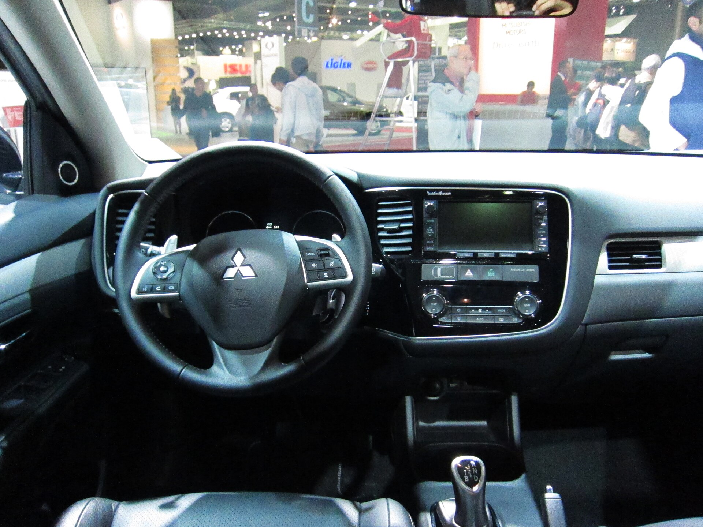

מיצובישי אאוטלנדר היברید נטען חוזר להיות אחד השחקנים המעניינים בקטגוריית הקרוסאוברים המשפחתיים בישראל, והפעם עם דור שנבנה על בסיס משותף עם ניסאן. התשובה הקצרה למי ששוקל אותו: זהו רכב שבעה מושבים שמצליח לשלב נוחות של רכב חשמלי בנסיעה היומיומית עם גמישות של מנוע בנזין לנסיעות הארוכות — ובכך פותר את חרדת הטווח מבלי לוותר על מרחב פנימי.

## מה מיוחד במיצובישי אאוטלנדר היברید נטען?

בניגוד להיברید רגיל, מיצובישי אאוטלנדר היברید נטען מצויד בסוללה גדולה יחסית שניתן להטעין משקע חשמל ביתי או מעמדת טעינה. בזכות זה הרכב יכול לנסוע מרחק משמעותי על חשמל בלבד לפני שמנוע הבנזין נכנס לפעולה. עבור נהג ישראלי שנוסע נסיעות קצרות בעיר ומטעין בבית בכל לילה, המשמעות היא נסיעות יומיומיות כמעט ללא צריכת דלק כלל.

המערכת כוללת מנוע בנזין בנפח כ-2.4 ליטר ושני מנועים חשמליים — אחד לכל סרן — שמעניקים לרכב הנעה כפולה חכמה (הידועה בשם S-AWC) המנהלת את הכוח בין הגלגלים בצורה מדויקת. התוצאה היא אחיזה בטוחה בכביש רטוב ותחושת יציבות גבוהה גם בעומסים.

## איך זה מרגיש על הכביש?

ההתנעה שקטה ורכה, כמו ברכב חשמלי מלא. בנסיעה עירונית הרכב זריז ותגובתי, והמעבר בין הנעה חשמלית להנעה משולבת חלק ולרוב לא מורגש. במהירויות גבוהות מנוע הבנזין נשמע יותר בעת האצה חדה, אך ברמות נסיעה רגילות בכביש בין-עירוני התא שקט ונעים.

המתלים כוונו לנוחות, מה שהופך את אאוטלנדר לבן לוויה מצוין לנסיעות משפחתיות ארוכות. מערכת הבלימה המשלבת בלימה מתחדשת מרגישה טבעית יותר מבעבר, וניתן לכוונן את עוצמת ההאטה באמצעות מתגי הגה — תכונה שמשפרת את החוויה ואת החיסכון.

## פנים, מרחב ושבעה מושבים

תא הנוסעים עשה קפיצת מדרגה בעיצוב ובאיכות החומרים. מסך המולטימדיה המרכזי גדול וברור, לוח המחוונים דיגיטלי, והשימוש בחומרים רכים מעניק תחושה יוקרתית יותר מהעבר. שתי שורות המושבים הראשונות מרווחות ונוחות, כולל למבוגרים גבוהים.

שורת המושבים השלישית קיימת ומעניקה גמישות, אך היא מתאימה בעיקר לילדים או לנסיעות קצרות. כשהיא מקופלת, נפח תא המטען נדיב ומאפשר להעמיס בקלות ציוד משפחתי מלא.

## צריכת דלק וחיסכון בפועל

כאן טמון היתרון הגדול. מי שמטעין את הרכב באופן סדיר יכול להגיע לצריכה ממוצעת נמוכה מאוד בנסיעה מעורבת, משום שחלק ניכר מהקילומטרים היומיומיים מבוצע על חשמל בלבד. עם זאת, חשוב להבין: מי שלא מטעין ומסתמך רק על מנוע הבנזין יקבל צריכה סבירה בלבד — דומה להיברید רגיל, אך ללא היתרון הכלכלי המלא של הפלאג-אין.

## טבלת השוואה: אאוטלנדר היברید נטען מול מתחרים

| פרמטר | מיצובישי אאוטלנדר היברید נטען | קיה סורנטו היברید נטען | טויוטה RAV4 היברید נטען |
|---|---|---|---|
| מספר מושבים | עד 7 | עד 7 | 5 |
| הנעה | כפולה (4X4) | כפולה (4X4) | כפולה (4X4) |
| טווח חשמלי יומיומי | בינוני-גבוה | בינוני | בינוני |
| אופי הנהיגה | נוחות ושקט | מאוזן | ספורטיבי-חסכן |
| התאמה למשפחה גדולה | גבוהה | גבוהה | בינונית |

## למי מתאים מיצובישי אאוטלנדר היברید נטען?

הרכב מתאים במיוחד למשפחות שמחפשות קרוסאובר גדול עם אפשרות לשבעה מושבים, שיש להן אפשרות טעינה בבית או בעבודה, ושנוסעות בעיקר נסיעות עירוניות עם טיולים ארוכים מדי פעם. מי שלא יכול להטעין באופן קבוע — כדאי שישקול היברید רגיל וזול יותר, שכן חלק גדול מהיתרון הכלכלי של הפלאג-אין ילך לאיבוד.

בשורה התחתונה, מיצובישי אאוטלנדר היברید נטען הוא חבילה משפחתית מלוטשת, שקטה וגמישה, שמצליחה לגשר בין עולם הבנזין לעולם החשמל בצורה מעשית ונוחה במיוחד עבור התנאים הישראליים.
