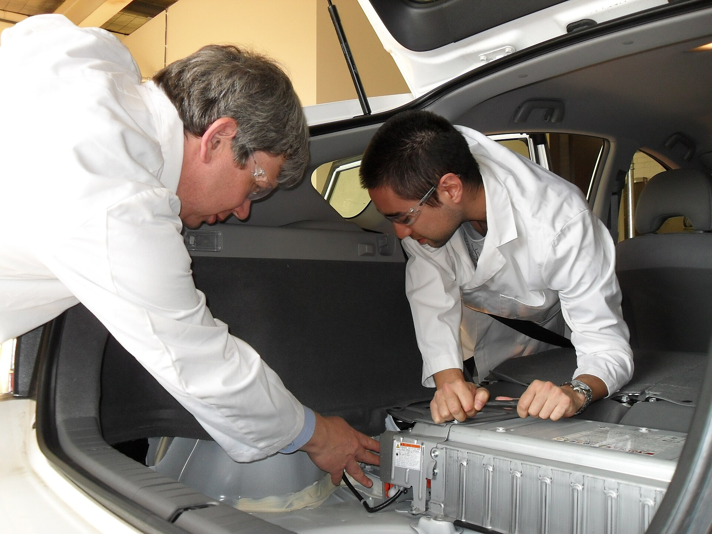

רכב **היברید נטען** (פלאג-אין) הפך לאחד הכוכבים הבולטים של שוק הרכב הישראלי לקראת 2026, והוא מציב את עצמו בדיוק בנקודת האמצע שבין ההיברید הרגיל לרכב החשמלי המלא. במילים פשוטות: מדובר ברכב עם מנוע בנזין וגם עם סוללה גדולה יחסית שניתן לטעון מהשקע — כך שאת רוב הנסיעות היומיומיות אפשר לבצע על חשמל בלבד, ולנסיעות הארוכות נשאר מנוע הבנזין כרשת ביטחון. עבור נהגים ישראלים רבים שחוששים עדיין ממעבר מלא לחשמל, זהו פתרון הביניים המושלם.

## מה זה בעצם היברید נטען ובמה הוא שונה?

ההבדל המרכזי בין היברید רגיל להיברید נטען הוא הסוללה ואופן הטעינה. בהיברید קלאסי (כמו טויוטה קורולה) הסוללה קטנה ונטענת רק תוך כדי נסיעה ובלימה — אי אפשר לחבר אותו לחשמל. לעומת זאת, **היברید נטען** מצויד בסוללה גדולה בהרבה, בדרך כלל בטווח של 12 עד 25 קילוואט-שעה, שאותה מחברים לעמדת טעינה ביתית או ציבורית בדיוק כמו רכב חשמלי.

התוצאה: טווח נסיעה חשמלי טהור של כ-40 עד 100 קילומטרים, תלוי בדגם. עבור הנסיעה היומית לעבודה, להסעות הילדים ולקניות — רוב הנהגים כמעט לא ייגעו בבנזין. וכשיוצאים לצפון או לדרום בסוף שבוע, המנוע הרגיל נכנס לפעולה ומעלים לחלוטין את חרדת הטווח.

## למי מתאים רכב היברید נטען?

היברید נטען מתאים במיוחד לשלושה סוגי נהגים:

- **בעלי חניה פרטית עם עמדת טעינה** — אלו שיכולים לטעון בבית בכל לילה וימצו את היתרון החשמלי במלואו.
- **נהגים שמשלבים עיר וכביש בין-עירוני** — נוסעים חשמלי בעיר, בנזין בכביש הפתוח.
- **מתלבטים לפני מעבר לחשמלי מלא** — מי שרוצה לטעום את חוויית הנהיגה החשמלית בלי להתחייב.

מנגד, מי שאין לו גישה נוחה לטעינה עלול לגלות שהוא פשוט סוחב סוללה כבדה ויקרה סתם, ומפעיל את מנוע הבנזין רוב הזמן. במקרה כזה, היברید רגיל יהיה בחירה חכמה וזולה יותר.

## יתרונות וחסרונות — טבלת השוואה

כדי להבין את התמונה המלאה, הנה השוואה תמציתית בין שלוש הטכנולוגיות הנפוצות בשוק:

| פרמטר | היברید רגיל | היברید נטען | חשמלי מלא |
|---|---|---|---|
| טעינה מהשקע | לא | כן | כן |
| טווח חשמלי טהור | אפסי | כ-40 עד 100 ק"מ | 300 עד 600 ק"מ |
| חרדת טווח | אין | אין | קיימת |
| מחיר יחסי | נמוך | בינוני-גבוה | גבוה |
| תלות בתשתית טעינה | אין | בינונית | גבוהה |
| התאמה לנסיעות ארוכות | מצוינת | מצוינת | תלוי תשתית |

## מה עם המיסוי בישראל?

נקודה קריטית לישראלים: מדרגות המיסוי על רכבי היברید נטען השתנו בשנים האחרונות, והטבות המס שנהנו מהן בעבר הצטמצמו בהדרגה. עם זאת, נכון ל-2026 המיסוי עליהם עדיין נוטה להיות נוח יותר מזה של רכב בנזין מקביל, אם כי פחות אטרקטיבי מזה של רכב חשמלי מלא. מומלץ לבדוק מול היבואן את מחיר המחירון העדכני, שכן פערי המיסוי משפיעים ישירות על כדאיות הקנייה. חשוב לזכור שהמחירים והמיסוי משתנים ואין להסתמך על הערכות כלליות בלבד.

## הדגמים הבולטים בשוק הישראלי

מגוון היצרנים שמציעים **היברید נטען** בישראל התרחב מאוד. מטויוטה מגיעים דגמים אמינים ומוכרים, קופרה ופולקסווגן מציעות אופי ספורטיבי יותר, וולוו ממתגת את הפלאג-אין כפרימיום שקט וחסכוני, והיצרנים הסיניים — ביניהם מותגים חדשים שנכנסים במהירות לשוק — מציעים טווחי מחיר תחרותיים במיוחד עם ציוד עשיר. חלק מהדגמים הסיניים החדשים אף מתגאים בטווח חשמלי חריג של מעל 100 קילומטרים, שמקרב אותם לחוויה חשמלית כמעט מלאה.

## איך למצות את החיסכון?

הסוד להנאה מרכב היברید נטען הוא **משמעת טעינה**. מי שטוען את הרכב בכל לילה בעמדה ביתית ייהנה מעלות "דלק" נמוכה משמעותית — טעינה מהחשמל הביתי זולה בהרבה מתדלוק בבנזין. לעומת זאת, מי שמזניח את הטעינה ומפעיל בעיקר את מנוע הבנזין, לא רק שלא יחסוך אלא אף עלול לצרוך יותר דלק בשל משקל הסוללה. לכן, לפני שרוכשים היברید נטען, כדאי לוודא שיש פתרון טעינה נוח וזמין.
