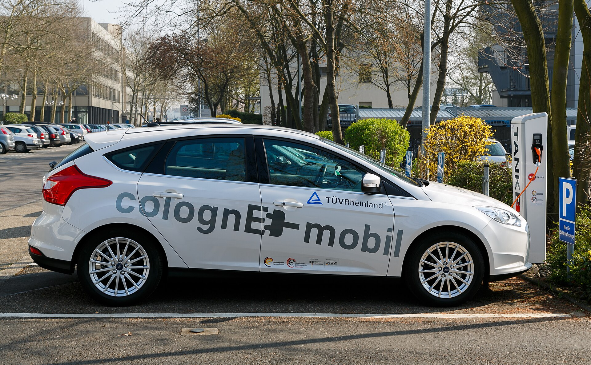

BYD אטו 3 היא אחת החשמליות הסיניות המדוברות ביותר בישראל, וקל להבין למה: קרוסאובר משפחתי קומפקטי, טווח נסיעה סביר, סוללה בטוחה ותמחור שמתחרה ישירות במותגים הוותיקים. במבחן החשמלי שלנו בדקנו האם **BYD אטו 3** מצדיקה את ההייפ, או שמדובר בעוד רכב סיני עם הרבה מפרט ומעט אופי.

BYD, ענקית הרכב והסוללות הסינית, הפכה בשנתיים האחרונות לאחת השחקניות המרכזיות בשוק החשמלי הישראלי. אטו 3 היא הדגם שהוביל את המתקפה, והיא ממוקמת בדיוק בלב הביקוש המקומי — קרוסאובר בגובה עיניים נעים, במחיר שאינו מבהיל.

## מה מייחד את BYD אטו 3?

היתרון הגדול של הדגם הוא **סוללת בלייד** (Blade Battery) מתוצרת BYD עצמה. מדובר בסוללת ליתיום-ברזל-פוספט (LFP) בעלת מבנה שטוח וארוך, הנחשבת עמידה ובטוחה יותר בפני התלקחות בהשוואה לסוללות ניקל-מנגן-קובלט הנפוצות. יתרון נוסף של כימיה זו הוא סבילות טובה לטעינות מלאות תכופות עד 100%, מה שמקל על השימוש היומיומי.

הגרסה הנפוצה בישראל מציעה סוללה בקיבולת של כ-60 קילוואט-שעה, עם **טווח מוצהר של כ-420 ק"מ** במחזור הבדיקה האירופאי. בפועל, בנהיגה משולבת ישראלית ובקיץ החם, סביר לצפות לטווח אמיתי בטווח של 320–370 ק"מ, תלוי בסגנון הנהיגה ובשימוש במיזוג.

## איך זה מרגיש מבפנים?

כאן BYD אטו 3 מפצלת דעות. העיצוב הפנימי נועז ולא שגרתי — מסך מולטימדיה מרכזי בגודל 12.8 אינץ' שמסוגל להסתובב אוטומטית ממצב לרוחב למצב לאורך, גימורים בצבעים חיים, וכיסים בדלתות עם "מיתרי גיטרה" אמיתיים שנועדו להדגיש מוטיב מוזיקלי. יש כאן הרבה יצירתיות, גם אם לא כולם יתחברו אליה.

מבחינת מרחב, האטו 3 מציעה תא נוסעים מרווח יחסית לגודלה החיצוני, בזכות בסיס גלגלים נדיב שאופייני לרכבים חשמליים ייעודיים. תא המטען בנפח של כ-440 ליטר מספק לצרכים משפחתיים יומיומיים.

### מערכת המולטימדיה והבטיחות

המערכת מגיבה בצורה סבירה, אך התלות הגבוהה במסך המגע — כולל פונקציות בסיסיות כמו כוונון המיזוג — עלולה להסיח את הדעת בנהיגה. מנגד, רשימת הבטיחות עשירה וכוללת בקרת שיוט אדפטיבית, שמירת נתיב, זיהוי הולכי רגל ובלימת חירום. הדגם זכה בדירוג חמישה כוכבים במבחני הבטיחות האירופאיים.

## איך היא נוהגת?

BYD אטו 3 אינה רכב ספורטיבי, וזה בסדר גמור. המנוע החשמלי הקדמי מפיק כ-204 כוחות סוס, ומאיץ מ-0 ל-100 קמ"ש בכ-7.3 שניות — נתון נעים ומספק לחלוטין לשימוש עירוני ובין-עירוני. תגובת ההאצה מיידית וחלקה, כמצופה מרכב חשמלי.

המתלים מכוילים לנוחות, והרכב סופג היטב את מרבצי המהירות והבורות של הכביש הישראלי. בפניות חדות מורגש נטיית גוף מסוימת, אך זו אינה מטרתו של הרכב. השקט בתא הנוסעים סביר במהירויות עירוניות, אם כי בכביש מהיר חודר מעט רעש רוח.

## טעינה: כמה זמן זה לוקח?

בטעינה ביתית בזרם חילופין (AC) בהספק של עד 7 קילוואט, טעינה מלאה תימשך כ-8–9 שעות — מושלם לטעינת לילה. בטעינה מהירה בזרם ישר (DC) הרכב מגיע להספק שיא של כ-88 קילוואט, המאפשר מעבר מ-30% ל-80% בכ-30–40 דקות. זהו נתון סביר, אך לא מרשים בהשוואה לחשמליות חדשות שמגיעות ל-150 קילוואט ומעלה.

## טבלת השוואה: BYD אטו 3 מול המתחרות

| פרמטר | BYD אטו 3 | סוללה | טווח מוצהר (משוער) |
|---|---|---|---|
| קיבולת סוללה | כ-60 קוט"ש | LFP (בלייד) | כ-420 ק"מ |
| הספק מנוע | כ-204 כ"ס | חשמלי קדמי | 0-100 בכ-7.3 שנ' |
| טעינה מהירה DC | עד כ-88 קילוואט | 30%-80% | כ-30-40 דקות |
| נפח תא מטען | כ-440 ליטר | — | — |

## למי מתאימה BYD אטו 3?

האטו 3 מתאימה למשפחות המחפשות **רכב חשמלי** ראשון, פרקטי ומאובזר, מבלי לשלם את הפרמיה של מותגים אירופאיים. היא לא הכי מהירה ולא הכי מתוחכמת בטעינה, אך היא מציעה חבילה מאוזנת עם דגש על בטיחות ואמינות הסוללה.

מי שמחפש חוויית נהיגה חדה או עיצוב פנים מינימליסטי — כנראה יעדיף אלטרנטיבה. אך למי שמחפש ערך משפחתי אמיתי ותמחור תחרותי, BYD אטו 3 היא בהחלט שחקנית שכדאי לשקול ברשימה הקצרה.
