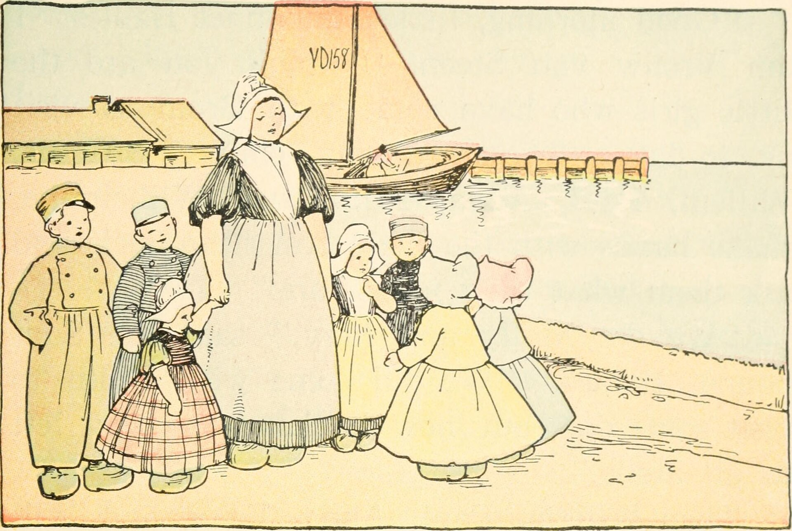

## למה צבע הרכב דוהה דווקא בישראל?

**שמירה על צבע הרכב** בישראל היא אתגר אמיתי, בעיקר בגלל השמש. הקרינה האולטרה-סגולה (UV) החזקה, בשילוב חום קיצוני, לחות מלוחה באזורי החוף ואבק מדברי — שוחקים את שכבת הלכה (Clear Coat) המגנה על הצבע. התוצאה: גוונים דוהים (במיוחד אדום וכחול), ברק שמתעמעם, וכתמים לבנבנים על השטח.

הבשורה הטובה: עם כמה הרגלים פשוטים אפשר להאט את התהליך משמעותית ולשמור על מראה הרכב כמעט כמו ביום שיצא מהאולם.

## מה בעצם פוגע בצבע?

- **קרינת UV** — הגורם מספר אחת לדהייה ולהתפוררות שכבת הלכה.
- **חום** — מאיץ תגובות כימיות שמייבשות את הצבע.
- **צואת ציפורים ושרף עצים** — חומציים מאוד, אוכלים את הלכה תוך שעות אם לא מסירים אותם.
- **אבק ומלח ים** — חלקיקים שוחקים שיוצרים שריטות זעירות בכל שטיפה לא נכונה.
- **טפטופי מזגן ומי ברז קשים** — מותירים כתמי מינרלים.

## איך שוטפים נכון?

שטיפה נכונה היא הבסיס לכל שמירה על צבע הרכב, אך שטיפה שגויה עלולה לגרום יותר נזק מתועלת.

### כללי הזהב

1. **אל תשטפו רכב חם או בשמש ישירה** — המים והשמפו מתייבשים מהר ומשאירים כתמים.
2. **השתמשו בשמפו ייעודי לרכב** — לא בסבון כלים, שמסיר את שכבת ההגנה.
3. **שיטת שני הדליים** — דלי אחד לשמפו ודלי נפרד לשטיפת הכפפה, כדי לא להחזיר אבק שוחק אל הצבע.
4. **ייבוש עם מגבת מיקרופייבר** — לא בהתאדות טבעית, שמשאירה כתמי מים.
5. **הסירו מיד** צואת ציפורים ושרף — אל תחכו לשטיפה הבאה.

## שכבות הגנה: ווקס, סילנט או ציפוי קרמי?

אחרי שהרכב נקי, כדאי להוסיף שכבת מגן שתחזה את הקרינה ותרחיק לכלוך. אלו שלוש האפשרויות הנפוצות:

| סוג הגנה | עמידות משוערת | עלות יחסית | רמת הגנה |
|---|---|---|---|
| ווקס (שעווה) | 4–8 שבועות | נמוכה | בסיסית, ברק חם |
| סילנט סינתטי | 3–6 חודשים | בינונית | טובה, קל ליישום |
| ציפוי קרמי | 2–5 שנים | גבוהה | מעולה, עמיד ל-UV |

עבור רוב הנהגים בישראל, **סילנט סינתטי** מהווה איזון מצוין בין מחיר, קלות יישום ועמידות מול השמש. מי שרוצה הגנה מקסימלית לטווח ארוך — ובעיקר על רכב חדש — ישקול **ציפוי קרמי** מקצועי במכון מוסמך.

## חניה: ההגנה הזולה והיעילה ביותר

אף מוצר לא מחליף חניה חכמה. חניה מתחת לצל, בחניון מקורה או בתוך מוסך מפחיתה דרמטית את חשיפת הצבע ל-UV. אם אין ברירה וחונים בחוץ:

- השתמשו ב**כיסוי רכב** נושם ואיכותי (כיסוי זול עלול לשרוט).
- הפנו את החזית לכיוון שממנו השמש חלשה יותר בשעות היום.
- שטיחון שמשייה לשמשה הקדמית שומר גם על הדשבורד והפלסטיקים מהתבקעות.

## מה עם צבעים בהירים מול כהים?

רכבים בגוון **לבן או כסוף** מסתירים דהייה, שריטות ואבק טוב יותר וגם נשארים קרירים יותר בחניה בשמש — יתרון אמיתי בקיץ הישראלי. גוונים **כהים ומטאליים** (שחור, אדום, כחול עז) נראים מרשימים אך דורשים תחזוקה תכופה יותר, שכן כל פגם בולט בהם מיד.

## שגרת טיפוח מומלצת לישראלי

- **שבועית:** שטיפה קלה או הסרת מזהמים נקודתיים.
- **חודשית:** שטיפה יסודית בשיטת שני הדליים.
- **כל 3–6 חודשים:** חידוש שכבת ההגנה (סילנט/ווקס).
- **פעם בשנה:** פוליש קל להסרת שריטות שטחיות והחזרת ברק (עדיף במכון).

השקעה קטנה וקבועה שומרת לא רק על המראה, אלא גם על **ערך הרכב** — צבע במצב מצוין הוא אחד הדברים הראשונים שקונה יד שנייה שם לב אליהם.
