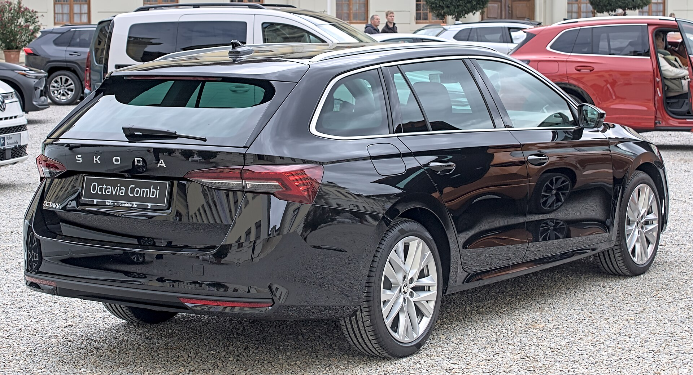

סקודה אוקטביה נותרת אחת הבחירות ההגיוניות ביותר למשפחה הישראלית שמחפשת מרחב, חסכון ופרקטיות במחיר שפוי. למרות שגל הקרוסאוברים משך אליו כמעט את כל תשומת הלב בשנים האחרונות, האוקטביה ממשיכה להוכיח שרכב משפחתי נמוך, מרווח ויעיל אווירודינמית עדיין יודע להעניק חוויית נהיגה נעימה וחשבון דלק נוח בסוף החודש.

## למה סקודה אוקטביה עדיין רלוונטית?

הסוד של האוקטביה מעולם לא היה בזוהי — אלא ביחס נדיר בין גודל למחיר. על בסיס פלטפורמת MQB של קבוצת פולקסווגן, האוקטביה מציעה מרחב פנימי שמבייש רכבים מקטגוריה גבוהה יותר. מקומות הישיבה מאחור נדיבים במיוחד במרווח רגליים, ותא המטען — במיוחד בגרסת הסטיישן — הוא מהגדולים שתמצאו בסגמנט המשפחתי.

עבור משפחה ישראלית שנוסעת מהמרכז לצפון בסופ"ש עם עגלת תינוק, מזוודות וציוד קמפינג, זה בדיוק ההבדל שמרגישים בפועל.

## איך היא נוהגת?

מערך המנועים כולל בעיקר יחידות טורבו בנפח 1.0 ו-1.5 ליטר, המשולבות בתיבת אוטומט בעלת מצמד כפול. אלו אינם מנועים שנועדו לרגש חובבי ספורט, אבל הם עושים את העבודה בצורה תרבותית: תגובת גז נעימה בעיר, כוח מספק לעקיפות בכביש בין-עירוני, וחשוב מכל — צריכת דלק חסכונית יחסית שנעה בטווח נוח בנהיגה מעורבת.

המתלים מכוילים לנוחות. האוקטביה בולעת מהמורות וכבישים משובשים בביטחון, ובמהירויות כביש מהיר היא שקטה ויציבה. זו לא מכונית שמזמינה נהיגה אגרסיבית, אלא בת לוויה רגועה שמפחיתה עייפות בנסיעות ארוכות.

### פנים הרכב והטכנולוגיה

תא הנוסעים עוצב בגישה נקייה ומודרנית, עם מסך מולטימדיה מרכזי גדול ולוח מחוונים דיגיטלי. המערכת תומכת בחיבור אלחוטי לטלפון, ניווט ובקרת אקלים. החיסרון: חלק מהפונקציות היומיומיות הועברו למסך המגע, וישנם נהגים שיתגעגעו לכפתורים פיזיים נוחים יותר לתפעול תוך כדי נסיעה.

סקודה נאמנה למסורת ה"סימפלי קלבר" — פתרונות חכמים קטנים כמו מטריה נסתרת בדלת, מגרד קרח מובנה וקרסי תלייה שהופכים את השימוש היומיומי לנוח יותר.

## סקודה אוקטביה מול המתחרות

| פרמטר | סקודה אוקטביה | טויוטה קורולה | יונדאי איוניק |
| --- | --- | --- | --- |
| מרחב פנימי | מצוין | טוב | טוב מאוד |
| תא מטען (סטיישן) | מהגדולים בסגמנט | סביר | טוב |
| צריכת דלק | חסכונית | חסכונית מאוד (היברידי) | חסכונית מאוד (היברידי) |
| חוויית נהיגה | רגועה ויציבה | נוחה | נוחה |
| ערך למחיר | גבוה מאוד | גבוה | גבוה |

## למי מתאימה האוקטביה?

האוקטביה מתאימה במיוחד למשפחות שמעדיפות רכב נמוך וחסכוני על פני קרוסאובר גבוה, ולמי שמבצע קילומטראז' שנתי גבוה — נציגי מכירות, מטיילים וכל מי שמבלה שעות רבות בכביש. גרסת הסטיישן היא ההמלצה הברורה למי שזקוק לתא מטען ענק.

מצד שני, מי שמחפש תחושת ישיבה גבוהה, מבט מוגבה על הכביש ותדמית שטח — כנראה ימשוך יותר לעבר הקרוסאוברים של המותג, כמו הקארוק או הקודיאק.

## שורה תחתונה

סקודה אוקטביה ממשיכה להיות שיעור בפרקטיות. היא לא הרכב הכי מרגש בכביש, אבל היא מציעה חבילה מאוזנת להפליא של מרחב, חסכון, נוחות ואמינות מוכחת של קבוצת פולקסווגן. בעולם שרץ אחרי קרוסאוברים, האוקטביה מזכירה שלפעמים הבחירה החכמה היא פשוט המכונית שעושה הכול טוב — בלי להתפשר על הארנק.
