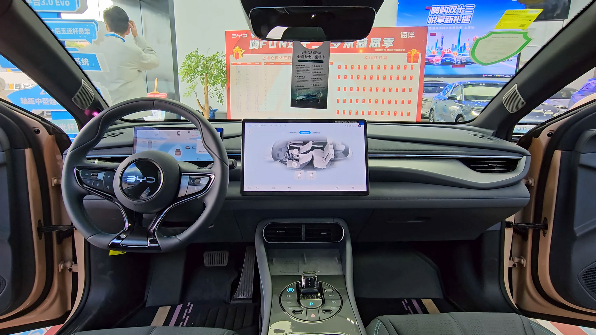

## מה מייחד את BYD סיל בשוק הישראלי?

**BYD סיל** היא סדאן חשמלית בגודל בינוני שהגיעה לישראל כדי להתמודד ישירות מול טסלה מודל 3, וכבר בנסיעה הראשונה ברור שמדובר במוצר בוגר ומגובש. היא משלבת עיצוב אווירודינמי זורם, תא נוסעים איכותי וטכנולוגיית סוללה מתקדמת של יצרנית שהפכה לאחת מהגדולות בעולם ברכב חשמלי. אם חיפשתם רכב חשמלי משפחתי עם אופי ספורטיבי במחיר שפוי יחסית — BYD סיל בהחלט ראויה לתשומת לב.

היצרנית הסינית ביי-די-די (BYD) הפכה בשנתיים האחרונות לשחקנית מובילה בשוק הישראלי, וסיל היא הדגם שנועד להוכיח שרכב סיני יכול להתחרות לא רק במחיר אלא גם באיכות ובחוויית נהיגה.

## עיצוב חיצוני: אווירודינמי ובוגר

העיצוב של סיל מבוסס על שפת "אסתטיקה של האוקיינוס" של BYD, עם קווים זורמים, גג משופע וחרטום נמוך. מקדם הגרר הנמוך (סביב 0.219) לא רק מרשים על הנייר אלא גם תורם ישירות לטווח וליציבות במהירויות גבוהות. הפנסים הדקים, הידיות השקועות והחישוקים בגודל 19 אינץ' מעניקים לה נוכחות ספורטיבית שמושכת מבטים.

## פנים הרכב: הפתעה נעימה

כאן BYD סיל באמת מפתיעה. איכות החומרים, התפרים בריפוד והמסך המרכזי המסתובב (בגודל 15.6 אינץ') יוצרים תחושת פרימיום שלא הייתם מצפים לה מרכב בטווח המחיר הזה. המערכת המולטימדיה מהירה יחסית, תומכת בעברית, וכוללת חיבור לאפל קארפליי ואנדרואיד אוטו.

מרחב הרגליים מאחור נדיב, ותא המטען מציע נפח סביר לצד תא אחסון קדמי קטן. לוח המחוונים הדיגיטלי ברור וקריא, וישנה תצוגה עילית (הד-אפ) בגרסאות הגבוהות.

## ביצועים וטווח: מה קורה על הכביש?

גרסת ההנעה האחורית הבודדת מספקת נהיגה חלקה ויעילה, בעוד גרסת ההנעה הכפולה (ארבע גלגלים) חדה במיוחד — עם תאוצה של פחות מ-4 שניות מ-0 ל-100 קמ"ש. המתלים מכוילים בנטייה לצד הספורטיבי, מה שמעניק תחושת יציבות בפניות אך נשמר נוח מספיק לנסיעה יומיומית.

הטווח הריאלי, לפי סוג הנהיגה ומזג האוויר, נע בערך בין **450 ל-520 ק"מ** בגרסאות הטווח המורחב. בחורף הישראלי ובנהיגה בין-עירונית מהירה מומלץ להביא בחשבון ירידה מסוימת מהמספרים הרשמיים.

### סוללת ה-Blade: יתרון בטיחותי

אחד היתרונות הבולטים של BYD הוא טכנולוגיית סוללת ה-Blade מבוססת ליתיום-ברזל-פוספט, הנחשבת עמידה ובטוחה במיוחד, נטולת קובלט וניקל. הארכיטקטורה השטוחה תורמת גם למרכז כובד נמוך ולניצול מרחב יעיל בתא הנוסעים.

## טבלת השוואה: BYD סיל מול טסלה מודל 3

| פרמטר | BYD סיל | טסלה מודל 3 |
|---|---|---|
| טווח ריאלי משוער | כ-450–520 ק"מ | כ-450–540 ק"מ |
| תאוצה (הנעה כפולה) | פחות מ-4 שניות | כ-4 שניות |
| מסך מרכזי | 15.6 אינץ' מסתובב | 15 אינץ' |
| לוח מחוונים נפרד | יש | אין |
| טכנולוגיית סוללה | Blade (ליתיום-ברזל) | ליתיום-יון / LFP |
| רשת טעינה ייעודית | ציבורית כללית | סופר-צ'ארג'ר |

## למי מתאימה BYD סיל?

הסדאן הזו מתאימה במיוחד למשפחות ולנהגים שמחפשים רכב חשמלי אחד עם אופי ספורטיבי, תא נוסעים איכותי וטווח מספק ליומיום ולנסיעות בין-עירוניות. היא פחות מתאימה למי שזקוק לגובה מעבר של קרוסאובר או לתא מטען ענק, אך כסדאן משפחתית חשמלית היא מציעה חבילה מאוזנת ומשכנעת.

## שורה תחתונה

BYD סיל מוכיחה שרכב סיני יכול להתחרות ראש בראש מול השחקנים המובילים — לא רק במחיר אלא גם בחוויית נהיגה, גימור וטכנולוגיה. בשוק הישראלי שרעב לחלופות חשמליות איכותיות במחיר הגיוני, היא אחת מהאפשרויות המעניינות ביותר של 2026.
