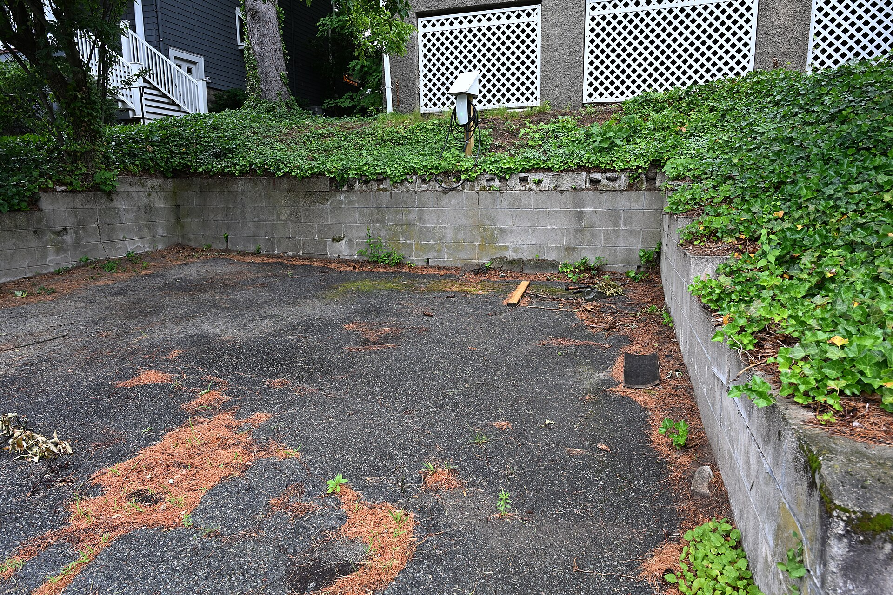

מיצובישי אאוטלנדר היברид נטען הוא אחד הקרוסאוברים המשפחתיים המעניינים שחזרו לשוק הישראלי, והוא מציע פתרון ביניים חכם בין רכב חשמלי מלא לבין היברид רגיל. בקצרה: מדובר ברכב שבע מושבים עם הנעה כפולה, שמסוגל לנוע חשמלי בלבד בנסיעות היומיומיות ולהישען על מנוע בנזין בנסיעות ארוכות — כך שאין חרדת טווח, אך יש חיסכון משמעותי למי שטוען בבית.

## מה זה בעצם היברид נטען?

בניגוד להיברид הרגיל שמטעין את הסוללה רק תוך כדי נסיעה, מיצובישי אאוטלנדר היברид נטען כולל סוללה גדולה יותר שניתן לחבר לשקע חשמל או לעמדת טעינה ביתית. התוצאה היא טווח חשמלי מוערך של כ-70 עד 85 קילומטרים בנסיעה עירונית — מספיק לרוב הישראלים כדי לעבור יום עבודה שלם, כולל הסעות ילדים וקניות, מבלי להתניע כלל את מנוע הבנזין.

כשהסוללה מתרוקנת, הרכב עובר לפעולה כהיברید רגיל וממשיך לנסוע בצריכת דלק סבירה. זהו היתרון הגדול: אין תלות בתחנות טעינה בנסיעות בין-עירוניות.

## חוויית הנהיגה בכביש הישראלי

האאוטלנדר בונה על נוחות ולא על ספורטיביות. מערכת ההנעה הכפולה — מנוע חשמלי מלפנים ומנוע חשמלי מאחור בתוספת מנוע בנזין — מספקת אחיזת דרך טובה ותחושת ביטחון, במיוחד בגשם ובכבישים רטובים. התאוצה החשמלית מיידית ושקטה, והמעבר בין הנעה חשמלית לבנזין חלק ברוב המצבים.

המתלים מכוונים לנוחות: הרכב בולע היטב מהמורות וברוכים בכביש עירוני, אך בסיבובים מהירים מורגשת נטייה קלה של הגוף. מהירות השיוט על כביש מהיר נעימה ושקטה, והבידוד האקוסטי בתא הנוסעים ראוי לשבח.

### שבעה מושבים — האם זה מספיק?

שורת המושבים השלישית באאוטלנדר מתאימה בעיקר לילדים או לנסיעות קצרות של מבוגרים. בתצורת חמישה מושבים תא המטען מרווח ונוח למשפחה, ובכך הרכב מתחרה ישירות מול דגמים כמו סקודה קודיאק ומול קרוסאוברים משפחתיים אחרים בשוק.

## צריכת דלק וחיסכון בפועל

כאן טמון הסיפור האמיתי. מי שטוען את הרכב מדי לילה בבית ונוסע בעיקר בעיר עשוי לצרוך מעט מאוד דלק — לעיתים מילוי אחד לחודשיים. לעומת זאת, מי שלא טוען כלל ומסתמך רק על מנוע הבנזין יגלה צריכה דומה להיברид רגיל, ולעיתים אף מעט גבוהה יותר בשל משקל הסוללה. המסקנה: היברид נטען משתלם בעיקר למי שיכול וישתמש בטעינה ביתית.

## טבלת השוואה: אאוטלנדר היברид נטען מול חלופות

| פרמטר | אאוטלנדר היברид נטען | היברид רגיל | חשמלי מלא |
|---|---|---|---|
| טווח חשמלי | כ-80 ק"מ (מוערך) | ללא נסיעה חשמלית משמעותית | 350-500 ק"מ |
| חרדת טווח | אין | אין | קיימת |
| צורך בטעינה | מומלץ בבית | לא נדרש | הכרחי |
| חיסכון בדלק | גבוה למי שטוען | בינוני | אין דלק |
| מספר מושבים | עד שבעה | תלוי דגם | תלוי דגם |

## למי מתאים האאוטלנדר?

האאוטלנדר היברид נטען מתאים למשפחה שמחפשת רכב אחד שיעשה הכול: נסיעות חשמליות שקטות בעיר, גמישות מלאה לנסיעות ארוכות בסופ"ש, ומרחב לשבעה נוסעים בעת הצורך. הוא פחות מתאים למי שאין לו אפשרות לטעון בבית או בעבודה — במקרה כזה עדיף לשקול היברид רגיל וזול יותר.

## שורה תחתונה

מיצובישי אאוטלנדר היברид נטען הוא פשרה מחושבת ומוצלחת עבור רבים בישראל. הוא אמנם יקר יותר מהיברید קונבנציונלי, אך מציע גמישות אמיתית ופוטנציאל חיסכון גבוה למי שינצל את הטעינה הביתית. אם אתם מחפשים מעבר הדרגתי לעולם החשמלי בלי לוותר על ביטחון בנסיעות ארוכות — זה מועמד רציני מאוד.
