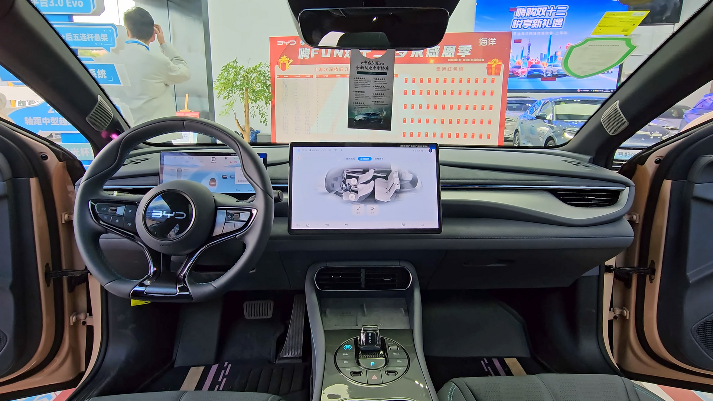

## מה זה בעצם ה-BYD Seal?

ה-**BYD Seal** היא הסדאן החשמלית הספורטיבית של יצרנית הרכב הסינית ביד, והיא מגיעה לישראל עם שאיפה ברורה: להתמודד ראש בראש מול טסלה מודל 3 ויונדאי איוניק 6. מדובר במכונית באורך של כ-4.8 מטרים, עם עיצוב זורם בהשראת האוקיינוס, מקדם גרר נמוך במיוחד וביצועים שמפתיעים כל מי שעדיין חושב שרכב סיני הוא פשרה. אחרי כמה ימים על הכביש הישראלי, התשובה הקצרה היא שה-Seal היא הרבה יותר מ"עוד חשמלית סינית".

## עיצוב וחזות חיצונית

החזות של ה-Seal בוגרת ואלגנטית. הקווים הזורמים, הפנסים הדקים והגג המשופע יוצרים צללית קופה-סדאן שנראית יקרה יותר מהמחיר. ביד השקיעה באווירודינמיקה — מקדם הגרר הנמוך תורם ישירות לטווח הנסיעה ולשקט בנסיעה מהירה בכביש מהיר. הדגם נראה מצוין גם בצבעים הכהים וגם בגוונים הבהירים שמדגישים את הפרופורציות.

### תא הנוסעים

בפנים מקבלים אווירה מודרנית ונקייה. בלב לוח המחוונים ניצב מסך מרכזי מסתובב בגודל של כ-15 אינץ', לצד צג נהג דיגיטלי. חומרי הגמר נעימים למגע, יש שפע ריפודים רכים ותחושת איכות כללית גבוהה. המרווח לנוסעים מאחור טוב, אם כי קו הגג המשופע מקצץ מעט בחופש הראש לנוסעים גבוהים.

## איך ה-BYD Seal נוהגת?

כאן ה-**BYD Seal** באמת מפתיעה. גרסת ההנעה הכפולה (ארבע גלגלים) מספקת האצה של כ-3.8 שניות מ-0 ל-100 קמ"ש — נתון שמציב אותה בטריטוריה של רכבי ספורט. גם גרסת ההנעה האחורית היחידה מהירה ותגובתית לחלוטין לשימוש יומיומי.

מערכת המתלים מכווננת בצורה מפתיעה — יש איזון יפה בין נוחות בכביש עירוני מחורר לבין יציבות בפניות מהירות. ההגה מדויק, מרכז הכובד נמוך בזכות מיקום הסוללה, והמכונית מרגישה נטועה לכביש. הבלימה חזקה, אך מערכת השחזור האנרגיה (רגנרציה) דורשת מעט התרגלות בתחילת הדרך.

## טווח, סוללה וטעינה

ה-Seal בנויה סביב פלטפורמת e-Platform 3.0 וסוללת ה-**Blade** האופיינית לביד. הסוללה מסוג ליתיום-ברזל-פוספט (LFP) ידועה ביציבות תרמית גבוהה ובעמידות מצוינת לאורך זמן, מה שתורם לביטחון ולאורך חיי הסוללה.

הטווח המוצהר בגרסאות המובילות נע סביב 550-570 ק"מ במחזור הבדיקה האירופי, וברוב תנאי הנהיגה הישראלית ניתן לצפות לטווח מציאותי של כ-420-480 ק"מ, בהתאם לסגנון הנהיגה ולשימוש במיזוג. הטעינה המהירה בזרם ישר מאפשרת מעבר מ-30% ל-80% בכ-30 דקות בעמדה מהירה.

## טבלת השוואה: BYD Seal מול המתחרות

| פרמטר | BYD Seal | טסלה מודל 3 | יונדאי איוניק 6 |
|---|---|---|---|
| סוג | סדאן חשמלית | סדאן חשמלית | סדאן חשמלית |
| טווח מוצהר (משוער) | 550-570 ק"מ | 510-630 ק"מ | 480-610 ק"מ |
| האצה 0-100 (גרסה מובילה) | כ-3.8 שניות | כ-4.4 שניות | כ-5.1 שניות |
| סוג סוללה | Blade (LFP) | ליתיום-יון / LFP | ליתיום-יון |
| חוזק בולט | תמורה וביצועים | טעינה ורשת-על | נוחות ועיצוב |

## יתרונות וחסרונות

**יתרונות:**
- ביצועים ספורטיביים אמיתיים
- תחושת איכות גבוהה בתא הנוסעים
- סוללת Blade עמידה ובטוחה
- תמחור תחרותי ביחס לרמת הגימור

**חסרונות:**
- ממשק המסך המרכזי עמוס בתפריטים
- כיוונון הרגנרציה דורש התרגלות
- חופש ראש מוגבל מעט מאחור בשל קו הגג

## למי מתאימה ה-BYD Seal?

ה-Seal מתאימה במיוחד לנהג שמחפש סדאן חשמלית עם אופי ספורטיבי, תא נוסעים איכותי וטווח נסיעה נדיב — במחיר שמתחרה ישירות במותגים המבוססים. מי שמחפש רכב משפחתי מרווח לגובה ראש עשוי להעדיף קרוסאובר, אבל כמכונית נהיגה יומיומית עם נשמה, ה-Seal מספקת חבילה מרשימה שמסמנת עד כמה השוק הישראלי השתנה.
