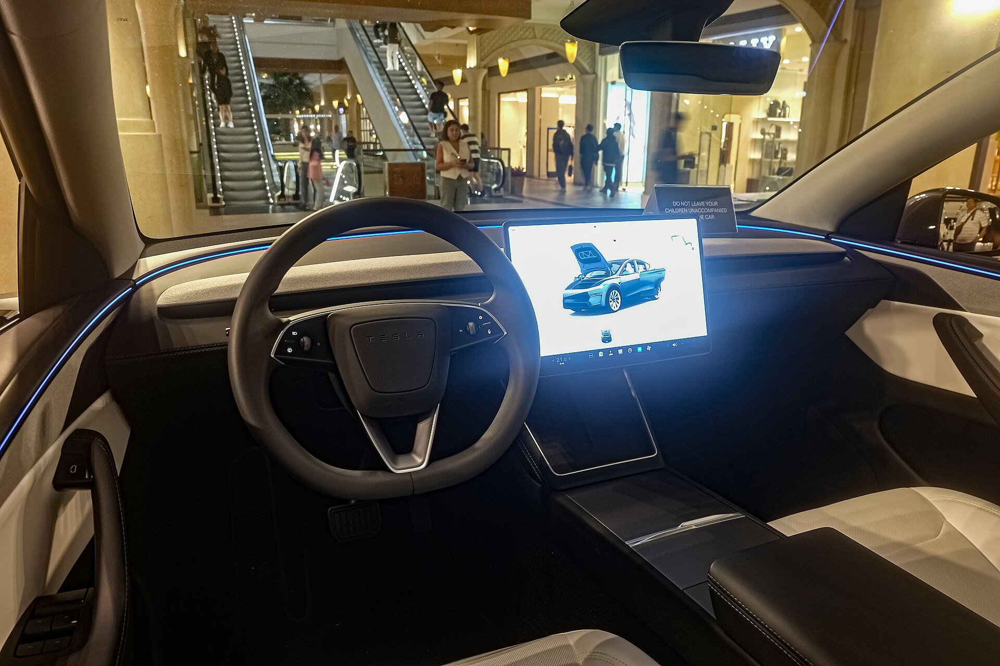

**טסלה מודל Y ג'וניפר** היא גרסת הפייסליפט המקיפה של הקרוסאובר החשמלי הנמכר בעולם, והיא בדרכה לכבוש מחדש את שוק הרכבים החשמליים בישראל. העדכון, המכונה בשם הקוד "ג'וניפר" (Juniper), מביא עיצוב חיצוני מרוענן, שדרוגים משמעותיים בנוחות ובשקט הנסיעה, ושיפורים קטנים אך מורגשים בטווח וביעילות. עבור הקהל הישראלי, שכבר אימץ את מודל Y כאחת החשמליות הפופולריות ביותר, מדובר בעדכון שנועד לשמר את הבכורה מול תחרות סינית וקוריאנית מתגברת.

## מה חדש בטסלה מודל Y ג'וניפר?

השינוי הבולט ביותר הוא בחזית ובאחורי הרכב. מודל Y ג'וניפר מקבלת פס תאורה חדשני לרוחב החזית, פנסים דקים יותר ופגושים מעוצבים מחדש שמשפרים את מקדם הגרר האווירודינמי. מאחור, רצועת תאורה מלאה חוצה את דלת התא ומעניקה לרכב חזות רחבה ומודרנית יותר.

מעבר לעיצוב, טסלה השקיעה בעיקר בתחושת האיכות. בין השיפורים המרכזיים:

- **בידוד אקוסטי משופר** עם זכוכית כפולה ואטמים חדשים שמורידים את רעש הרוח והכביש.
- **מתלים מכוילים מחדש** לנסיעה רכה ושקטה יותר, נקודת תורפה ידועה בדגם הקודם.
- **תא נוסעים מעודכן** עם חומרים משודרגים, תאורת אווירה, ומסך אחורי לנוסעי הספסל.
- **מסך מרכזי בגודל כ-15.4 אינץ'** עם מערכת מולטימדיה מהירה יותר.

## טווח, ביצועים וטעינה

טסלה שמרה על מבנה הפלטפורמה החשמלית המוכר, אך ביצעה אופטימיזציה של יעילות הצריכה. בגרסאות המובילות הטווח המוצהר נע סביב **500 עד 600 קילומטרים** במחזור הבדיקה האירופי, כתלות בגודל הסוללה ובגלגלים. הגרסה הדו-מנועית (Long Range AWD) מציעה תאוצה חדה של פחות מ-5 שניות מ-0 ל-100 קמ"ש, בעוד הגרסה החד-מנועית מתמקדת בטווח ובחיסכון.

הטעינה נותרה מהמהירות בשוק בזכות רשת המטענים המהירים (Supercharger) של טסלה, שכבר פרוסה בעשרות אתרים ברחבי ישראל. במטען מהיר ניתן להוסיף מאות קילומטרים תוך כרבע שעה בתנאים אופטימליים.

## כמה תעלה מודל Y ג'וניפר בישראל?

התמחור הסופי בישראל מושפע ממדיניות המיסוי על רכבים חשמליים, שצפויה להשתנות בהדרגה בשנים הקרובות עם עליית מס הקנייה. ההערכות הן שמחיר ההשקה של **טסלה מודל Y ג'וניפר** יינע בטווח שדומה או מעט גבוה מזה של הדגם היוצא, כלומר בסביבות מאות אלפי שקלים בגרסאות המובילות. כדאי לעקוב אחר מחירון היבואן הרשמי, שכן טסלה נוהגת לעדכן מחירים בתדירות גבוהה.

## מול מי היא מתחרה?

שוק הקרוסאוברים החשמליים המשפחתיים בישראל צפוף מתמיד. מודל Y ג'וניפר מתמודדת מול שורה ארוכה של יריבים, מהקוריאנים ועד המותגים הסיניים.

| דגם | טווח מוערך (ק"מ) | יתרון בולט |
|------|------------------|-------------|
| טסלה מודל Y ג'וניפר | 500-600 | רשת טעינה וביצועים |
| קיה EV6 | 480-530 | עיצוב ואחריות ארוכה |
| יונדאי איוניק 5 | 480-520 | מרחב פנימי ונוחות |
| סקודה אניאק | 500-560 | פרקטיות ומחיר |
| BYD סי-ליון 7 | 480-540 | תמורה למחיר |

## למי היא מתאימה?

מודל Y ג'וניפר מתאימה במיוחד למשפחות ולנהגים שמחפשים חשמלית מרווחת עם טווח נדיב, גישה לרשת טעינה מהירה ואמינה, וטכנולוגיה מתקדמת. השדרוגים בשקט הנסיעה ובנוחות המתלים עונים ישירות על הביקורת המרכזית שהופנתה לדגם הקודם, והופכים אותו לנסיעתי ומפנק יותר ביומיום הישראלי.

מנגד, מי שמחפש רכב במחיר נגיש יותר או עיצוב פנים עשיר בכפתורים פיזיים עשוי למצוא חלופות מפתות אצל המתחרים הקוריאנים והסיניים. עם זאת, השילוב של מותג חזק, ערך משומש יציב יחסית ותשתית טעינה עצמאית שומר על מודל Y כאחת ההצעות המובילות בקטגוריה.
