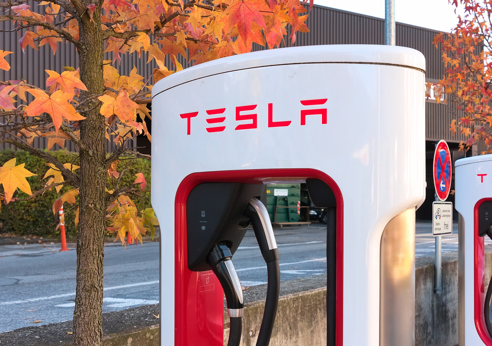

**טסלה מודל Y ג'וניפר** היא הגרסה המעודכנת של החשמלית הנמכרת ביותר בעולם, והיא מביאה עיצוב מרוענן, שקט נסיעה משופר וטווח גדול יותר. עבור הקונה הישראלי מדובר בעדכון משמעותי לרכב שכבר היום נמצא בין החשמליות הפופולריות בכבישי הארץ, וכעת הוא מנסה לשמר את ההובלה מול גל המתחרים הסינים והקוריאנים.

הכינוי "ג'וניפר" הוא שם הקוד הפנימי של טסלה לעדכון, בדומה למהלך שנעשה קודם לכן במודל 3 תחת השם "היילנד". מדובר בעדכון אמצע-חיים, כלומר לא דור חדש לגמרי אלא שדרוג מקיף של דגם קיים.

## מה השתנה בעיצוב של מודל Y ג'וניפר?

השינוי הבולט ביותר נמצא בחזית ובאחור. הפנסים הקדמיים הפכו דקים וחדים יותר, והחזית קיבלה פס תאורה רציף שמעניק לרכב מראה עדכני ומודרני. באחור בולט פס תאורה אופקי המשתרע לרוחב כל הדלת, מוטיב עיצובי שהופך נפוץ בעולם החשמליות.

מעבר לאסתטיקה, טסלה השקיעה בשיפור האווירודינמיקה, מה שתורם הן לטווח והן לשקט הנסיעה. גם הצמיגים והחישוקים עברו אופטימיזציה כדי להקטין התנגדות.

### תא הנוסעים

בפנים ממשיכה טסלה בגישה המינימליסטית שלה. מסך מרכזי גדול שמרכז כמעט את כל הפונקציות, היעדר לוח מחוונים מסורתי מול הנהג, וחומרי גימור שדורגו כלפי מעלה. חידוש מרכזי הוא הוספת מסך אחורי לנוסעים במושב האחורי, המאפשר שליטה במיזוג ובבידור. גם איכות הריפודים והבידוד האקוסטי שופרו באופן מורגש.

## כמה טווח יש למודל Y ג'וניפר?

הטווח הוא אחד מנתוני המפתח לכל רכב חשמלי בישראל. בגרסאות ארוכות הטווח מדברת טסלה על טווח שמגיע להערכות של מעל 550 ק"מ במחזור המדידה האירופי, בזכות שיפורי היעילות והאווירודינמיקה. בפועל, בנהיגה ישראלית מעורבת עם מיזוג פעיל, סביר להניח על טווח מציאותי נמוך יותר, אך עדיין נוח לרוב השימושים היומיומיים.

לטסלה יש יתרון מובנה בזכות רשת מטעני העל (Superchargers) הפרוסה בישראל, שמאפשרת טעינה מהירה ונוחה בנסיעות בין-עירוניות.

## מודל Y ג'וניפר מול המתחרות

שוק החשמליות המשפחתיות בישראל צפוף מתמיד. כך נראית מודל Y מול מתחרות בולטות:

| דגם | טווח מוערך (WLTP) | יתרון בולט | חיסרון |
|------|------------------|------------|--------|
| טסלה מודל Y ג'וניפר | מעל 550 ק"מ | רשת טעינה, תוכנה | תא נוסעים מינימליסטי |
| קיה EV6 | כ-500 ק"מ | עיצוב, טעינה מהירה מאוד | מחיר |
| יונדאי איוניק 5 | כ-480 ק"מ | מרווח פנימי, נוחות | טווח מעט נמוך |
| סקודה אניאק | כ-560 ק"מ | פרקטיות, נפח מטען | חוויית נהיגה שמרנית |

היתרון המרכזי של טסלה נשאר מערכת התוכנה, העדכונים המרחוק (OTA) ומערך הטעינה הנרחב. מנגד, המתחרות מציעות תא נוסעים מסורתי יותר עם כפתורים פיזיים, שיש קונים שמעדיפים.

## למי מתאימה מודל Y ג'וניפר בישראל?

הרכב מתאים במיוחד למשפחות שמחפשות חשמלית מרווחת עם תא מטען גדול, לנהגים שעושים נסיעות בין-עירוניות תכופות ונהנים מרשת הטעינה של טסלה, ולחובבי טכנולוגיה שמעריכים את ממשק התוכנה ואת יכולת העדכונים המתמשכת.

מנגד, מי שמעדיף ריבוי כפתורים פיזיים, לוח מחוונים מסורתי מול הנהג או חוויית שירות של יבואן רשמי מסורתי — כדאי שישקול גם את המתחרות הקוריאניות והאירופיות.

## מחיר וזמינות

המחיר בישראל צפוי להתחיל בטווח דומה לדגם היוצא, כלומר סביב 200 אלף שקל ומעלה בהתאם לגרסה ולעדכוני המיסוי. חשוב לזכור כי מס הקנייה על רכבים חשמליים בישראל נמצא במגמת עלייה הדרגתית, ולכן כדאי לבדוק את המחיר המעודכן מול היבואן בעת הרכישה.
