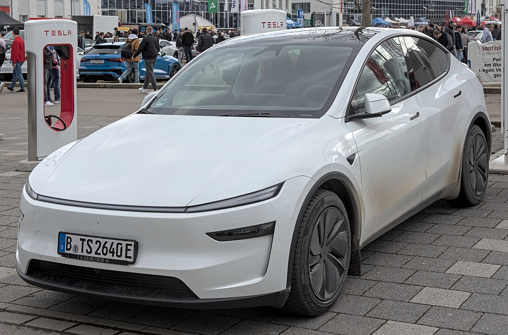

טסלה מודל Y ג'וניפר החדשה הגיעה לישראל, והיא מביאה איתה עדכון מקיף לקרוסאובר החשמלי הנמכר בעולם. מדובר בעדכון אמצע-חיים שמתמקד בעיקר בעיצוב מרוענן, בשקט נסיעה משופר ובשדרוג איכות ההרכבה — כשהמכניקה והטכנולוגיה שכבר הוכיחו את עצמן נשמרות. השאלה המרכזית היא האם טסלה מודל Y ג'וניפר עדיין הבחירה החכמה בקטגוריה שהפכה צפופה מתמיד, ובעיקר מול המבול הסיני.

## מה חדש בטסלה מודל Y ג'וניפר?

השינוי הראשון שקופץ לעין הוא החזית המחודשת, עם פס תאורה רציף לרוחב המכסה ומראה נקי ומודרני יותר. גם מאחור התקבלה תאורה חדשה בעיצוב ייחודי. אלה אינם שינויים דרמטיים במכניקה, אך הם מרעננים דגם שכבר הפך למראה שגרתי בכבישים.

השיפור המשמעותי באמת מסתתר במקומות שלא רואים: הוספת זכוכית אקוסטית, בידוד רעשים משופר ומתלים מכוילים מחדש. התוצאה היא נסיעה שקטה ומיושבת בהרבה מהדגם הקודם, מה שהיה אחד החולשות המרכזיות של המודל Y המקורי.

### תא הנוסעים

בפנים ממשיכה טסלה בקו המינימליסטי המוכר: מסך מרכזי גדול השולט כמעט בכל פונקציה, היעדר מד מהירות מאחורי ההגה, וגימור נקי. בגרסה החדשה נוספו חומרים איכותיים יותר, תאורת אווירה ומסך אחורי קטן לנוסעים במושב האחורי לשליטה במיזוג ובמולטימדיה.

המרווח הפנימי נותר מהגדולים בקטגוריה, ותא המטען העצום — יחד עם תא קדמי נוסף — הופך את הרכב לפרקטי במיוחד למשפחות ולנסיעות ארוכות.

## טווח, ביצועים וטעינה

טסלה מודל Y ג'וניפר מגיעה בגרסאות הנעה אחורית וגרסת הנעה כפולה. הטווח המוצהר בגרסאות המובילות נע סביב 550 עד 600 קילומטרים במחזור הבדיקה האירופי, כאשר בשימוש יומיומי מעורב סביר לצפות לטווח מעשי נמוך יותר, בהתאם לסגנון הנהיגה ולתנאי מזג האוויר.

התאוצה נותרה מרשימה גם בגרסה הבסיסית, ובגרסת ההנעה הכפולה מדובר בביצועים ספורטיביים של ממש. מבחינת טעינה, המודל Y תומך בטעינה מהירה במתח גבוה, והיתרון הגדול הוא כמובן הגישה לרשת מטעני העל של טסלה הפרוסה ברחבי ישראל — מהצפון ועד הדרום.

## טסלה מודל Y ג'וניפר מול המתחרים

הקטגוריה של הקרוסאוברים החשמליים המשפחתיים הפכה לצפופה במיוחד בישראל, בעיקר בזכות הדגמים הסיניים. הנה השוואה כללית מול מתחרים בולטים:

| דגם | יתרון מרכזי | קהל יעד |
|------|-------------|----------|
| טסלה מודל Y ג'וניפר | רשת טעינה, טכנולוגיה ותוכנה | מחפשי חבילה שלמה ובשלה |
| סקודה אניאק | פרקטיות ונוחות אירופית | משפחות שמרניות |
| קיה EV6 | עיצוב וטעינה מהירה מאוד | חובבי סטייל |
| BYD סיל U | מחיר ותמורה | קונים רגישי מחיר |

היתרון המובהק של טסלה נותר האקוסיסטם: רשת הטעינה, עדכוני התוכנה האלחוטיים התכופים והממשק החכם. אלה דברים שהמתחרים עדיין מתקשים להשתוות אליהם, גם אם הם מציעים תמורה חומרית מרשימה למחיר.

## למי מתאימה טסלה מודל Y ג'וניפר?

הרכב מתאים במיוחד למשפחות שמחפשות קרוסאובר חשמלי מרווח, טכנולוגי ופרקטי, ושמעריכות את הנוחות של רשת טעינה אמינה. מי שנרתע מהמינימליזם הקיצוני של תא הנוסעים או מהיעדר לוח מחוונים מסורתי — כדאי לו לנסוע ולהתרשם לפני ההחלטה.

בשורה התחתונה, העדכון של ג'וניפר לא ממציא את הגלגל מחדש, אבל הוא מטפל בדיוק בנקודות שהיו זקוקות לשיפור: שקט, נוחות ואיכות. זה הופך את טסלה מודל Y ג'וניפר לבחירה בשלה ומאוזנת בקטגוריה תחרותית מתמיד.
