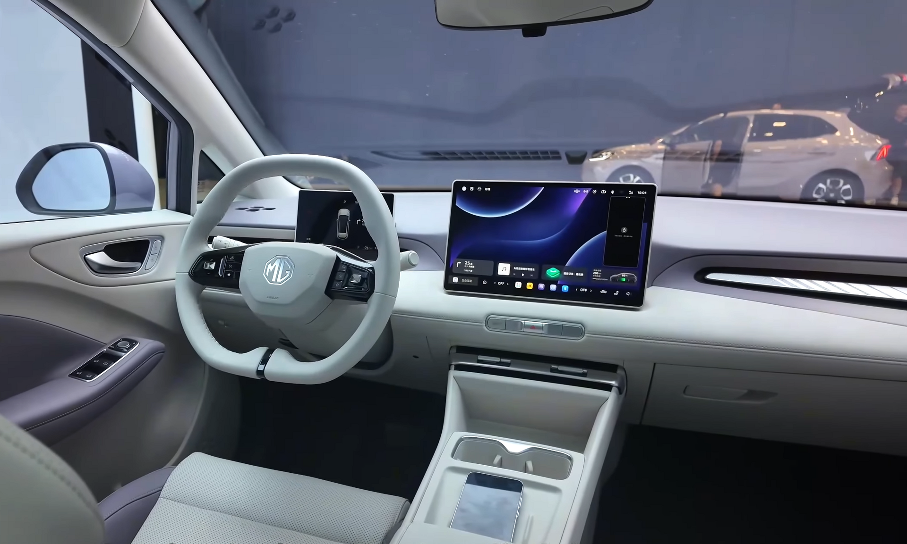

ה-**MG4 החשמלית** הפכה לאחד השחקנים הבולטים בשוק הרכב החשמלי המשפחתי בישראל, והיא מציעה שילוב מפתיע של נהיגה מהנה, טווח סביר ומחיר תחרותי. בשורה התחתונה: זו אחת ההצעות המשתלמות ביותר בקטגוריית ההאצ'בק החשמלי, ובמבחן הדרך שלנו היא הוכיחה שהיא הרבה יותר מ"עוד רכב סיני זול".

MG, המותג הבריטי ההיסטורי שנמצא כיום בבעלות קונצרן SAIC הסיני, זיהתה נכון את הצורך של המשפחה הישראלית: רכב חשמלי בגודל הגיוני, עם מרחב פנימי טוב ומחיר שאינו מבהיל. התוצאה היא רכב שמצליח לאתגר שמות מבוססים כמו פולקסווגן ID.3 ואפילו דגמים יפניים וקוריאניים.

## מה מייחד את ה-MG4 החשמלית?

המאפיין הבולט ביותר הוא ה**הנעה האחורית** — תצורה נדירה בקטגוריה הזו, שמעניקה לרכב איזון ותחושת נהיגה ספורטיבית. בשילוב עם מרכז כובד נמוך הודות למיקום הסוללה ברצפה, ה-MG4 מרגישה יציבה ומהנה בסיבובים, הרבה מעבר למה שמצפים מהאצ'בק משפחתי חשמלי.

העיצוב החיצוני חד וצעיר, עם קווים חדים בחזית, גג משופע וספוילר אחורי כפול שמעניק נופך ספורטיבי. זהו רכב שנראה יקר יותר ממה שהוא באמת.

### טווח נסיעה וטעינה

ה-MG4 מוצעת בכמה תצורות סוללה. הגרסאות הבסיסיות מציעות טווח מוצהר של כ-**350 ק"מ**, בעוד שגרסאות הסוללה הגדולה יותר מגיעות לטווח מוצהר של כ-**450 ק"מ**. בשימוש יומיומי מעורב בישראל, הצפי הריאלי נמוך במעט מהנתון המוצהר, בעיקר בנהיגה בין-עירונית מהירה או בשימוש אינטנסיבי במזגן בקיץ.

הטעינה המהירה בזרם ישר מאפשרת מעבר מ-10% ל-80% תוך פרק זמן סביר של כחצי שעה עד 40 דקות, בהתאם לגרסה ולעמדת הטעינה.

## איך זה מרגיש מבפנים?

תא הנוסעים של ה-MG4 מפתיע לטובה במרחב, ובמיוחד במרווח לרגליים במושב האחורי — תוצאה של בסיס גלגלים ארוך יחסית. חומרי הגמר פשוטים אך הגיוניים למחיר, והעיצוב הפנימי מינימליסטי ונקי.

במרכז שולט מסך מולטימדיה בגודל נדיב, שדרכו מתבצעת רוב הבקרה על מערכות הרכב. זהו גם היתרון וגם החיסרון: המסך עשיר בפונקציות, אך היעדר כפתורים פיזיים לחלק מהפעולות היומיומיות דורש התרגלות. תא המטען מציע נפח שימושי לחיי המשפחה, גם אם אינו מהגדולים בקטגוריה.

## טבלת השוואה: MG4 מול המתחרות

| פרמטר | MG4 החשמלית | פולקסווגן ID.3 | קיה EV3 |
|---|---|---|---|
| סוג הנעה | אחורית | אחורית | קדמית |
| טווח מוצהר (משוער) | 350–450 ק"מ | 400–550 ק"מ | 400–600 ק"מ |
| אופי נהיגה | ספורטיבי | מאוזן | נוח ורגוע |
| רמת גימור | סבירה למחיר | גבוהה | גבוהה |
| מיצוב מחיר | תחרותי מאוד | גבוה | בינוני-גבוה |

## ביצועים ונהיגה

בכביש ה-MG4 מגלה אופי חד ומדויק. ההיגוי מדויק, המתלים מכוונים לצד הספורטיבי מבלי להקשיח יתר על המידה, והתאוצה החשמלית המיידית הופכת עקיפות ויציאות מצומת לפשוטות. הגרסאות החזקות יותר מספקות תאוצה שמרגישה מהירה מהמצופה.

בנהיגה עירונית הרכב שקט ונוח, ובמהירויות גבוהות בכביש בין-עירוני הוא נשאר יציב. הבלימה ההתחדשותית ניתנת לכוונון בכמה רמות, מה שמאפשר נהיגה ב"דוושה אחת" למי שאוהב.

## למי ה-MG4 מתאימה?

ה-MG4 מתאימה במיוחד למשפחות ולזוגות צעירים שמחפשים כניסה לעולם הרכב החשמלי בלי לשבור את הכיס, אך בלי לוותר על חוויית נהיגה. מי שמחפש את הגימור הפרימיומי ביותר או את הטווח הארוך ביותר אולי יעדיף מתחרות יקרות יותר — אבל מבחינת תמורה לכסף, ה-MG4 היא אחת ההצעות הבולטות בשוק הישראלי כרגע.
