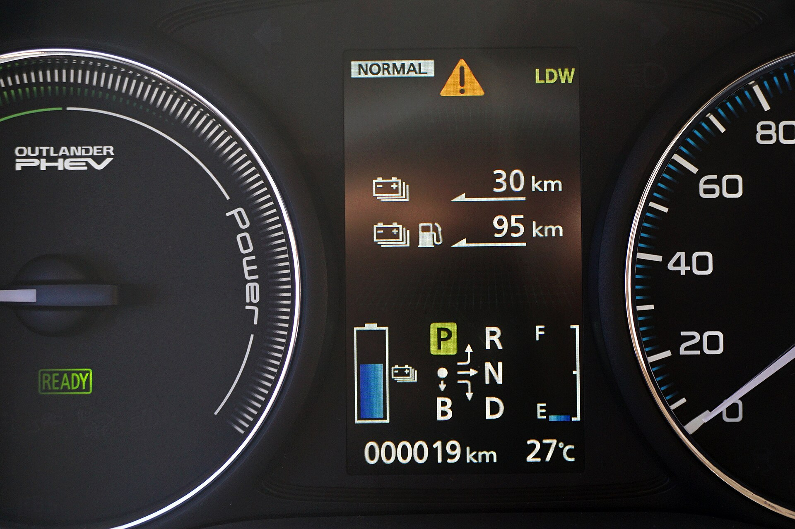

מיצובישי אאוטלנדר היברید נטען חוזרת לזירה הישראלית עם הבטחה ברורה: משפחתי גדול עם שבעה מושבים, שיודע לנסוע חשמלי בעיר ולחסוך דלק משמעותית, בלי חרדת טווח של רכב חשמלי מלא. במבחן הדרך שלנו גילינו רכב בוגר, שקט ונוח, שמכוון בדיוק למשפחה הישראלית שרוצה גמישות — טעינה בשקע הביתי ליום-יום, ומנוע בנזין לנסיעות הארוכות.

## מה מיוחד בהנעה של אאוטלנדר?

המערכת בנויה סביב מנוע בנזין המשמש בעיקר כמחולל, לצד שתי מכונות חשמליות — אחת בכל סרן — שמעניקות הנעה כפולה חשמלית. המשמעות הפרקטית: ברוב הנסיעות היומיומיות הרכב נע כחשמלי לחלוטין, שקט וחלק, ורק כשהסוללה מתרוקנת או כשלוחצים חזק על הגז נכנס מנוע הבנזין לתמונה.

הטווח החשמלי הנקי מספיק לרוב הנסועה העירונית — נסיעה לעבודה, הסעות ילדים וקניות — ובכך רבים מהנהגים יגלו שהם ממלאים דלק לעיתים רחוקות מאוד. מי שמחבר את הרכב לטעינה ביתית מדי לילה יזכה בחוויית שימוש שקרובה מאוד לרכב חשמלי, בלי לוותר על גיבוי מנוע הבנזין בנסיעות הבין-עירוניות.

## איך זה מרגיש על הכביש?

על הכביש אאוטלנדר משדרת רוגע. תגובת המצער חלקה, ההאצה החשמלית מיידית ברמה שמספיקה לעקיפות בטוחות, והבידוד האקוסטי מרשים — בעיקר בנהיגה חשמלית שבה השקט כמעט מוחלט. מערכת ההנעה הכפולה תורמת ליציבות ולאחיזה טובה במגוון תנאי דרך, מה שמעניק ביטחון בנסיעה בגשם או על כביש רטוב.

מצד שני, זה לא רכב שמזמין נהיגה ספורטיבית. המשקל הגבוה מורגש בפניות חדות, וההיגוי מכוון לנוחות ולא לדינמיות. מי שמחפש אופי ספורטיבי יתאכזב — אבל קהל היעד של משפחתי שבעה מושבים בדיוק מחפש את השילוב של שקט, נוחות וחסכון.

## שבעה מושבים — כמה זה פרקטי?

השורה השלישית באאוטלנדר מתאימה בעיקר לילדים או לנסיעות קצרות של מבוגרים, כמקובל בקטגוריה. היתרון האמיתי הוא הגמישות: אפשר לקפל את השורה השלישית ולקבל תא מטען נדיב, או לפתוח אותה בעת הצורך. תא הנוסעים מרווח, האיכות הנתפסת השתדרגה משמעותית בדור הנוכחי, והמערכת המולטימדיה עם המסך המרכזי נוחה לשימוש.

## טבלת השוואה: אאוטלנדר מול מתחרים

| פרמטר | מיצובישי אאוטלנדר | טויוטה RAV4 | קיה סורנטו |
| --- | --- | --- | --- |
| סוג הנעה | היברید נטען | היברید / היברید נטען | היברید נטען |
| מושבים | שבעה | חמישה | שבעה |
| טווח חשמלי נקי | טוב, ליום-יום עירוני | קצר יותר בגרסה הנטענת | דומה |
| אופי הנהיגה | נוחות ושקט | מאוזן | נוחות משפחתית |
| התאמה למשפחה | גבוהה מאוד | בינונית-גבוהה | גבוהה מאוד |

## כמה היא חוסכת בדלק?

כאן טמון הלב של הסיפור. נהג שמקפיד לטעון את הרכב באופן קבוע ונוסע בעיקר בעיר יכול להגיע לצריכת דלק נמוכה במיוחד, כי הוא כמעט לא מפעיל את מנוע הבנזין. לעומת זאת, מי שלא טורח לטעון ונוסע הרבה בכביש מהיר יגלה שהיתרון הכלכלי מצטמצם — הסוללה מתרוקנת ומנוע הבנזין נושא בעומס, כולל משקל המערכת ההיברידית.

המסקנה ברורה: **אאוטלנדר היברید נטען משתלמת בעיקר למי שמתחייב לטעינה סדירה**. עבור בעל בית פרטי או מקום עבודה עם עמדת טעינה, זו יכולה להיות עסקה מצוינת. עבור מי שאין לו גישה לטעינה — כדאי לשקול היברید רגיל.

## למי מיצובישי אאוטלנדר מתאימה?

- **משפחות** שצריכות שבעה מושבים לפחות מדי פעם.
- **נהגים עירוניים** עם אפשרות טעינה ביתית קבועה.
- **מי שמחפש רוגע ושקט** בנהיגה יותר מאשר אופי ספורטיבי.
- **מי שרוצה יתרונות של רכב חשמלי** בלי לוותר על גמישות מנוע הבנזין לנסיעות ארוכות.

בשורה התחתונה, מיצובישי אאוטלנדר היברید נטען היא הצעה שקולה ובוגרת בקטגוריית המשפחתיים. היא לא מנסה לרגש, אלא לפתור בעיה יומיומית — והיא עושה זאת בצורה משכנעת, במיוחד למי שינצל את יכולת הטעינה שלה במלואה.
