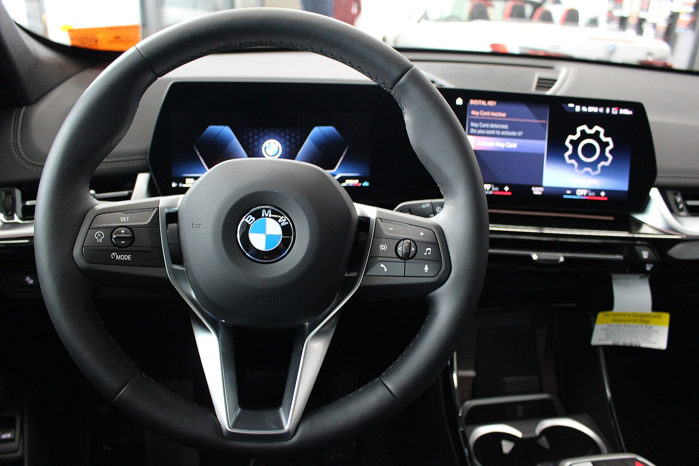

ה-**BMW iX1** הוא הכניסה הנגישה יחסית של ב.מ.וו לעולם הקרוסאוברים החשמליים, והוא מציע שילוב מרשים של איכות פרימיום, ביצועים חדים ומרחב פנים פרקטי בגוף קומפקטי. במבחן הדרך שערכנו בכבישי ישראל גילינו רכב שמצליח להרגיש "ב.מ.וו אמיתי" גם ללא מנוע בעירה, עם התנהגות כביש בוגרת ותחושת יוקרה שמצדיקה את תג המחיר.

## מה מייחד את ה-BMW iX1?

ה-iX1 בנוי על אותה פלטפורמה של דגם ה-X1 המוכר, אך במקום מנוע בנזין הוא נושא סוללה גדולה ומערכת הנעה חשמלית. גרסת xDrive30 הנפוצה מגיעה עם שני מנועים חשמליים — אחד לכל סרן — שמספקים הנעה כפולה והספק כולל של כ-300 כוחות סוס בסביבת ה-overboost. התוצאה: זינוק ל-100 קמ"ש בכ-5.6 שניות, מספר שמרגיש אפילו מהיר יותר בזכות המומנט המיידי.

מבחינת עיצוב, ה-iX1 שומר על קווים שקטים ומרובעים יחסית, עם סורג קדמי סגור המרמז על ההנעה החשמלית ופנסים חדים. זהו רכב שלא צועק לכל עבר שהוא חשמלי, וזה בדיוק הקסם עבור מי שמחפש כניסה נקייה ומאופקת לעולם הרכב החשמלי הפרימיומי.

## מרחב פנים ואיכות גימור

הפנים הם אחד החוזקות הגדולות של ה-iX1. הגימור נקי, החומרים איכותיים, ולוח המחוונים המעוקל (Curved Display) משלב מסך נהג דיגיטלי ומסך מולטימדיה מרכזי גדול. מערכת ה-iDrive 8 מהירה ומודרנית, אך שימו לב — ב.מ.וו העבירה חלק ניכר מהפונקציות למסך המגע, מה שדורש התרגלות בזמן נהיגה.

למרות המידות הקומפקטיות, מרחב הנוסעים מאחור נוח גם למבוגרים בזכות רצפה שטוחה יחסית, ותא המטען מציע נפח נדיב לקטגוריה — סביב 490 ליטר, שמתרחב משמעותית בקיפול הספה. זהו רכב שמתאים למשפחה קטנה שמחפשת פרימיום בלי לוותר על פרקטיות יומיומית.

## טווח, סוללה וטעינה

השאלה הראשונה של כל קונה ישראלי היא הטווח. ה-**BMW iX1** נושא סוללה שימושית בקיבולת של כ-64.7 קילוואט-שעה, והטווח המוצהר במחזור הבדיקה האירופי נע סביב 430–450 ק"מ. בפועל, בנהיגה מעורבת בישראל עם מזגן פעיל, כדאי לצפות לטווח ריאלי של כ-330–380 ק"מ — נתון סביר לקטגוריה ולשימוש יומיומי בתוך העיר ובין-עירוני קצר.

מבחינת טעינה, הרכב תומך בטעינה מהירה בזרם ישר בהספק של עד כ-130 קילוואט, המאפשרת מעבר מ-10% ל-80% בכ-30 דקות בעמדה מתאימה. בטעינה ביתית בזרם חילופין (עד 11 קילוואט) הטעינה המלאה תיקח כמה שעות — מושלם לטעינת לילה.

## איך הוא מרגיש על הכביש?

כאן ה-iX1 מזכיר לנו למה זו ב.מ.וו. ההיגוי מדויק, המרכב יציב בפניות, והתחושה הכללית ספורטיבית אך בוגרת. המתלים מכוילים לצד המוצק, מה שמעביר לעיתים מהמורות בכבישים הישראליים המחוספסים, אך בתמורה מקבלים שליטה ויציבות מצוינים במהירויות גבוהות. הבידוד האקוסטי טוב, והשקט החשמלי משדרג את תחושת היוקרה.

## טבלת השוואה: BMW iX1 מול המתחרים

| דגם | הספק (סס) | טווח מוצהר (ק"מ) | הנעה | קטגוריה |
|------|-----------|-------------------|-------|----------|
| BMW iX1 xDrive30 | כ-300 | 430–450 | כפולה 4X4 | פרימיום קומפקטי |
| אאודי Q4 e-tron | כ-286 | 480–520 | אחורית/כפולה | פרימיום קומפקטי |
| מרצדס EQA | כ-190–290 | 420–530 | קדמית/כפולה | פרימיום קומפקטי |
| טסלה מודל Y | כ-300+ | 450–530 | אחורית/כפולה | חשמלי מיינסטרים |

## למי ה-BMW iX1 מתאים?

ה-iX1 מתאים בעיקר למי שמחפש כניסה לעולם הרכב החשמלי הפרימיומי בלי לוותר על תחושת נהיגה, איכות גימור ומיתוג. הוא לא הזול בקטגוריה, וגם לא בעל הטווח הארוך ביותר, אך הוא מציע חבילה מאוזנת ומלוטשת. מי שמחפש ערך כלכלי גולמי ימצא אלטרנטיבות זולות יותר, אך מי שמחפש את השילוב של פרקטיות, יוקרה ותחושת ב.מ.וו — יתקשה להישאר אדיש.
