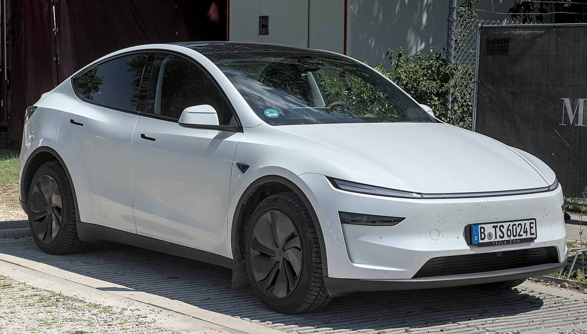

טסלה מודל Y ג'וניפר (Juniper) — עדכון אמצע-החיים לרכב החשמלי הנמכר ביותר בעולם — מגיעה לישראל, ומביאה עמה עיצוב מרוענן, שקט נסיעה משופר וטווח נהיגה מעט גדול יותר. מדובר בשדרוג המשמעותי הראשון שעובר הדגם מאז השקתו המקורית, והוא נועד לשמור על מודל Y בחזית התחרות מול גל הרכבים החשמליים החדשים, ובראשם המתחרים הסיניים.

## מה חדש בטסלה מודל Y ג'וניפר?

השינוי הבולט ביותר הוא בעיצוב. החזית קיבלה פס תאורה מלא לרוחב המכסה, בדומה למגמה שמאפיינת חשמליות רבות כיום, ואילו מאחור הותקנה תאורה בעיצוב חדש. מעבר לאסתטיקה, טסלה השקיעה בעיקר ברכיבים שמורגשים בנסיעה יומיומית.

הדגש המרכזי הוא על **שקט הנסיעה**: זכוכית עבה יותר, אטמים משופרים ובידוד אקוסטי טוב יותר מפחיתים משמעותית את רעש הרוח והכביש שחדר לתא הנוסעים בדגם הקודם. זו הייתה אחת הביקורות הנפוצות על מודל Y, וטסלה טיפלה בה ישירות.

## איך משתנה חוויית הנהיגה?

מערכת המתלים כווננה מחדש לנוחות טובה יותר על כבישים ישראליים משובשים, בלי לוותר על התחושה הישירה שמאפיינת את הדגם. תא הנוסעים המשופר, יחד עם ריפוד חדש ומסך אחורי לנוסעים במושב השני, מקרבים את התחושה הכללית לרמת פרימיום גבוהה יותר.

גם המרחב הפנימי נשאר מרווח — מודל Y ממשיכה להיות אחת האופציות הפרקטיות ביותר בקטגוריה, עם תא מטען גדול ותא קדמי נוסף מתחת למכסה המנוע.

### מה לגבי הטווח והביצועים?

הטווח שופר קלות בזכות שיפורי יעילות אווירודינמית וניהול אנרגיה. בגרסאות המובילות מדובר בהערכות של סביב 500 עד 600 קילומטר במחזור הבדיקה האירופי, כתלות בגודל הגלגלים ובתנאי הנהיגה. הביצועים נותרו חדים, עם האצה מהירה שמאפיינת את הדגם.

## טבלת השוואה: מודל Y ג'וניפר מול הדגם היוצא

| פרמטר | מודל Y (דור קודם) | מודל Y ג'וניפר |
|---|---|---|
| עיצוב חזית | פנסים נפרדים | פס תאורה רציף |
| שקט נסיעה | טוב | משופר משמעותית |
| בידוד אקוסטי | בסיסי | זכוכית עבה ואטמים חדשים |
| מסך אחורי לנוסעים | אין | קיים בגרסאות מסוימות |
| טווח (הערכה) | דומה | מעט גדול יותר |

## למי מתאימה מודל Y ג'וניפר בישראל?

הדגם מתאים במיוחד למשפחות שמחפשות רכב חשמלי מרווח, פרקטי, עם רשת טעינה מהירה ייעודית של טסלה הפרוסה ברחבי הארץ. השיפור בשקט הנסיעה הופך אותה לאטרקטיבית יותר גם למי שנרתע בעבר מרעש הרקע.

מנגד, כדאי לזכור שהמיסוי על רכבים חשמליים בישראל צפוי להתייקר בהדרגה משנת 2026, מה שעשוי להשפיע על המחיר הסופי. מומלץ לבדוק את המחירון המעודכן מול היבואן לפני ההזמנה.

## שורה תחתונה

טסלה מודל Y ג'וניפר אינה מהפכה, אלא שדרוג חכם וממוקד שמטפל בנקודות התורפה המרכזיות של הדגם — בעיקר שקט הנסיעה והתחושה הפנימית. בשוק חשמלי שמתחמם משנה לשנה, זהו מהלך שנועד לשמור על מודל Y כברירת מחדל עבור רבים מהקונים הישראליים.
