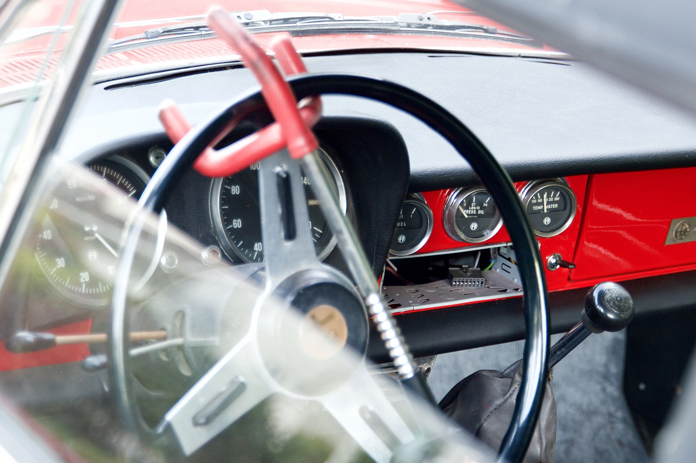

## איך מגנים על הרכב מפני גניבה?

**הגנה מפני גניבת רכב** מתחילה בהבנה שהגנבים של היום כמעט לא שוברים חלונות — הם מנצלים חולשות טכנולוגיות, בעיקר במפתחות ללא מגע (Keyless). הדרך היעילה ביותר היא לשלב אמצעי הרתעה פיזי גלוי, מערכת מיגון אלקטרונית ומערכת איתור, וכך להפוך את הרכב שלכם למטרה לא משתלמת. במדריך הזה נסביר כיצד פועלות הגניבות המודרניות בישראל, ומה באמת שווה להתקין.

## מהי שיטת הריליי ולמה היא כל כך מסוכנת?

שיטת ה'ריליי' (Relay Attack) היא כיום הגורם המרכזי לגניבות רכב חדשות. ברכבים עם מפתח ללא מגע, המפתח משדר כל הזמן אות רדיו קצר-טווח. הגנבים עובדים בזוגות: אחד מתקרב לדלת הבית עם מכשיר שקולט את אות המפתח מבפנים, השני עומד ליד הרכב עם מכשיר שמשדר את האות המועתק. הרכב 'חושב' שהמפתח לידו — נפתח ומותנע תוך שניות, בלי רעש ובלי נזק.

הבעיה חמורה במיוחד בדגמים פופולריים ויקרים יחסית, כמו טויוטה, יונדאי, קיה, מאזדה ורכבי פרימיום. לכן, גם אם הרכב שלכם חדש ומצויד היטב, אסור להניח שהוא מוגן אוטומטית.

## אילו אמצעי הגנה באמת עובדים?

### 1. שקית חוסמת אותות (כלוב פאראדיי)

זהו הפתרון הזול והחכם ביותר נגד מתקפת ריליי. שקית או קופסה עם ציפוי מתכתי חוסמת את אות הרדיו של המפתח, כך שאי אפשר להעתיק אותו. פשוט מניחים את המפתח בשקית בכניסה הביתה. עלות של כמה עשרות שקלים בלבד — והשפעה עצומה.

### 2. נעילת הגה פיזית

נעילת הגה נראית 'ישנה', אבל דווקא בגלל זה היא עובדת: היא אמצעי הרתעה גלוי. גנב שרואה נעילה בולטת יעדיף לוותר ולעבור לרכב הבא. זהו רובד הגנה מכני שלא תלוי בחשמל או בתוכנה.

### 3. אימובילייזר ומערכת מיגון מאושרת

מערכות מיגון אלקטרוניות מדור מתקדם מונעות התנעה גם אם הגנב הצליח לפתוח את הרכב. חברות הביטוח בישראל מסווגות רמות מיגון, ולעיתים דורשות התקנה של רמה מסוימת כתנאי לביטוח מקיף — במיוחד בדגמים מבוקשים.

### 4. מערכת איתור ושחזור

מערכות כמו איתוראן ודומותיהן לא מונעות את הגניבה עצמה, אבל מגדילה משמעותית את הסיכוי לאתר ולשחזר את הרכב. בחלק מהמקרים היא גם מוזילה את פוליסת הביטוח.

## טבלת השוואה: אמצעי הגנה מפני גניבת רכב

| אמצעי | עלות משוערת | יעילות מול ריליי | הרתעה גלויה |
|---|---|---|---|
| שקית חוסמת אותות | נמוכה מאוד | גבוהה מאוד | לא |
| נעילת הגה | נמוכה | בינונית | גבוהה |
| מערכת מיגון/אימובילייזר | בינונית-גבוהה | גבוהה | חלקית |
| מערכת איתור ושחזור | חודשית קבועה | לא מונעת, מסייעת בשחזור | לא |

## טעויות נפוצות שמקלות על הגנבים

- **השארת המפתח ליד הדלת או החלון:** מקצרת מאוד את המרחק שמכשיר הריליי צריך לגשר. הרחיקו את המפתח למרכז הבית.
- **הסתמכות על אמצעי יחיד:** מערכת אחת לבדה לא מספיקה. שילוב של פיזי ואלקטרוני הוא המפתח.
- **חניה במקום חשוך ומבודד:** חניה תחת תאורה, ליד מצלמות או בחניון סגור מרתיעה משמעותית.
- **אי-החלפת קודים וסיסמאות ברירת מחדל** באפליקציות ובמערכות מחוברות של הרכב.

## מה עושים אם הרכב כבר נגנב?

ראשית, מדווחים מיד למשטרה ומקבלים מספר תיק. לאחר מכן מודיעים לחברת המיגון או האיתור לצורך הפעלת חיפוש, ומעדכנים את חברת הביטוח בהקדם. שמרו עותק של פרטי הרכב, מספר השלדה והמפתחות — פרטים אלו יזרזו את הטיפול.

## שורה תחתונה

**הגנה מפני גניבת רכב** אינה עניין של גאדג'ט יחיד אלא של שכבות. גנב מודרני מחפש את הדרך המהירה והשקטה ביותר, וכל מכשול נוסף — משקית פאראדיי זולה ועד נעילת הגה ומערכת איתור — מגדיל את הסיכוי שיוותר וימשיך הלאה. ההשקעה קטנה ביחס לשווי הרכב ולעוגמת הנפש שנחסכת.
