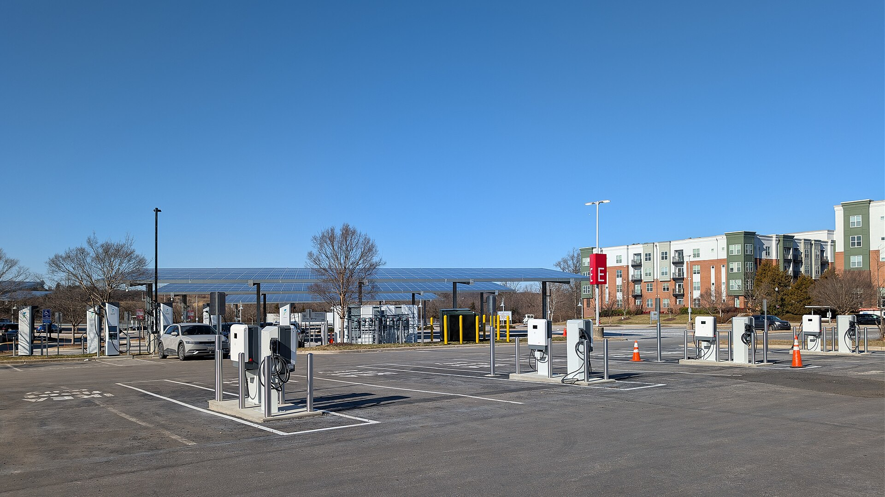
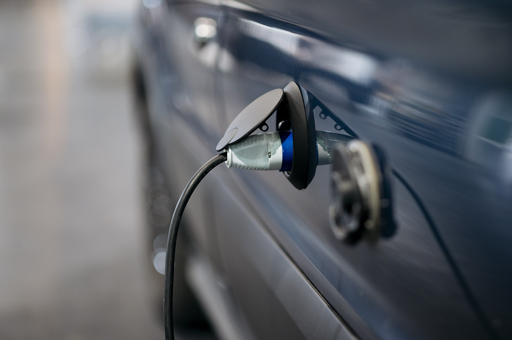

טעינה מהירה לרכב חשמלי בעמדת זרם ישר לוקחת ברוב הדגמים המודרניים בין 20 ל-40 דקות כדי לעבור מכ-10% ל-80% טעינה. זהו הטווח הריאלי שכדאי לתכנן לפיו נסיעה ארוכה בישראל, אך המספר המדויק תלוי בשורה של גורמים שרבים מהנהגים אינם מכירים. בכתבה זו נסביר מה קובע את מהירות הטעינה, למה לא כדאי לחכות ל-100%, ואיך להוציא את המקסימום מכל עצירה.

## מה זו בעצם טעינה מהירה לרכב חשמלי?

בניגוד לעמדה ביתית שמספקת זרם חילופין בהספק של כ-7 עד 11 קילוואט, עמדת טעינה מהירה מספקת **זרם ישר** ישירות לסוללה, בהספקים של 50, 150 ואף 350 קילוואט. ההבדל דרמטי: בעוד טעינה ביתית מלאה עשויה להימשך לילה שלם, טעינה מהירה לרכב חשמלי מאפשרת להוסיף מאות קילומטרים של טווח בזמן הפסקת קפה.

בישראל פרוסות כיום רשתות טעינה מהירה לאורך הצירים המרכזיים, כולל עמדות מהירות במיוחד המתאימות לדגמים כמו יונדאי איוניק 5, קיה אי-וי 6, טסלה מודל 3 ומודל וואי, וסקודה אניאק.

## מה משפיע על מהירות הטעינה?

גם אם עמדה מפרסמת הספק גבוה, הרכב שלכם לא בהכרח ינצל אותו במלואו. הנה הגורמים המרכזיים:

- **הספק העמדה** — עמדה של 50 קילוואט תמיד תהיה איטית יותר מעמדה של 150 קילוואט.
- **הספק הטעינה המרבי של הרכב** — לכל דגם יש תקרה משלו. רכב שמוגבל ל-100 קילוואט לא ייהנה מעמדה של 350.
- **רמת מתח הסוללה** — רכבים בארכיטקטורת 800 וולט, כמו יונדאי איוניק 5, טוענים מהר במיוחד.
- **מפלס הטעינה הנוכחי** — הטעינה מהירה בין 10% ל-60%, ומאטה משמעותית מעל 80%.
- **טמפרטורת הסוללה** — סוללה קרה מדי או חמה מדי מגבילה את קצב הטעינה להגנה על התאים.

## עקומת הטעינה: למה 100% זה בזבוז זמן

המושג החשוב ביותר להבנת טעינה מהירה הוא **עקומת הטעינה**. בתחילת הטעינה הרכב מושך את ההספק המרבי, אך ככל שהסוללה מתמלאת, קצב הטעינה יורד בהדרגה כדי להגן על התאים. התוצאה: המעבר מ-10% ל-80% עשוי לקחת חצי שעה, אך המעבר מ-80% ל-100% יכול לקחת כמעט אותו זמן בפני עצמו.

לכן ההמלצה הרווחת היא לנתק את הרכב סביב 80% בעמדה מהירה, להמשיך בנסיעה, ולהשלים טעינה מלאה בבית אם צריך. כך גם משחררים את העמדה לנהגים אחרים וגם חוסכים זמן יקר.

## השוואת זמני טעינה לפי הספק

הטבלה הבאה ממחישה את ההבדל בזמני טעינה מ-10% ל-80% עבור סוללה טיפוסית בגודל בינוני (כ-60 עד 70 קילוואט-שעה). הנתונים הם הערכה כללית ומשתנים בין דגמים:

| הספק העמדה | זמן משוער 10%-80% | שימוש אופייני |
|---|---|---|
| 11 קילוואט (בית) | 6-8 שעות | טעינה לילית |
| 50 קילוואט | 60-80 דקות | עמדה עירונית |
| 150 קילוואט | 25-35 דקות | צירים בין-עירוניים |
| 350 קילוואט | 18-25 דקות | דגמים בארכיטקטורת 800 וולט |

## טיפים לטעינה מהירה חכמה

- **חממו את הסוללה מראש** — רוב הרכבים מציעים חימום מקדים כשמזינים עמדת טעינה בניווט. בחורף זה יכול לקצר את הטעינה בדקות רבות.
- **הגיעו עם סוללה נמוכה יחסית** — טעינה שמתחילה ב-15% מנצלת את החלק המהיר של העקומה.
- **אל תחכו ל-100%** — עצרו ב-80% ותמשיכו.
- **בדקו את הספק הרכב שלכם** — אין טעם לחפש עמדת 350 קילוואט אם הרכב שלכם מוגבל ל-120.

## האם טעינה מהירה פוגעת בסוללה?

זו אחת השאלות הנפוצות ביותר. התשובה: טעינה מהירה מדי פעם, בעיקר בנסיעות ארוכות, אינה גורמת לנזק משמעותי — מערכות ניהול הסוללה מתוכננות בדיוק לכך. עם זאת, **טעינה מהירה יומיומית** כשגרה עלולה להאיץ מעט את הבלאי הטבעי של הסוללה לאורך שנים. הכלל הפרקטי פשוט: השתמשו בטעינה ביתית איטית לשגרה היומית, ושמרו את הטעינה המהירה לנסיעות הארוכות.
