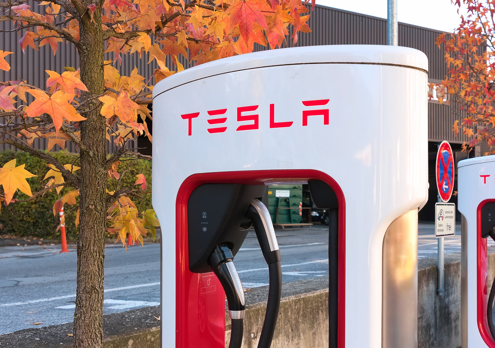

טסלה מודל Y החדשה, הנושאת את שם הקוד "ג'וניפר", היא הדור המרוענן של החשמלית המשפחתית המבוקשת בעולם — וגם בישראל. היא מביאה עיצוב חיצוני מעודכן, פנים שקטים ומוקפדים יותר, שיפור בטווח ובאיכות הנסיעה, תוך שמירה על מה שהפך את הדגם לרב-מכר: פשטות, ביצועים ורשת טעינה מהירה ופרוסה. במבחן החשמלי הזה נבחן מה השתנה, למי היא מתאימה, והאם היא עדיין הבחירה הנכונה בשוק שמוצף בחשמליות חדשות.

## מה חדש בטסלה מודל Y?

השינוי הבולט ביותר הוא בחזית ובחלק האחורי. הפנסים הקדמיים הצרים והפס האחורי הרציף מעניקים לרכב מראה עכשווי ומזוקק יותר, שמזכיר את קווי העיצוב של דגמי הדור החדש. מעבר לאסתטיקה, השיפורים המשמעותיים נמצאים דווקא בתחומים שלא רואים בעין:

- **בידוד אקוסטי משופר** — זגוגיות עבות יותר ואיטום טוב יותר מפחיתים רעשי רוח וכביש.
- **מתלים מכוילים מחדש** — נסיעה נוחה יותר וספיגת מהמורות עדינה יותר, נקודת תורפה היסטורית של הדגם.
- **טווח מוגדל** — שיפור ביעילות האנרגטית מעלה את הטווח המוצהר.

## פנים הרכב: פשטות עם שדרוג

תא הנוסעים של טסלה מודל Y ממשיך בקו המינימליסטי המוכר, שבמרכזו מסך מגע גדול השולט כמעט בכל פונקציה ברכב. הדור החדש מוסיף **מסך מגע אחורי** לנוסעים במושב האחורי, לשליטה במיזוג ובמערכת הבידור, וכן חומרי גימור משודרגים ותאורת אווירה סובבת לאורך הדשבורד.

המרחב הפנימי נותר מהמרווחים בקטגוריה, עם תא מטען קדמי (frunk) נוסף לתא המטען האחורי הגדול. מי שמגיע מרכב בנזין משפחתי ימצא כאן שפע מקום לנוסעים ולציוד.

### חוויית נהיגה

הביצועים נותרו נקודת חוזק. גם בגרסאות הבסיס ההאצה מיידית ונטולת השהיות, בזכות מומנט החשמלי הזמין באופן מיידי. ההיגוי מדויק, מרכז הכובד הנמוך מעניק יציבות בפניות, והשיפור במתלים הופך את הנסיעה היומיומית לנעימה יותר מבעבר.

## טווח, טעינה וצריכה

הטווח המוצהר בגרסאות המובילות נע בטווח שבין כ-500 לכ-600 ק"מ במחזור WLTP, בהתאם לגרסה ולגודל הסוללה. בשימוש ישראלי אמיתי — עם מיזוג בקיץ ונהיגה מעורבת — סביר לצפות לטווח נמוך יותר במקצת, אך עדיין נוח לרוב הנהגים היומיומיים.

יתרון מהותי הוא **רשת העל-טעינה (Supercharger)** של טסלה, המספקת טעינה מהירה ואמינה, לצד תשתית הטעינה הציבורית הכללית המתרחבת בישראל. הטעינה הביתית נותרת הדרך הזולה והנוחה ביותר לתחזק את הרכב.

## טסלה מודל Y מול המתחרות

השוק הישראלי מוצף כיום בחשמליות משפחתיות, בעיקר מתוצרת סינית, המציעות ערך גבוה במחיר תחרותי. כך ניצבת טסלה מודל Y מול היריבות המרכזיות:

| פרמטר | טסלה מודל Y | חשמליות סיניות מתחרות | חשמליות אירופאיות |
|---|---|---|---|
| טווח מוצהר | גבוה (500–600 ק"מ) | בינוני-גבוה | בינוני |
| רשת טעינה ייעודית | מצוינת (Supercharger) | תלוי ברשת ציבורית | תלוי ברשת ציבורית |
| ביצועים | מהירים מאוד | טובים | טובים |
| איכות פנים | טובה ומינימליסטית | משתפרת מהר | גבוהה |
| מחיר | תחרותי | לרוב נמוך יותר | לרוב גבוה יותר |

היתרון של טסלה טמון בשילוב בין ביצועים, טווח ורשת טעינה ייעודית — שילוב שקשה למתחרות להשוות אליו במלואו, גם אם הן מציעות ציוד נדיב יותר לעיתים.

## למי מתאימה טסלה מודל Y?

הדגם מתאים במיוחד למשפחות ולנהגים המחפשים רכב חשמלי מרווח, מהיר ופשוט לתפעול, שמסתמכים על רשת טעינה נוחה לנסיעות ארוכות. מי שמחפש גימור פנים עשיר במיוחד או ריבוי כפתורים פיזיים — עשוי להעדיף מתחרה אחרת. אך ככלל, הדור המרוענן שומר על מעמדה של מודל Y כאחת החשמליות המשפחתיות המשתלמות והמלוטשות בשוק.

## סיכום

טסלה מודל Y החדשה אינה מהפכה, אלא שכלול חכם של נוסחה מנצחת. השיפורים בשקט הנסיעה, בנוחות ובעיצוב הופכים אותה לבשלה יותר, בעוד הטווח ורשת הטעינה שומרים על היתרון התחרותי. בשוק ישראלי שהופך תחרותי מיום ליום, היא נותרת נקודת ייחוס שכל קונה חשמלי משפחתי צריך לשקול.
