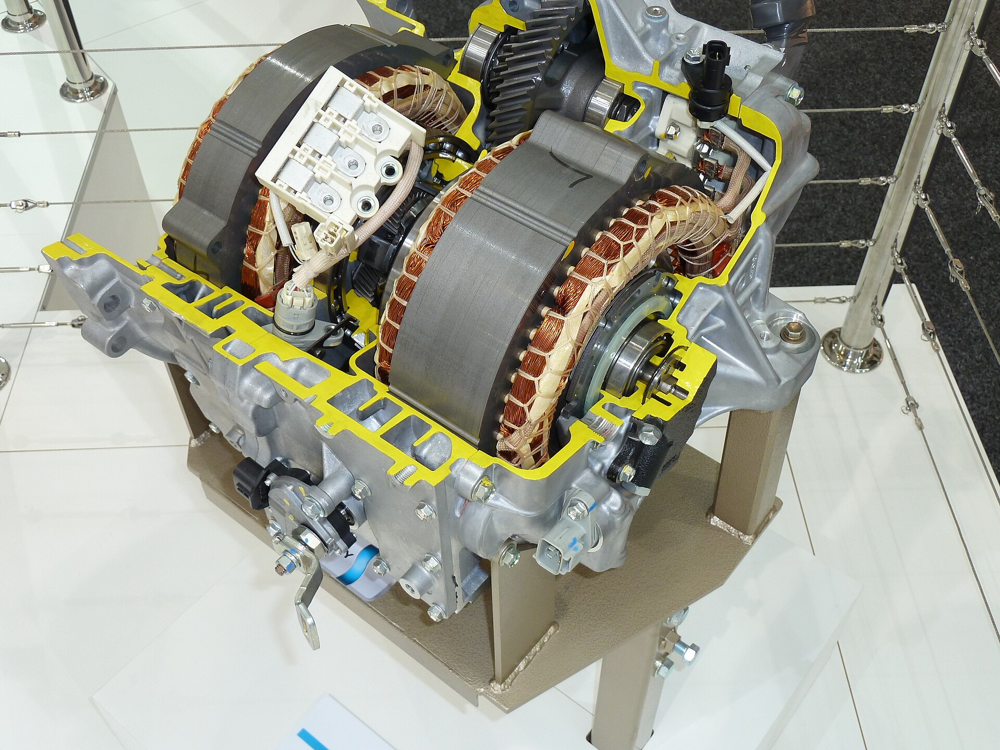
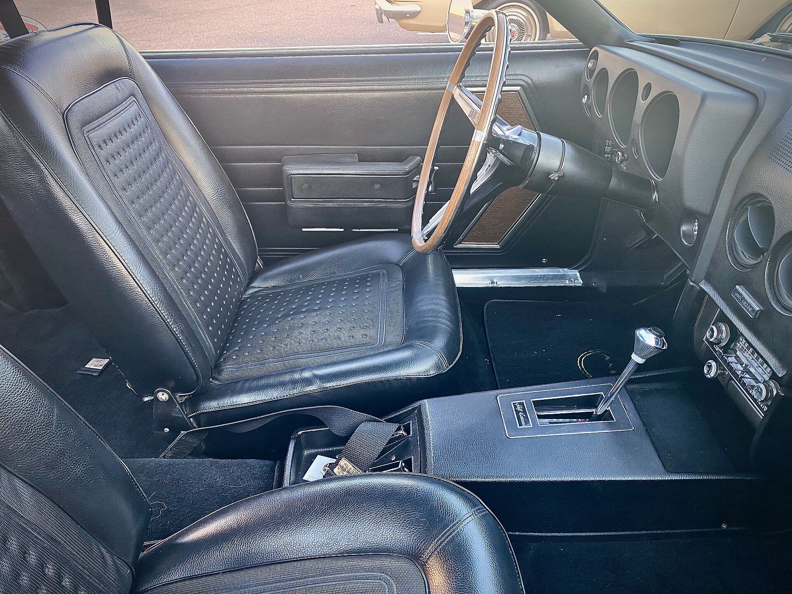

בחירת רכב חדש בישראל כמעט תמיד מגיעה עם תיבת הילוכים אוטומטית, אך מעטים יודעים שמאחורי המילה "אוטומטית" מסתתרים שלושה סוגים שונים לחלוטין של טכנולוגיה. **תיבת הילוכים אוטומטית** הידראולית קלאסית, תיבת CVT ותיבה רובוטית כפולת מצמד — כל אחת מהן מתנהגת אחרת בכביש, צורכת דלק אחרת ודורשת תחזוקה שונה. הבחירה הנכונה יכולה לחסוך לכם אלפי שקלים בתחזוקה ולשפר משמעותית את חוויית הנהיגה.

## מהם סוגי תיבות ההילוכים האוטומטיות?

לפני שקונים רכב חשוב להבין מה בדיוק מסתתר מתחת למכסה המנוע. ישנם היום שלושה סוגים עיקריים של תיבות אוטומטיות בשוק הישראלי, ולכל אחת אופי משלה.

### תיבה אוטומטית הידראולית קלאסית

זוהי התיבה הוותיקה והמוכרת ביותר, המשתמשת בממיר מומנט הידראולי במקום מצמד מכני. היא ידועה בנסיעה חלקה ורכה, ובעמידות גבוהה לאורך שנים. יצרנים כמו טויוטה, מאזדה ומרצדס משתמשים בה בדגמים רבים. החיסרון העיקרי הוא צריכת דלק מעט גבוהה יותר ותחושת האצה פחות ישירה.

### תיבת CVT — רציפה ללא מדרגות

תיבת CVT (רציפה) עובדת בעזרת מערכת רצועה וגלגלות המאפשרת יחסי העברה אינסופיים, כך שאין תחושת "מעברים" בין הילוכים. היא חסכונית מאוד בדלק ומעניקה נסיעה שקטה בעיר. הונדה, ניסאן וכל ההיברידים של טויוטה משתמשים בעיקרון הזה. החיסרון: תחת עומס גבוה נוצרת לעיתים תחושת "החלקה" ורעש מנוע מוגבר.

### תיבה רובוטית כפולת מצמד (DSG)

התיבה הרובוטית משלבת שני מצמדים המאפשרים החלפת הילוכים מהירה במיוחד, כמעט ללא איבוד תאוצה. פולקסווגן, סקודה, קופרה ורבים מהיצרנים האירופיים והסיניים אימצו אותה. היא מספקת נהיגה ספורטיבית וחסכונית, אך רגישה יותר לעומסי פקקים ודורשת תחזוקה מדויקת של המצמדים ושמן התיבה.

## טבלת השוואה: איזו תיבה מתאימה לכם?

| קריטריון | אוטומטית הידראולית | CVT רציפה | רובוטית כפולת מצמד |
|---|---|---|---|
| חלקות נסיעה | מצוינת | מצוינת | טובה |
| חיסכון בדלק | בינוני | גבוה | גבוה |
| תחושת ספורטיביות | בינונית | נמוכה | גבוהה |
| אמינות לאורך זמן | גבוהה מאוד | גבוהה | בינונית-תלוי דגם |
| התאמה לפקקים | מצוינת | מצוינת | בינונית |
| עלות תיקון | בינונית-גבוהה | בינונית | גבוהה |

## מה הכי מתאים לנהיגה בישראל?

הנהיגה הישראלית מאופיינת בפקקים כבדים, עומס חום בקיץ ונסועה עירונית גבוהה. עבור הרוב המכריע של הנהגים, **תיבת הילוכים אוטומטית** מסוג הידראולי או CVT תהיה הבחירה הבטוחה והנוחה ביותר. הן מתמודדות מצוין עם עצירות ותנועות זחילה בפקקים, בלי לשחוק רכיבים מכניים.

מי שמחפש חוויית נהיגה ספורטיבית ותאוצה חדה ייהנה מתיבה רובוטית — אך חשוב לוודא שמדובר בדגם עם היסטוריית אמינות טובה ולהקפיד על תחזוקה. ההיברידים של טויוטה, המצוידים בתיבת CVT ייעודית, מוכיחים כבר שנים אמינות יוצאת דופן בתנאים הישראליים.

## תחזוקה: הסוד לאריכות ימים

ללא קשר לסוג התיבה, הגורם המשפיע ביותר על אורך חייה הוא **החלפת שמן במועד**. בניגוד לאמונה הרווחת, גם תיבות אוטומטיות "אטומות" דורשות טיפול תקופתי, בדרך כלל כל 60-80 אלף קילומטר בהתאם להוראות היצרן.

כמה כללי אצבע שיאריכו את חיי התיבה:

- **המתינו לחימום** בבוקר קר לפני נסיעה אגרסיבית.
- **עצרו לחלוטין** לפני מעבר מ-D ל-R או להפך.
- **הימנעו מגרירת משקל** מעבר להמלצות היצרן.
- **הקשיבו לרעשים** או נטישות בהחלפות — סימן מוקדם לתקלה.

## אז מה שורת התחתית?

אין תשובה אחת נכונה. אם אמינות ושקט נפשי הם בראש סדר העדיפויות — לכו על תיבה הידראולית או היבריד עם CVT. אם אתם מחפשים חיסכון מקסימלי — CVT מובילה. ואם ספורטיביות היא שם המשחק ואתם מוכנים להשקיע בתחזוקה — התיבה הרובוטית תעניק לכם את החוויה המרגשת ביותר.
