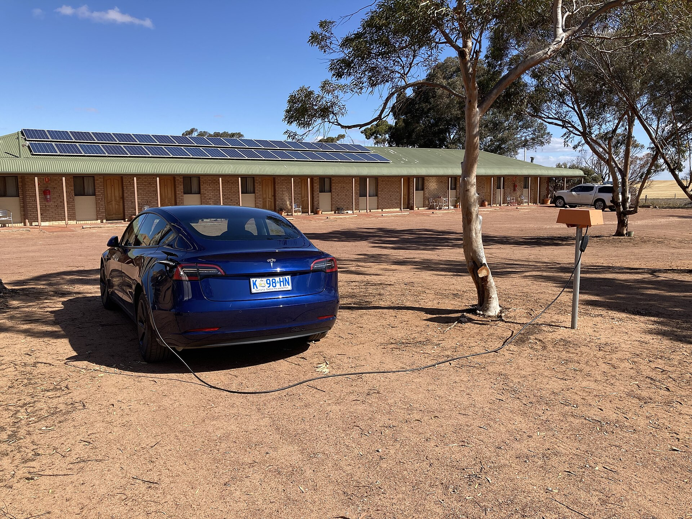

ההתלבטות בין **רכב חשמלי מול היברید נטען** היא אחת השאלות הנפוצות ביותר בקרב קוני רכב בישראל בשנת 2026. התשובה הקצרה: אם אתם נוסעים בעיקר בתוך העיר ויכולים לטעון בבית או בעבודה — רכב חשמלי מלא יהיה לרוב הבחירה החסכונית והנוחה יותר. לעומת זאת, אם אתם נוסעים מרחקים ארוכים באופן קבוע או שאין לכם גישה נוחה לעמדת טעינה — היברید נטען מספק ביטחון וגמישות בלי חרדת טווח.

## מה ההבדל הטכנולוגי בין רכב חשמלי להיברید נטען?

**רכב חשמלי מלא** (הידוע גם כ-BEV) מונע אך ורק על ידי מנוע חשמלי וסוללה גדולה. אין בו מנוע בנזין כלל, והוא נטען מהרשת החשמלית — בבית או בעמדות ציבוריות. דגמים פופולריים בישראל כוללים את טסלה מודל 3, יונדאי איוניק 5, קיה EV6 וסקודה אניאק.

**היברید נטען** (PHEV) הוא שילוב: יש בו מנוע בנזין רגיל וגם מנוע חשמלי עם סוללה שאפשר לטעון מהחשמל. בטווח קצר — בדרך כלל בין 40 ל-90 קילומטרים — הרכב נוסע כחשמלי לחלוטין, וכשהסוללה מתרוקנת המנוע הרגיל נכנס לפעולה. דגמים כמו טויוטה RAV4 נטען, מרצדס GLC נטען ומיצובישי אאוטלנדר מייצגים את הקטגוריה.

## עלות תפעול: מי חוסך יותר?

כאן ההבדל בולט. טעינת רכב חשמלי מלא בבית עולה משמעותית פחות מתדלוק בנזין לאותו מרחק. היברید נטען חוסך גם הוא — אך רק אם באמת טוענים אותו באדיקות. נהג שלא טורח לחבר את ההיברید הנטען לחשמל למעשה נוסע ברכב בנזין כבד ולא חסכוני במיוחד.

מבחינת תחזוקה, לרכב חשמלי מלא פחות חלקים נעים, אין החלפות שמן ומערכת בלמים שנשחקת לאט יותר בזכות בלימה מתחדשת. ההיברید הנטען, לעומת זאת, מחזיק שתי מערכות הנעה ולכן דורש תחזוקה מעט מורכבת יותר.

## טבלת השוואה: רכב חשמלי מלא מול היברید נטען

| פרמטר | רכב חשמלי מלא | היברید נטען |
|---|---|---|
| מקור הנעה | חשמל בלבד | חשמל + בנזין |
| טווח חשמלי | 300–550 ק"מ (הערכה) | 40–90 ק"מ (הערכה) |
| חרדת טווח | קיימת בנסיעות ארוכות | כמעט לא קיימת |
| עלות תפעול | הנמוכה ביותר | נמוכה בתנאי שטוענים |
| תלות בעמדות טעינה | גבוהה | נמוכה |
| תחזוקה | פשוטה יותר | מורכבת יותר |
| מתאים ל | נהג עירוני עם טעינה ביתית | נהג עם נסיעות מעורבות/ארוכות |

## מה עם הטעינה בישראל?

רשת הטעינה הציבורית בישראל ממשיכה להתרחב, אך היא עדיין לא אחידה בכל האזורים. בעל רכב חשמלי מלא שמתגורר בבניין ללא חניה פרטית עלול למצוא את עצמו תלוי בעמדות ציבוריות — מה שדורש תכנון. עבור נהג כזה, **היברید נטען** יכול להיות פשרה נוחה: אפשר להסתפק בטעינה חלקית, ובמקרה הצורך פשוט לתדלק בנזין.

מצד שני, מי שיש לו עמדת טעינה ביתית ייהנה מנוחות מרבית עם רכב חשמלי מלא — הרכב מוכן כל בוקר, ללא ביקורים בתחנות דלק.

## איך המיסוי ב-2026 משפיע על ההחלטה?

מדיניות המיסוי על רכבים חשמליים בישראל מתעדכנת ב-2026, ומס הקנייה על חשמליות מלאות צפוי לעלות בהדרגה לעומת שנים קודמות. עם זאת, החשמליות עדיין נהנות מהטבות מסוימות בהשוואה לרכבי בנזין. ההיברید הנטען ממוקם באמצע — לרוב נהנה מהטבה קטנה יותר מהחשמלי המלא, אך גבוהה מזו של רכב בנזין רגיל. לפני קנייה כדאי לבדוק את המחיר הסופי הכולל את המיסוי העדכני, שכן הוא עשוי לשנות את כדאיות ההשוואה.

## אז מה כדאי לבחור?

אין תשובה אחת שמתאימה לכולם. הנוסחה הפשוטה:

- **בחרו רכב חשמלי מלא** אם רוב הנסיעות שלכם עירוניות או בינוניות, יש לכם אפשרות טעינה ביתית, ואתם רוצים את עלות התפעול הנמוכה ביותר.
- **בחרו היברید נטען** אם אתם נוסעים מרחקים משתנים, יוצאים לנסיעות ארוכות מחוץ לעיר, או שאין לכם גישה יציבה לעמדת טעינה.

בשורה התחתונה, ההכרעה ב**רכב חשמלי מול היברید נטען** תלויה פחות בטכנולוגיה עצמה ויותר באורח החיים שלכם ובהרגלי הנהיגה. שני הפתרונות מייצגים צעד קדימה לעומת רכב בנזין מסורתי — וההתאמה האישית היא שתקבע את שביעות הרצון.
