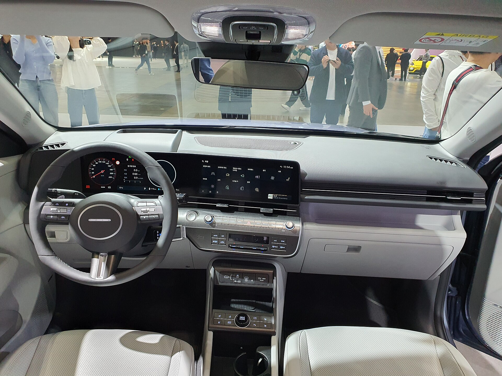

## יונדאי קונה חשמלית — האם הדור השני עשה קפיצת מדרגה?

**יונדאי קונה חשמלית** בדור השני היא הרבה יותר מרענון קוסמטי. יונדאי לקחה את הקרוסאובר הקומפקטי, הגדילה אותו, עיצבה אותו מחדש סביב פלטפורמה חשמלית ראשונית, והפכה אותו לאחת ההצעות המעניינות בקטגוריית החשמליות הקומפקטיות בישראל. התשובה הקצרה: כן, זו קפיצת מדרגה אמיתית — במרחב הפנימי, בטווח ובתחושת הבגרות של הרכב.

אם הדור הקודם הרגיש קטן וצפוף מאחור, הדור החדש פותר את זה כמעט לגמרי. יונדאי האריכה את הרכב ואת בסיס הגלגלים, והתוצאה מורגשת מיד — בעיקר לנוסעים במושב האחורי ובתא מטען שנעשה שימושי הרבה יותר.

## עיצוב חיצוני: פוטוריסטי בלי להגזים

החזית מקבלת פס תאורה רציף לרוחב המכסה, שמעניק לקונה מראה עתידני ומזוהה. הקווים חדים יותר, הפגושים מסיביים, והפרופיל הצדדי גבוה מעט מבעבר. זו כבר לא מכונית "חמודה" — זה קרוסאובר עם נוכחות.

העיצוב אינו אגרסיבי מדי, מה שכנראה יעבוד היטב מול הקהל הישראלי שמחפש רכב מודרני אך לא צעקני.

## פנים הרכב: מסכים, מרחב וארגונומיה

בתוך התא ממתינים שני מסכים בני 12.3 אינץ' שמתמזגים ללוח אחד רחב — אחד ללוח המחוונים ואחד למערכת המולטימדיה. הממשק חלק, מגיב, ותומך באפל קארפליי ואנדרואיד אוטו.

יונדאי השאירה בחוכמה כפתורים פיזיים לבקרת האקלים, החלטה שמקלה מאוד על השימוש היומיומי. איכות החומרים סבירה עד טובה לקטגוריה, עם שילוב של משטחים רכים ופלסטיק קשיח באזורים הנמוכים.

### כמה מקום יש בפועל?

- **מושב אחורי:** מרווח לשני מבוגרים בנוחות, וגם שלישי לנסיעות קצרות.
- **תא מטען:** נדיב יותר מהדור הקודם, עם תא אחסון קדמי קטן להטענת כבלים.
- **תאי אחסון:** קונסולה מרכזית פתוחה וגמישה שמנצלת היטב את היעדר תיבת ההילוכים המכנית.

## טווח, סוללה וטעינה

בישראל משווקת בעיקר הגרסה עם הסוללה הגדולה, שמציעה **טווח מוצהר של מעל 450 קילומטר**. בשימוש מציאותי, בשילוב של עיר וכביש מהיר ובמזג אוויר ישראלי, סביר לצפות לכ-350-400 קילומטר בטעינה מלאה — נתון ראוי לחלוטין לקטגוריה.

הטעינה המהירה מביאה את הסוללה מ-10% ל-80% בכ-40 דקות בעמדה מהירה מתאימה. בבית, עם עמדת טעינה ביתית, טעינה מלאה תתבצע בנוחות במהלך הלילה. יתרון נחמד הוא יכולת ה-Vehicle-to-Load, שמאפשרת להפעיל מכשירי חשמל חיצוניים ישירות מהרכב.

## איך היא נוהגת?

המנוע החשמלי מספק תאוצה חלקה ומיידית שמתאימה במיוחד לנהיגה עירונית. הקונה אינה רכב ספורט, אבל היא זריזה ברמזורים ובעקיפות. מערכת ההיגוי קלה ומדויקת, והמתלים מכוילים לנוחות — עם נטייה קלה להתגלגל בפניות חדות, כיאה לקרוסאובר גבוה.

בורר הנהיגה עם משוטי ההאטה מאחורי ההגה מאפשר לכוונן את עוצמת הבלימה המשחזרת, כולל מצב נהיגה בדוושה אחת — נוח מאוד בעומסי תנועה.

## טבלת השוואה: קונה חשמלית מול המתחרות

| פרמטר | יונדאי קונה חשמלית | קיה נירו חשמלית | סקודה אלרוק |
|---|---|---|---|
| קטגוריה | קרוסאובר קומפקטי | קרוסאובר קומפקטי | קרוסאובר קומפקטי |
| טווח מוצהר (משוער) | מעל 450 ק"מ | כ-460 ק"מ | כ-500 ק"מ |
| טעינה מהירה 10-80% | כ-40 דקות | כ-45 דקות | כ-30 דקות |
| תא נוסעים | מרווח | מרווח | מרווח מאוד |
| אופי | עירוני-רב-תכליתי | משפחתי מאוזן | משפחתי גדול |

## עלויות אחזקה ותפעול

כרכב חשמלי, עלות ה"דלק" נמוכה משמעותית מרכב בנזין, בעיקר אם טוענים בבית בתעריף לילה. עלויות התחזוקה השוטפת נמוכות יחסית בזכות פחות חלקים נעים. יש לזכור כי מס הקנייה על רכבים חשמליים בישראל צפוי לעלות בהדרגה בשנים הקרובות, ולכן כדאי לבחון את התמחור המדויק מול היבואן בזמן הרכישה.

## סיכום: למי מתאימה יונדאי קונה חשמלית?

זו בחירה מצוינת למשפחה קטנה או לזוג שמחפשים רכב חשמלי ראשון, מרווח מספיק, עם טווח אמין ואבזור עשיר. הקונה החדשה מרגישה בוגרת, נעימה לנהיגה יומיומית, ומתומחרת בצורה תחרותית מול ההצעות הסיניות ומול אחותה, קיה נירו. אם אתם לא זקוקים לשבעה מושבים או לתא מטען ענק — היא ראויה בהחלט לרשימה הקצרה שלכם.
