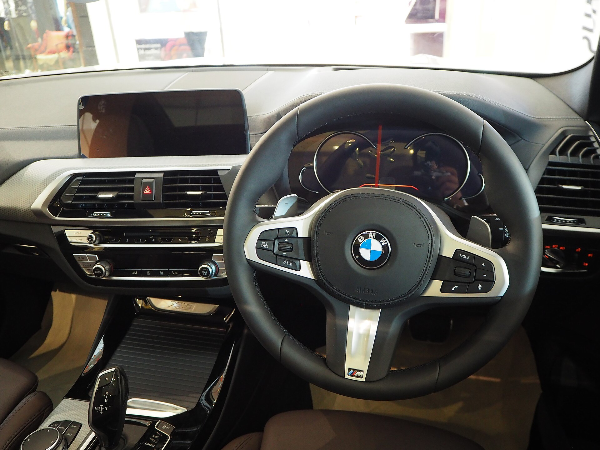

**ב.מ.וו iX3 החדש** מסמן את תחילתו של עידן חדש עבור היצרנית הבווארית: זהו הדגם הראשון שנבנה על פלטפורמת **Neue Klasse** ("המחלקה החדשה") — ארכיטקטורה חשמלית ייעודית שפותחה מאפס. הקרוסאובר המשפחתי מבטיח קפיצת מדרגה בטווח הנהיגה, במהירות הטעינה ובחוויה הדיגיטלית, וצפוי להגיע לישראל במהלך 2026 כאחת ההשקות המשמעותיות של השנה בקטגוריית החשמליים.

## מה מיוחד בפלטפורמת Neue Klasse?

בניגוד לדגמים החשמליים הקודמים של ב.מ.וו, שהתבססו על מבנה משותף עם דגמי בנזין, ה-**ב.מ.וו iX3 החדש** יושב על שלדה שתוכננה מלכתחילה עבור הנעה חשמלית בלבד. המשמעות היא ניצול יעיל יותר של המרחב, מרכז כובד נמוך ומערכת חשמל מתקדמת בארכיטקטורת **800 וולט**.

המעבר למתח גבוה יותר מאפשר טעינת זרם ישר מהירה משמעותית: ב.מ.וו מדברת על הוספת עשרות רבות של קילומטרים בתוך דקות ספורות בעמדות טעינה מהירות. במקביל, סוללות מסוג תא עגול חדשות משפרות את צפיפות האנרגיה, כך שהטווח המרבי צפוי לחצות בנוחות את רף ה-500 ק"מ במחזור הבדיקה האירופי.

## חוויה דיגיטלית חדשה בתא הנהג

החידוש הבולט בתא הנוסעים הוא מערכת **Panoramic iDrive** — תצוגה מוקרנת שנפרשת לרוחב תחתית השמשה הקדמית ומציגה מידע לנהג ולנוסע. לצידה נותר מסך מגע מרכזי בעיצוב חדש, וכמות הכפתורים הפיזיים צומצמה לטובת ממשק דיגיטלי נקי.

ב.מ.וו הדגישה שהמערכת תומכת בעדכוני תוכנה אלחוטיים ובפונקציות עזרה לנהג מתקדמות, כולל שיפורים בנהיגה חצי-אוטונומית בכביש מהיר.

## נתונים עיקריים — מה ידוע עד כה

| פרמטר | ב.מ.וו iX3 החדש (הערכה) | הדור הקודם |
|---|---|---|
| פלטפורמה | Neue Klasse חשמלית ייעודית | משותפת עם בנזין |
| מתח מערכת | 800 וולט | 400 וולט |
| טווח משוער | מעל 500 ק"מ | כ-450 ק"מ |
| טעינה מהירה | מהירה משמעותית יותר | סטנדרטית |
| תצוגה | Panoramic iDrive לרוחב | מסך קלאסי |

*הנתונים בטבלה הם הערכות המבוססות על פרסומי היצרנית וטרם אושרו סופית לגרסה הישראלית.*

## איך זה משתלב בשוק החשמלי בישראל?

שוק הרכב החשמלי בישראל ממשיך לצמוח, למרות העלייה הצפויה במס הקנייה על חשמליים בשנים הקרובות. ה-**ב.מ.וו iX3 החדש** ייכנס לזירה תחרותית שכוללת את טסלה מודל Y, יונדאי איוניק 5, קיה EV6 ואת מרצדס GLC החשמלית הצפויה גם היא.

היתרון של ב.מ.וו טמון בשילוב של מיתוג פרימיום, טכנולוגיה חדשה לחלוטין ותשתית שירות ותיקה בישראל. עם זאת, המחיר יהיה גורם מכריע — במיוחד לנוכח שינויי המיסוי המתקרבים.

## מתי זה מגיע ובכמה?

ההשקה העולמית של הדגם מתוכננת לקראת 2026, וההגעה לישראל צפויה במהלך אותה שנה. יבואנית ב.מ.וו בישראל טרם פרסמה מחירים רשמיים, אך בהתחשב במיצוב הדגם והמעבר לפלטפורמה חדשה, סביר שהמחיר יהיה גבוה במקצת מהדור היוצא. מומלץ לעקוב אחר הכרזות רשמיות לקראת מועד ההשקה.

### שורה תחתונה

ה-**ב.מ.וו iX3 החדש** אינו רק עדכון דור — הוא סנונית ראשונה של אסטרטגיה חשמלית חדשה שתלווה את היצרנית לשנים הבאות. עבור הקונה הישראלי, מדובר באחת ההשקות המסקרנות של 2026, שתגדיר מחדש את הציפיות מקרוסאובר חשמלי בקטגוריית הפרימיום.
